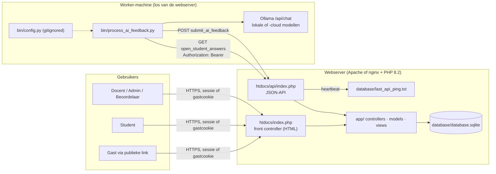
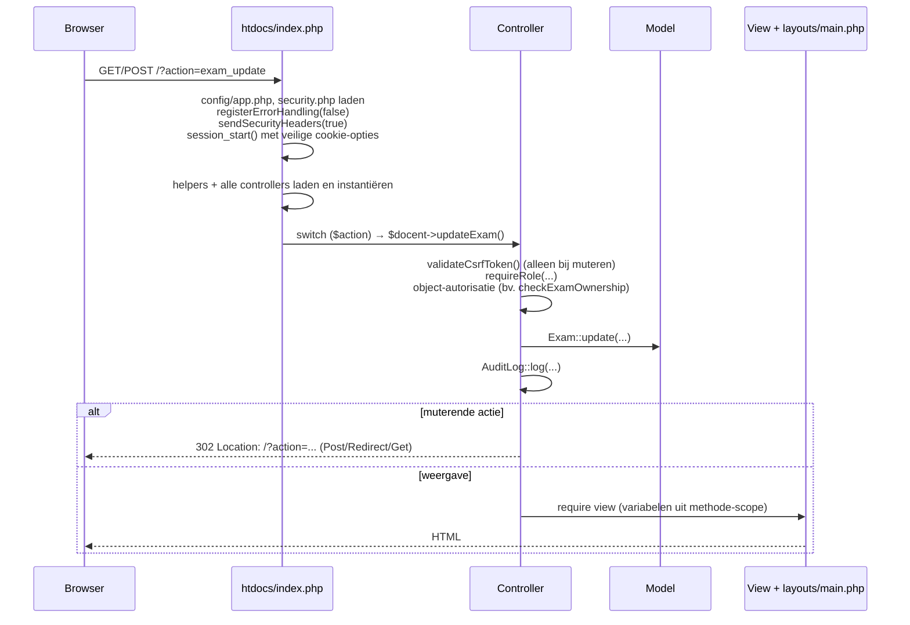
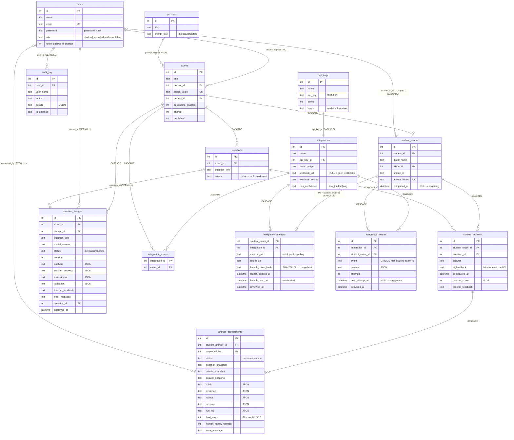
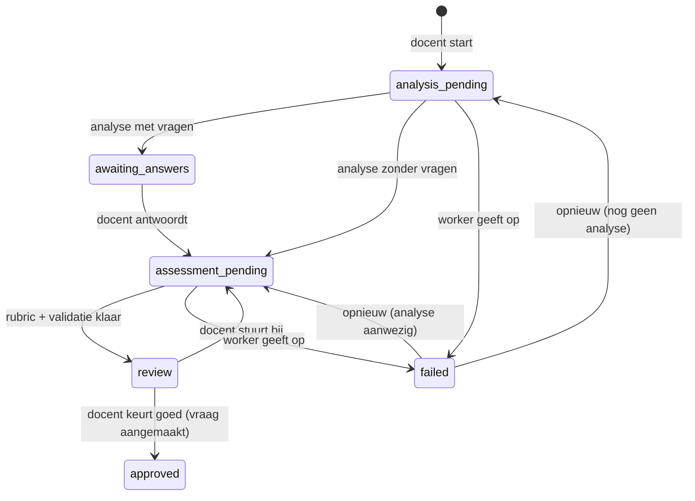
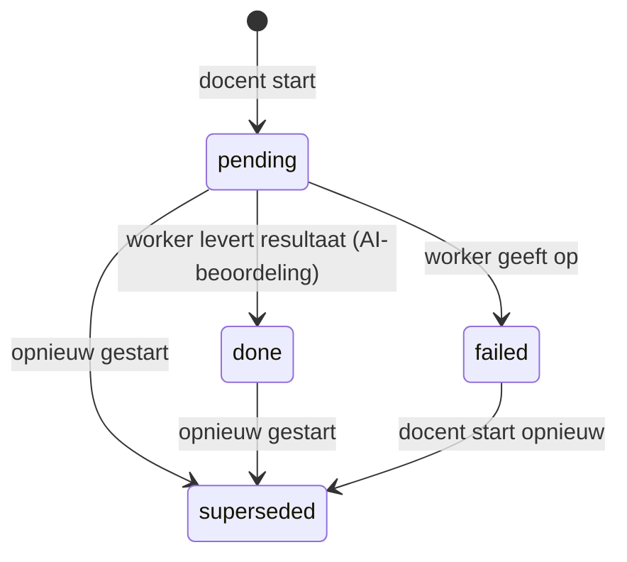
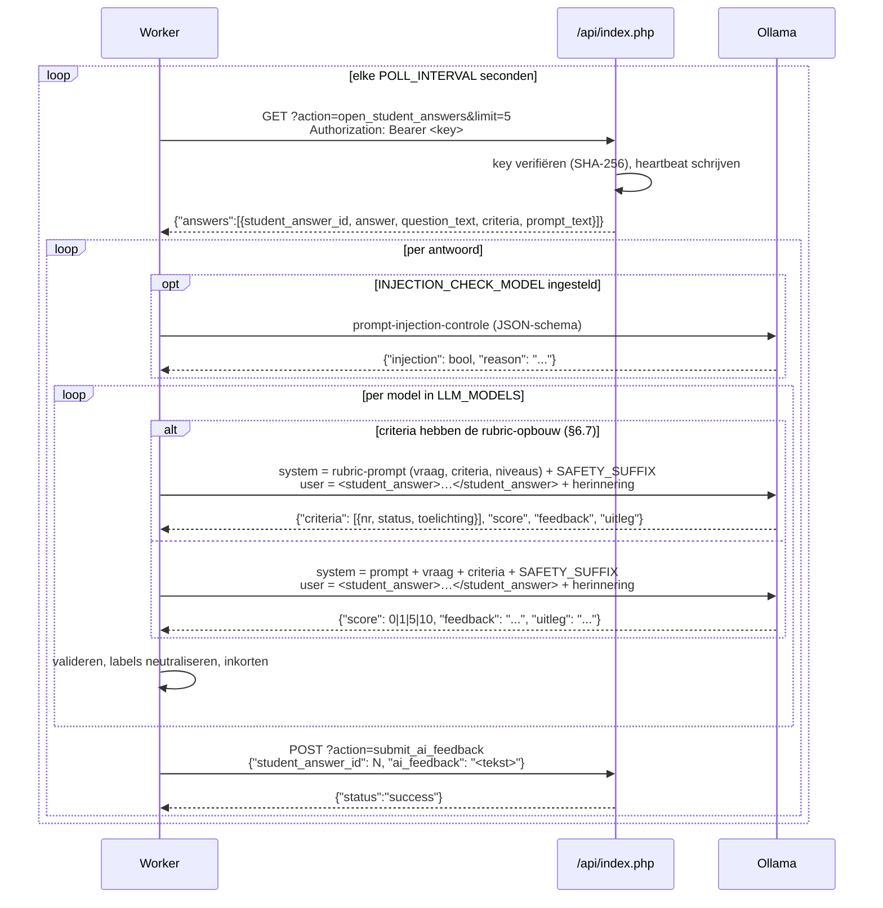
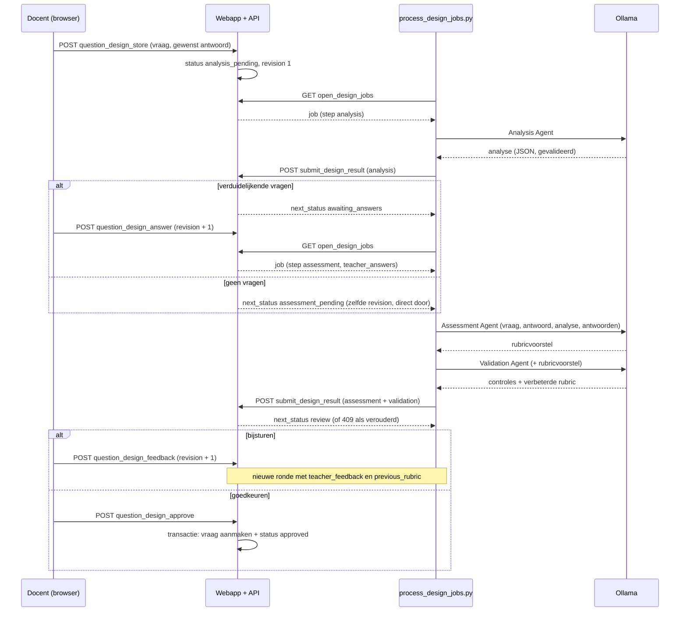

# Architectuur — genai-open-assessment

Dit document beschrijft hoe de applicatie is opgebouwd, welke afspraken (contracten) er tussen de onderdelen gelden en hoe je de opzet hergebruikt: voor een nieuwe feature-branch of als blauwdruk voor een nieuwe applicatie.

- Wat de applicatie inhoudelijk doet en waarom: [README.md](README.md)
- Hoe gebruikers ermee werken: [MANUAL.md](MANUAL.md)
- Werkafspraken voor Claude Code: [CLAUDE.md](CLAUDE.md)

---

## 1. Systeemoverzicht

De applicatie bestaat uit een webapplicatie en **los gedeployde worker-processen** die alleen via een kleine HTTP/JSON-API met elkaar praten:

| Component | Taal / runtime | Locatie | Verantwoordelijkheid |
|---|---|---|---|
| **Webapplicatie** | PHP 8.2, SQLite (PDO), Bootstrap 5 | `htdocs/`, `app/`, `config/`, `setup/` | Gebruikers, toetsen, vragen, afname, docentbeoordeling, rapportage, API voor de worker |
| **AI-feedbackworker** | Python 3, `requests` | `bin/process_ai_feedback.py` | Haalt ingeleverde antwoorden op, laat ze door één of meer LLM's beoordelen via Ollama, stuurt de feedback terug |
| **AI-ontwerpworker** | Python 3, `requests` | `bin/process_design_jobs.py` + `bin/design_agents.py` | Werkt vraagontwerpen van docenten uit met drie agents (analyse, rubricvoorstel, validatie), zie §6.6 |
| **AI-assessmentworker** | Python 3, `requests` | `bin/process_assessment_jobs.py` + `bin/assessment_agents.py` | Beoordeelt antwoorden op rubric-vragen agentic met drie agents (evidence, assessment, validatie) als voorstel voor de docent, zie §6.8 |
| *Externe website* (geen onderdeel van deze repo) | willekeurig | voorbeeld: `docs/integration-demo/demo_site.py` | Laat haar deelnemers via een koppeling een toets maken: integratie-API (scope `integration`) en webhooks, zie §6.9 |



Belangrijke ontwerpkeuzes:

- **Geen framework, geen Composer, geen build-stap.** Gewone PHP-bestanden met `require_once`. Dat houdt de deployment simpel: bestanden kopiëren, documentroot op `htdocs/` zetten en klaar.
- **Pull in plaats van push.** De webserver roept nooit een LLM aan. De worker vraagt periodiek om werk. Daardoor blijft de webserver licht, kan de worker op een andere machine draaien (met GPU of met Ollama Cloud) en kan de webserver doorwerken als de worker uitvalt.
  - **Eén bewuste uitzondering: webhooks van de externe koppeling (§6.9).** Alleen daar doet de webserver zelf uitgaande HTTP-verzoeken, en alleen naar een webhook-URL die de admin heeft ingesteld (`https`, geen redirects, korte timeout). Ze worden verstuurd tijdens de polls van de workers, ná het antwoord aan de worker, zodat een trage ontvanger een poll niet vertraagt.
- **De database is de wachtrij.** Een antwoord staat "in de wachtrij" zolang `student_answers.ai_feedback` leeg is, de poging is ingeleverd en AI-beoordeling voor de toets aanstaat. Er is geen aparte queue-tabel. De vraagontwerper en agentic beoordelen gebruiken hun eigen tabel (`question_designs`, `answer_assessments`) als wachtrij, met een statuskolom. Antwoorden op rubric-vragen gaan automatisch naar agentic beoordelen en dan niet naar de AI-feedbackworker (§6.8).
- **De mens beslist.** AI-scores zijn adviezen. De docentscore (`teacher_score`) is altijd een menselijke beoordeling en leidend voor het eindcijfer; geen enkele AI-uitvoer (ook agentic niet) komt daarin.

---

## 2. Mappenstructuur

```
.
├── htdocs/                  # DOCUMENT ROOT: alleen dit is publiek bereikbaar
│   ├── index.php            # Front controller voor alle HTML-pagina's (?action=...)
│   ├── api/index.php        # Front controller voor de JSON-API (worker)
│   ├── style.css            # Huisstijl bovenop Bootstrap (CSS-variabelen in :root)
│   ├── images/, site.webmanifest
├── app/
│   ├── controllers/         # Eén klasse per domein; publieke methode = één action
│   │                        #   (o.a. IntegrationController: beheer van externe koppelingen)
│   ├── models/              # Statische data-access-klassen (PDO, prepared statements)
│   │                        #   (o.a. Integration, IntegrationAttempt, IntegrationEvent, §6.9)
│   ├── views/
│   │   ├── layouts/main.php # Enige layout: navbar, flash-berichten, modal, cookiebanner, JS-helpers
│   │   ├── auth/            # Login, registratie, wachtwoord wijzigen
│   │   ├── docent/          # Docent-, beoordelaar- en admin-schermen
│   │   ├── student/         # Student- en gastschermen
│   │   └── pages/           # Statische pagina's (privacy)
│   └── helpers/
│       ├── security.php     # e(), abort(), requestInt/String(), headers + CSP, foutafhandeling
│       ├── csrf.php         # CSRF-token genereren/valideren (POST-only)
│       └── auth.php         # requireLogin(), requireRole(), sessie, wachtwoordbeleid
├── config/
│   ├── app.php              # Beveiligings- en limietconstanten
│   └── database.php         # Database-klasse: PDO-singleton, lichte migraties, default admin
├── setup/
│   ├── schema.sql           # Volledig schema voor een NIEUWE database
│   ├── init_db.php          # CLI-only: maakt database/database.sqlite aan vanuit schema.sql
│   └── cleanup_orphans.php  # CLI-only: ruimt wezen op (foreign_key_check), eerst dry-run, dan --apply
├── database/                # (gitignored) SQLite-bestand + heartbeat; buiten de webroot
├── bin/
│   ├── process_ai_feedback.py  # De AI-worker (beoordeling van studentantwoorden)
│   ├── process_design_jobs.py  # De ontwerp-worker: pollt open_design_jobs, stuurt resultaten terug
│   ├── design_agents.py        # Agents, JSON-schema's, validatie en orchestrator van de vraagontwerper
│   ├── test_design_agents.py   # Mocktests voor design_agents.py (unittest, gemockte call_ollama)
│   ├── process_assessment_jobs.py # De assessment-worker: pollt open_assessment_jobs, stuurt resultaten terug
│   ├── assessment_agents.py    # Agents, JSON-schema's, validatie, decide() en orchestrator van agentic beoordelen
│   ├── test_assessment_agents.py # Mocktests voor assessment_agents.py (gemockte call_ollama)
│   ├── test_rubric_grading.py  # Mocktests voor de rubric-beoordeling in process_ai_feedback.py
│   ├── fixtures/               # Voorbeelduitvoer van de agents (PLC-voorbeeld) voor tests en curl;
│   │                           #   fixtures/assessment/ voor agentic beoordelen
│   ├── config.py.sample        # Sjabloon voor bin/config.py (gitignored)
│   ├── dataset_import.py       # Importeert de Mohler ASAG-dataset voor validatie-onderzoek
│   └── README.md
├── docker/                  # Lokale testomgeving (php:8.2-apache), zie docker/README.md
└── docs/                    # Paper, security-review, uitrolhandleidingen
    ├── integration-api.md   # Integratie-API en webhooks, voor ontwikkelaars van een externe website
    └── integration-demo/    # Demo-"externe website" (demo_site.py, alleen standaardbibliotheek)
```

---

## 3. De webapplicatie

### 3.1 Request-levenscyclus (HTML)

Elke pagina is `/?action=<naam>`. Er is geen URL-rewriting.



De API (`htdocs/api/index.php`) volgt hetzelfde patroon, maar met `registerErrorHandling(true)` (JSON-fouten), `sendSecurityHeaders(false)` (strikte CSP zonder HTML), geen sessie en API-key-authenticatie.

### 3.2 Lagen en conventies

**Config** (`config/app.php`): alleen `const`-waarden (limieten, timeouts, feature-vlaggen zoals `ALLOW_SELF_REGISTRATION`). Geen secrets: de webapp heeft er geen nodig.

**Helpers** (functies, geen klassen):

| Helper | Doel |
|---|---|
| `e($v)` | HTML-escaping voor álle output in views |
| `abort($code, $msg)` | Nette foutpagina + `exit` (nooit `die()`) |
| `requestInt($src, $key)` | Positieve integer of `null` (ids uit `$_GET`/`$_POST`) |
| `requestString($src, $key, $max, $default)` | String (nooit array), afgekapt op `$max` |
| `validateCsrfToken()` | Eist POST (anders 405) en een geldig token (anders 403) |
| `csrfInput()` | Hidden input voor in elk formulier |
| `requireLogin()` | Sessie + idle-timeout + afgedwongen wachtwoordwijziging |
| `requireRole($rol)` | `requireLogin()` + rolcontrole (zie §4) |
| `cspNonce()` | Nonce voor inline `<script>` |
| `csvSafe($v)` | Bescherming tegen formula injection in CSV-exports |
| `appBaseUrl()`, `isHttps()` | Links opbouwen, ook achter een reverse proxy |

**Models** (`app/models/*.php`): klassen met **alleen statische methodes**. Elke methode haalt `Database::connect()` op (singleton-PDO), gebruikt prepared statements en geeft associatieve arrays terug (`PDO::FETCH_ASSOC`). Geen ORM, geen entiteit-objecten.

**Controllers** (`app/controllers/*.php`): één klasse per domein. Een publieke methode komt overeen met één `action`. Vast patroon voor muterende acties:

```php
public function updateThing() {
    validateCsrfToken();                         // 1. POST + CSRF
    requireRole('docent');                       // 2. ingelogd + juiste rol
    $id = requestInt($_POST, 'id');
    $this->checkExamOwnership($id, true);        // 3. mag déze gebruiker dít object wijzigen?
    $title = trim(requestString($_POST, 'title', 255));
    if ($title === '') {                         // 4. invoer valideren
        abort(400, 'Titel is verplicht.');
    }
    Thing::update($id, $title);                  // 5. model
    AuditLog::log('thing_update', ['id' => $id]);// 6. audit trail
    header('Location: /?action=things');         // 7. Post/Redirect/Get
    exit;
}
```

Gebruikersfouten die geen `abort()` rechtvaardigen gaan via een flash-bericht: `$_SESSION['error'] = '...'` of `$_SESSION['success_message'] = '...'` plus een redirect. De layout toont en wist ze.

**Views** (`app/views/**.php`): gewone PHP-templates die de variabelen uit de controllermethode gebruiken. Elke view vangt zijn eigen output op en geeft die aan de layout:

```php
<?php ob_start(); ?>
<h2><?= e($title) ?></h2>
<form action="/?action=<?= e($action) ?>" method="post">
    <?= csrfInput() ?>
    ...
</form>
<script nonce="<?= e(cspNonce()) ?>"> /* alleen met nonce */ </script>
<?php
$content = ob_get_clean();
$breadcrumbs = ['Dashboard' => '/?action=docent_dashboard', $title => ''];
require __DIR__ . '/../layouts/main.php';
```

Variabelen die de layout gebruikt: `$content`, `$title`, `$breadcrumbs` (label ⇒ url, lege url = huidige pagina), `$hideHeaderFooter` (bv. tijdens de toetsafname) en `$isGuest`.

Voor aanmaken en bewerken wordt **één formulier** gedeeld (`*_form.php`). De controller zet `$action` (`exam_store` of `exam_update`), `$title` en het object (`null` bij nieuw).

**Client-side conventies** (in `layouts/main.php`):

- **`data-confirm="Vraag?"` op een `<a>`** toont een bevestigingsmodal en verstuurt de link daarna als **POST met CSRF-token**. Zo werken alle verwijder-, toggle- en dupliceerlinks. Een gewone GET naar een muterende action geeft 405.
- `data-confirm` op een submitknop toont de modal vóór het verzenden.
- `data-copy-target="<id>"` kopieert de waarde van een input naar het klembord. `data-select-on-click` selecteert de inhoud.
- De CSP staat **geen inline event handlers** (`onclick=...`) toe en geen scripts zonder nonce. Externe scripts mogen alleen van `cdn.jsdelivr.net` of `cdnjs.cloudflare.com`, en altijd met `integrity` (SRI).

### 3.3 Routes

Alle routes staan in de `switch` van [htdocs/index.php](htdocs/index.php). Per controller:

| Controller | Actions | Minimale rol |
|---|---|---|
| `AuthController` | `login`, `do_login`, `logout`, `register`, `do_register`, `change_password`, `do_change_password` | publiek / ingelogd |
| `DocentController` | `docent_dashboard`, `exam_*` (create/store/edit/update/delete/duplicate/public_link), `questions`, `question_*`, `exam_results`, `exam_comparison`, `exam_comparison_export`, `view_student_answers`, `delete_student_exam`, `update_guest_name`, `audit_log` | docent |
| | `ai_results_reset_answer`, `ai_results_reset_attempt`, `ai_results_reset_exam` (POST; schrijfrecht op de toets: eigenaar of admin, §6.1) | docent |
| | `grade_student_exam`, `save_teacher_feedback`, `pending_assessments` | beoordelaar |
| | `clear_audit_log` | admin |
| `StudentController` | `students`, `student_create`, `student_store`, `student_delete` (gebruikersbeheer, alle rollen) | admin |
| | `student_edit`, `student_update` (eigen profiel, of iedereen als admin) | ingelogd |
| `StudentExamController` | `student_dashboard`, `exams_list` | student |
| | `start_exam`, `my_exams` | ingelogd |
| | `guest`, `guest_start`, `guest_logout`, `take_exam`, `submit_exam`, `student_view_results` | ingelogd **of** gast met geldig token |
| | `integration_launch` (landingspagina, GET), `integration_launch_start` (POST + CSRF) | publiek, met een geldige eenmalige startlink (§4.3) |
| `QuestionDesignController` | `question_design_create`, `question_design_store`, `question_design_view`, `question_design_answer`, `question_design_feedback`, `question_design_approve`, `question_design_retry`, `question_design_delete` (alleen eigenaar van de toets of admin) | docent |
| `AnswerAssessmentController` | `answer_assessment_start`, `answer_assessment_start_exam`, `answer_assessment_view` (leestoegang tot de toets: eigenaar, admin of gedeelde toets; niet de beoordelaar) | docent |
| `ApiKeyController` | `api_keys`, `api_key_create`, `api_key_toggle`, `api_key_delete` | admin |
| `IntegrationController` | `integrations`, `integration_create`, `integration_store`, `integration_edit`, `integration_update`, `integration_rotate_secret`, `integration_toggle`, `integration_delete`, `integration_view` | admin |
| `PromptController` | `prompts`, `prompt_*`, `prompt_help` | admin |
| (direct in router) | `privacy` | publiek |

> `StudentController` beheert ondanks de naam **alle** gebruikers, niet alleen studenten. De views daarvoor staan in `views/docent/student_*.php`.

---

## 4. Rollen en autorisatie

### 4.1 Rollen

Een gebruiker heeft precies één rol. De lijst staat op meerdere plekken die gelijk moeten blijven: de `CHECK`-constraint in `setup/schema.sql`, `validRoles()` in `auth.php`, de hiërarchie in `requireRole()`, de navigatie in `layouts/main.php` en de redirect-per-rol in `AuthController`, `StudentController` en `StudentExamController`.

| Rol | Komt door `requireRole(...)` voor | Startpagina na login |
|---|---|---|
| `admin` | alles | `docent_dashboard` |
| `docent` | `docent`, `beoordelaar` | `docent_dashboard` |
| `beoordelaar` | `beoordelaar` | `pending_assessments` |
| `student` | `student` | `student_dashboard` |
| *gast* (geen account) | n.v.t.: toegang via tokens | toetsafname |

### 4.2 Autorisatie op objectniveau (toetsen)

Een rolcheck is niet genoeg: ook moet worden bepaald of de gebruiker *deze* toets mag zien of wijzigen. Dat gebeurt in `DocentController`:

| Handeling | Wie mag | Functie |
|---|---|---|
| Inzien (vragen, resultaten, vergelijking, export) | eigenaar, admin, of iedere docent als `shared = 1` | `checkExamOwnership($id)` |
| Wijzigen (toets, vragen, dupliceren, poging verwijderen, gastnaam) | eigenaar of admin | `checkExamOwnership($id, true)` |
| Beoordelen (docentscore) | admin, beoordelaar (alle toetsen), docent bij eigen of gedeelde toets | `checkGradingPermission($examId)` |
| Starten (ingelogd) | admin: alles; docent: eigen, gedeeld of gepubliceerd; student: alleen `published = 1` | `StudentExamController::startExam()` |

Autoriseer altijd op basis van data uit de database (bijvoorbeeld `StudentAnswer::findWithExam($id)` → `exam_id`), nooit op basis van ids die de client meestuurt.

### 4.3 Gasttoegang

Gasten hebben geen account. Hun toegang loopt via twee tokens:

1. **`exams.public_token`** (32 hex): zit in de deelbare link `/?action=guest&token=…`. Werkt los van `published`. De eigenaar kan hem vernieuwen of uitzetten (`exam_public_link`, `public_token = NULL`); lopende gastpogingen werken dan door.
2. **`student_exams.access_token`** (64 hex): wordt bij `guest_start` aangemaakt en opgeslagen in de cookie `guest_access_token` (HttpOnly, SameSite=Strict, `GUEST_COOKIE_LIFETIME`). Daarnaast houdt de cookie `guest_history` (JSON, maximaal 20 tokens) eerdere pogingen bij, zodat de gast resultaten kan terugzien.

Komt een token in de URL binnen (bijvoorbeeld via de deellink die de docent kopieert), dan zet `absorbUrlToken()` het in de cookie en redirect naar dezelfde URL zónder token. Zo blijft het niet in logs of browsergeschiedenis staan.

Een gastpoging herken je aan `student_exams.student_id IS NULL`.

**Pogingen via een externe koppeling (§6.9)** hergebruiken dit mechanisme, maar starten anders:

1. De server van de externe website roept `integration_attempt_start` aan (API, scope `integration`). Dat maakt een gastpoging plus een rij in `integration_attempts` met een **launch-token** (64 hex, alleen als SHA-256-hash opgeslagen, `INTEGRATION_LAUNCH_TTL` geldig).
2. `GET integration_launch&token=…` toont alleen een landingspagina en verbruikt niets.
3. De knop doet `POST integration_launch_start` (CSRF). Die verbruikt het token atomair (één `UPDATE` die het token wist, alleen als het nog geldig is), zet `guest_access_token` en redirect naar `take_exam`. Twee stappen omdat een muterende GET niet mag, en omdat een `SameSite=Strict`-cookie die tijdens een navigatie vanaf een andere site wordt gezet, pas wordt meegestuurd vanuit een navigatie op onze eigen site.
4. Een koppelingspoging komt **niet** in `guest_history`, toont geen resultatenpagina (`take_exam` na inleveren, `student_view_results` en `submit_exam` sturen door naar de terugkeer-URL), wordt niet hervat via de publieke gastlink en `guest_logout` stuurt niet naar die link. Op `take_exam` staat de origin van de terugkeer-URL in de CSP-`form-action`, omdat browsers die regel ook toepassen op de redirect na de POST van het inleverformulier.

### 4.4 Overige beveiligingsmaatregelen

- **Sessie:** cookie met HttpOnly, SameSite=Strict en Secure (ook achter een proxy via `X-Forwarded-Proto`). `session_regenerate_id()` bij login en bij een wachtwoordwijziging. Na `SESSION_IDLE_TIMEOUT` volgt automatisch uitloggen. `requireLogin()` leest naam, rol en `force_password_change` bij elk verzoek uit de database (een rolwijziging geldt direct, een verwijderde gebruiker is direct uitgelogd) en vergelijkt een vingerafdruk van de wachtwoordhash (`passwordMarker()`): een nieuw wachtwoord beëindigt de andere sessies van die gebruiker.
- **Wachtwoorden:** `password_hash()`, minimaal `PASSWORD_MIN_LENGTH` tekens met een letter en een cijfer. Wie het eigen wachtwoord wijzigt, moet het huidige opgeven.
- **API-keys hebben een scope** (`api_keys.scope`): `worker` (de AI-workers; ook alle bestaande keys) of `integration` (één externe koppeling). `ApiController::verifyApiKey($scope)` geeft `401` bij een ongeldige of uitgeschakelde key en `403` (audit `api_scope_denied`) bij een geldige key met de verkeerde scope. Zo kan een externe partij nooit bij `open_student_answers` (alle studentantwoorden). Integratie-endpoints filteren alles op de koppeling van de key; een poging van een andere koppeling geeft `404`, geen `403`.
- **Rate limiting gebeurt via de audit log:** `AuditLog::countRecent()` telt recente `login_failed`- en `guest_start`-regels per IP of e-mailadres. "Log leegmaken" laat daarom de regels van het laatste uur staan (alle vensters zijn hooguit 60 minuten), zodat lockouts en rate limits niet terugspringen.
- **Headers:** centraal in `sendSecurityHeaders()` (een tweede aanroep vóór de output vervangt de CSP; alleen gebruikt om de `form-action` van een koppelingspoging uit te breiden): CSP met nonce, `nosniff`, `X-Frame-Options`, `Referrer-Policy`, `Permissions-Policy`, HSTS (alleen over HTTPS).
- **Foutafhandeling:** `registerErrorHandling()` logt exceptions server-side en toont de gebruiker alleen een generieke 500-melding.
- De volledige security-review en de status per bevinding staan in [docs/security-issues.txt](docs/security-issues.txt).

---

## 5. Datamodel

SQLite, bestand `database/database.sqlite` (buiten de webroot en gitignored). Foreign keys worden per verbinding aangezet (`PRAGMA foreign_keys = ON`) en zijn dus echt van kracht.



**Toestanden van een antwoord:**

| Toestand | Voorwaarde |
|---|---|
| Concept (student bezig) | `student_exams.completed_at IS NULL` |
| Wacht op AI | ingeleverd, `exams.ai_grading_enabled = 1`, `ai_feedback` leeg, en niet bij agentic beoordelen (zie §6.8) |
| Agentic (AI) beoordeeld | een run in `answer_assessments` met status `pending` of `done` |
| AI-beoordeeld | `ai_feedback` gevuld |
| Wacht op docent | ingeleverd, `teacher_score IS NULL` (zie `pending_assessments`) |
| Docent-beoordeeld | `teacher_score` gevuld |

**Status van een koppelingspoging** (`not_started`, `in_progress`, `grading`, `graded`, `reviewed`): wordt **niet opgeslagen** maar elke keer berekend uit `launch_used_at`, `completed_at`, de AI-resultaten per antwoord (`ai_feedback`, `answer_assessments`), `teacher_score` en `reviewed_at`. Zie §6.9.

**Statusmachine van een vraagontwerp** (`question_designs.status`, constanten in `QuestionDesign`; bewust geen `CHECK` in het schema):



Elke overgang is één `UPDATE … WHERE id = ? AND status = ? AND revision = ?`. Docentacties die nieuw werk opleveren (antwoorden, bijsturen, opnieuw) verhogen `revision`; de worker stuurt de revision van zijn job terug, zodat een verouderd resultaat niets overschrijft. De `*_pending`-statussen zijn de wachtrij van de ontwerp-worker.

**Statusmachine van een agentic beoordeling** (`answer_assessments.status`, constanten in `AnswerAssessment`; geen `CHECK`):



Elke start is een **nieuwe rij** (de geschiedenis blijft bewaard); `AnswerAssessment::create()` zet in dezelfde transactie de runs van dat antwoord met status `pending`, `done` of `failed` op `superseded`. De worker mag alleen een run met status `pending` bijwerken (`WHERE id = ? AND status = 'pending'`), anders 409; daarom is er geen `revision`-teller nodig. Vraag, criteria en antwoord worden bij het starten als snapshot opgeslagen: de worker beoordeelt de snapshot, niet de actuele vraag.

Bijzonderheden:

- **Wijzigt de prompt van een toets, dan wordt alle AI-feedback van die toets gewist** (`StudentAnswer::clearAiFeedbackByExam`). De worker beoordeelt daarna alles opnieuw.
- **Dupliceren** kopieert de vragen, pogingen en antwoorden **met** docentscores en **zonder** AI-feedback. De kopie is niet gedeeld en niet gepubliceerd. Vraagontwerpen, agentic beoordelingen en de koppelingsgegevens van pogingen (`integration_attempts`, events) worden bewust niet gekopieerd: een kopie van een koppelingspoging is een gewone gastpoging.
- **`updateExam()` raakt de agentic beoordelingen niet**: die beoordelen hun eigen snapshot. Een agentic beoordeling schrijft **nooit** `teacher_score` of `teacher_feedback`: dat zijn altijd menselijke beoordelingen.
- Het eindcijfer is het gemiddelde van de `teacher_score`s. Per AI-bron (elk model uit `ai_feedback`, plus `Agentic AI`) wordt apart een gemiddelde berekend, alleen ter vergelijking. Alle AI-scores komen uit `StudentAnswer::aiScores()`.

### 5.1 Schemawijzigingen (migraties)

Er is geen migratietool. Er zijn twee paden, en **beide moeten worden bijgewerkt**:

1. **Nieuwe database:** `setup/schema.sql` (wordt uitgevoerd door `setup/init_db.php`, ook in de Docker-entrypoint).
2. **Bestaande database:** `Database::migrate()` in [config/database.php](config/database.php). Die draait bij elke verbinding en moet idempotent zijn: eerst controleren (bijvoorbeeld met `PRAGMA table_info(...)`), dan pas `ALTER TABLE` of `CREATE TABLE IF NOT EXISTS`.

Kies voor nieuwe kolommen een default die voor bestaande rijen veilig is. Zo kreeg `published` de waarde `0`, zodat bestaande toetsen niet ongemerkt zichtbaar werden.

---

## 6. De AI-pipeline

### 6.1 Verloop



**AI-resultaten opnieuw laten uitvoeren (reset).** Omdat de database de wachtrij is, zet een reset antwoorden terug in de toestand van *net ingeleverd*: `StudentAnswer::resetAiResults()` zet in één transactie `ai_feedback` en `ai_updated_at` op `NULL` en de agentic runs (`pending`, `done`, `failed`) op `superseded` (`AnswerAssessment::supersedeActiveRuns()`). Daarna roept de controller per poging `AnswerAssessment::createAutomaticRuns()` aan, net als bij inleveren: rubric-antwoorden krijgen meteen een nieuwe agentic run, de rest komt weer in `open_student_answers`. De workers merken er niets van. Een agentic run die de worker nog aan het rekenen was, krijgt bij het insturen 409. De actions (`DocentController::resetAiResultsAnswer()`, `resetAiResultsAttempt()` en `resetAiResultsExam()`) vragen schrijfrecht op de toets (eigenaar of admin) en een ingeleverde poging bij een toets met `ai_grading_enabled = 1`, en weigeren koppelingspogingen (§6.9). `teacher_score`/`teacher_feedback` staan in geen enkele query van de reset. Elke reset schrijft één auditregel `ai_results_reset` (scope, betrokken pogingen en antwoorden, tellingen, de oude AI-scores en de nieuwe runs; bij de toets ook de overgeslagen pogingen). Die regel is ook de bron van de rate limit `AI_RESULTS_RESET_MAX_PER_HOUR` per docent. Na een reset per poging kan de redirect alleen naar een vaste keuze (`return=exam_results`) met de `exam_id` uit de database.

### 6.2 API-contract (webapp ↔ worker)

| | |
|---|---|
| Endpoint | `/api/index.php?action=<naam>` |
| Authenticatie | `Authorization: Bearer <64 hex>` of `X-Api-Key: <64 hex>`. **Nooit** in de query string. |
| Opslag van de key | SHA-256-hash in `api_keys`. De ruwe key wordt één keer getoond bij het aanmaken. Oude keys die nog in platte tekst staan, worden bij het eerste gebruik automatisch gehasht. |
| Fout bij authenticatie | `401`, header `WWW-Authenticate: Bearer`, regel `api_auth_failed` in de audit log |
| Scope | De zes worker-endpoints hieronder eisen een key met scope `worker`, de integratie-endpoints scope `integration`; anders `403` (`api_scope_denied`) |
| `GET open_student_answers` | optioneel `limit` (1–100) → `{"answers": [...]}`. Schrijft `database/last_api_ping.txt`. |
| `POST submit_ai_feedback` | JSON-body `{"student_answer_id": int, "ai_feedback": string}`. Maximaal `MAX_AI_FEEDBACK_LENGTH` tekens. Antwoorden: `200`, `400`, `404`, `405` of `413`. |
| `GET open_design_jobs` | optioneel `limit` (1–10, standaard 3) → `{"jobs": [{design_id, revision, step: "analysis"\|"assessment", question_text, model_answer, analysis\|null, teacher_answers: [{question, why, answer}], teacher_feedback, previous_rubric\|null}]}`. Schrijft `database/last_design_ping.txt`. Zie §6.6. |
| `POST submit_design_result` | JSON-body `{"design_id", "revision", "step", "result": {…}}` of `{…, "error": "reden"}`, maximaal `MAX_DESIGN_RESULT_LENGTH` bytes. Bij `analysis` is `result` de analyse, bij `assessment` `{"assessment": {…}, "validation": {…}}`. Antwoorden: `200 {"status":"success","next_status":"…"}`, `400` (ongeldig, ook als de uitvoer niet door de normalisatie komt), `404`, `405`, `409` (status, stap of revision klopt niet meer: verouderd resultaat) of `413`. |
| `GET open_assessment_jobs` | optioneel `limit` (1–10, standaard 3) → `{"jobs": [{assessment_id, question_text, criteria, answer}]}` (alle drie uit de snapshot van de run). Schrijft `database/last_assessment_ping.txt`. Zie §6.8. |
| `POST submit_assessment_result` | JSON-body `{"assessment_id", "result": {"rubric", "evidence", "rounds": [{"assessment", "validation"}], "decision", "run_log"}}` of `{"assessment_id", "error": "reden"}`, maximaal `MAX_ASSESSMENT_RESULT_LENGTH` bytes. Antwoorden: `200 {"status":"success"}`, `400` (ongeldig; de melding noemt het onderdeel dat niet door `AnswerAssessment::normalizeResult()` komt), `404`, `405`, `409` (status is niet meer `pending`: verouderd) of `413`. |
| `GET integration_exams` | **Scope `integration`** (contract 9, §6.9). De gekoppelde toetsen met AI aan: `{"exams": [{exam_id, title, question_count}]}` |
| `POST integration_attempt_start` | Body `{exam_id, external_ref, return_url, display_name?}` → `201` (nieuw) of `200` (nieuwe startlink, idempotent per `external_ref`): `{attempt_id, launch_url, expires_at, status}`. Fouten `400`, `404`, `409`, `413`, `429` |
| `GET integration_attempt&attempt_id=N` | Samenvatting van de poging (status, `review_needed`, confidence, redenen, scores, antwoorden). `404` als hij niet van deze koppeling is |
| `GET integration_attempts&filter=open\|needs_review\|all&limit=1..100` | `{"attempts": [{attempt_id, external_ref, exam_id, status, review_needed, updated_at}]}` |
| `POST integration_attempt_review` | Body `{attempt_id, reviewer?, grades?: [{question_id, score 0..10, feedback?}]}` → `200`; `400`, `404`, `409` (nog niet `graded`), `413` |
| Foutformaat | `{"error": "..."}` |

De volledige beschrijving van de integratie-API, voor ontwikkelaars van een externe website, staat in [docs/integration-api.md](docs/integration-api.md).

**Heartbeat:** de layout toont "Parser Actief" als `last_api_ping.txt` jonger is dan 120 seconden. De ontwerppagina meldt dat de AI-ontwerpassistent niet actief is als `last_design_ping.txt` ouder is dan 120 seconden terwijl een ontwerp wacht. De pagina van een agentic beoordeling doet hetzelfde met `last_assessment_ping.txt` en `ASSESSMENT_WORKER_STALE_SECONDS`.

### 6.3 Contract: het tekstformaat van `ai_feedback`

De worker slaat de feedback van alle modellen op als **één tekstveld**. De webapp haalt de scores daar met een regex weer uit:

```
[optioneel] WAARSCHUWING: dit antwoord bevat mogelijk instructies aan de AI ...

Model: gpt-oss:20b-cloud
Tijdsduur: 3.21s
Aantal punten: 5
Feedback: <tekst>

Model: gpt-oss:120b-cloud
...
```

Bij een rubric-beoordeling (§6.7) volgt onder `Feedback:` een blok `Criteria:` met per criterium een regel `- <naam> (<gewicht>): voldaan|deels voldaan|niet voldaan. <toelichting>`, en eventueel een regel dat de score van 10 naar 5 is verlaagd. De regex leest daar niets uit; criteriumnamen en toelichtingen gaan ook door `clean_output_text()`.

```php
preg_match_all('/Model:\s+(.+?)\s+.*?Aantal punten:\s+(\d+)/is', $ai_feedback, $m, PREG_SET_ORDER);
```

Deze regex staat op één plek: `StudentAnswer::aiScores()`. Die geeft per antwoord de AI-scores per bron terug (de modellen uit `ai_feedback`, plus de agentic beoordeling als bron `Agentic AI`, §6.8) en wordt gebruikt door `DocentController` (`viewStudentAnswers`, `compareExamResults`, `exportExamComparison`) en `StudentExamController::viewResults`. Daarnaast leest `StudentAnswer::hasInjectionWarning()` of de tekst met `WAARSCHUWING:` begint (voor de confidence van de externe koppeling, §6.9).

**Regels:**

- Wijzig de labels `Model:`, `Tijdsduur:`, `Aantal punten:` en `Feedback:` alleen samen met de regex in `StudentAnswer::aiScores()`.
- `clean_output_text()` in de worker maakt deze labels in modeluitvoer onschadelijk (`Model -`), zodat een model of een student via de feedbacktekst geen extra scores kan "injecteren". Laat die stap staan.
- Als een antwoord na `MAX_ATTEMPTS` pogingen niet te beoordelen is, slaat de worker een tekst zonder `Model:`-blokken op. Dat antwoord telt dan voor geen enkel model mee.
- Op termijn is gestructureerde opslag beter (zie §9).

### 6.4 Prompting en verdediging tegen prompt injection

- **Prompttemplate:** bij rubric-criteria `RUBRIC_SYSTEM_PROMPT` (§6.7). Anders het `prompt_text` van de toets (tabel `prompts`), of `DEFAULT_SYSTEM_PROMPT`. De placeholders `{{question_text}}` en `{{criteria}}` worden ingevuld. `{{student_answer}}` wordt **niet** door het antwoord vervangen maar door een verwijzing naar het gebruikersbericht.
- **Rolscheiding:** het studentantwoord staat uitsluitend in het *user*-bericht, tussen `<student_answer>`-tags (die tags worden eerst uit het antwoord gefilterd) en afgekapt op `MAX_ANSWER_CHARS`. Na het antwoord volgt een herinnering (`GRADING_REMINDER`, de "sandwich").
- **Afgedwongen output:** het Ollama-`format` krijgt een JSON-schema mee (score als enum `{0,1,5,10}`, tekstvelden met `maxLength`). Daarna valideert `validate_feedback()` de uitvoer nogmaals, want cloud-modellen houden zich niet altijd aan het schema. Bij ongeldige JSON volgen tot `JSON_RETRY_ATTEMPTS` correctiepogingen. Raakt het tokenbudget op aan het denken, dan wordt `num_predict` verdubbeld (tot `NUM_PREDICT_MAX`).
- **Voorcontrole (optioneel):** `INJECTION_CHECK_MODEL` beoordeelt eerst of het antwoord instructies aan de AI bevat. Is dat zo, dan krijgt de feedback een waarschuwing en wordt de AI-score met `INJECTION_ZERO_SCORE` op 0 gezet. De originele score blijft zichtbaar in de tekst. De docentscore wordt nooit aangeraakt.
- **Per modelfamilie:** `THINK_LEVELS` en `SAMPLING_OPTIONS` regelen het denkgedrag en gaan herhalingslussen tegen (bijvoorbeeld bij qwen3 en gpt-oss).

### 6.5 Worker-configuratie

`bin/config.py` is gitignored en staat op de **worker-machine**, die niet dezelfde machine hoeft te zijn als de webserver of je ontwikkelmachine. Verplichte waarden: `API_KEY`, `BASE_URL`, `OLLAMA_URL`, `LLM_MODELS` en `POLL_INTERVAL`. Alle andere instellingen leest de worker met `getattr(config, "NAAM", default)`, zodat een oudere `config.py` blijft werken. Buiten localhost moet `BASE_URL` met `https://` beginnen (anders stopt de worker), tenzij `ALLOW_INSECURE_BASE_URL = True`.

### 6.6 De vraagontwerper (agentic)

Een docent voert een vraag en het gewenste antwoord in; drie agents werken die uit tot een rubric, en de docent stuurt bij of keurt goed. Pas bij goedkeuring ontstaat een gewone rij in `questions` (`question_text` + `criteria` als platte tekst, via `QuestionDesign::rubricToCriteriaText()`). De beoordelingsworker herkent die opbouw en beoordeelt dan per criterium (§6.7); de scores in contract 1 (`ai_feedback`) en de scoreschaal blijven gelijk.

- **Waar het draait:** de webserver roept geen LLM aan. De orchestrator en de agents draaien in een eigen worker-proces (`bin/process_design_jobs.py`), los van de beoordelingsworker, zodat een docent die interactief wacht niet achter de wachtrij met studentantwoorden aansluit. `design_agents.py` bevat geen netwerkcode richting de webapp en hergebruikt `call_ollama()` (met een eigen `num_ctx`) uit `process_ai_feedback.py`.
- **Agents:** *Analysis* (essentiële elementen, duidelijkheid, mismatch tussen vraag en antwoord, issues, 0–5 verduidelijkende vragen met *waarom*), *Assessment* (1–6 criteria *essentieel*/*aanvullend*, niveaus 10/5/1/0 in termen van de criteria, alternatieve antwoorden) en *Validation* (zes controles, verbeterde rubric, wijzigingen met *waarom*, optioneel een betere vraagtekst). De schaal is holistisch: geen punten per criterium.
- **Eén doorloop per ronde:** zonder verduidelijkende vragen gaat de orchestrator direct door naar Assessment en Validation (zelfde revision). Er zijn geen automatische lussen.
- **Contract 6 (JSON-vormen):** de vormen en limieten (tekstvelden ≤ 800 tekens, lijsten met een maximum, `checks` precies zes) staan aan beide kanten: `validate_*()` in de worker en `QuestionDesign::normalize*()` in PHP. Houd ze gelijk.
- **Invoer als data:** alle docenttekst gaat als gelabelde blokken (`<vraag>`, `<gewenst_antwoord>`, `<analyse>`, `<antwoorden_docent>`, `<feedback_docent>`, `<vorige_rubric>`, `<rubricvoorstel>`) in het user-bericht; blokmarkeringen in de inhoud worden eerst verwijderd.



**Robuustheid:** de worker telt pogingen per `(design_id, revision, step)` en stuurt na `DESIGN_MAX_ATTEMPTS` een `error` in (status `failed`, de docent kan opnieuw proberen). Starten is begrensd met `DESIGN_START_MAX_PER_HOUR` per docent (via de audit log), bijsturen met `DESIGN_MAX_REVISIONS`.

### 6.7 Beoordelen met de rubric

De rubric van de vraagontwerper komt als platte tekst in `questions.criteria`, zodat de docent hem bij goedkeuren en later in "Vraag bewerken" vrij kan aanpassen. `parse_rubric_criteria()` in `process_ai_feedback.py` herkent die opbouw (**contract 7**):

```
Modelantwoord:                         (optioneel)
<tekst>

Beoordelingscriteria:
- [essentieel] <naam>: <beschrijving>
- [aanvullend] <naam>: <beschrijving>

Puntentoekenning:
10 punten: <tekst>
5 punten: <tekst>
1 punt: <tekst>
0 punten: <tekst>

Ook correct:                           (optioneel)
- <tekst>
```

- **Herkend:** 1–10 criteria met een geldig gewicht en elk niveau precies één keer. Vervolgregels (een afgebroken regel) horen bij het vorige item, `\r\n` uit een textarea mag. Tekst vóór het eerste kopje, een dubbel kopje of een onbekende regel betekent: geen rubric. Er geldt dan de gewone beoordeling met de tekst als `{{criteria}}`, dus er gaat nooit iets verloren.
- **Beoordeling:** `RUBRIC_SYSTEM_PROMPT` zet vraag, modelantwoord, genummerde criteria, alternatieven en niveaus in het systeembericht. Het JSON-schema (`rubric_feedback_schema()`) zet `criteria` vóór `score`: het model oordeelt eerst per criterium (`voldaan`/`deels`/`niet`, met toelichting) en kiest dan de score. Een custom prompt van de toets wordt hier niet gebruikt, omdat die een eigen puntentoekenning heeft.
- **Validatie:** `validate_rubric_feedback()` eist elk criterium precies één keer. Cloud-modellen dwingen `minItems` niet af; bij een onvolledig oordeel volgt `RUBRIC_RETRY_ATTEMPTS` keer een gerichte correctie. Een 10 terwijl een essentieel criterium niet volledig voldaan is, wordt een 5 (de rubric eist alle essentiële criteria voor 10).
- **Instellingen:** `RUBRIC_GRADING` (uitzetten = altijd de oude beoordeling) en `RUBRIC_NUM_CTX` (ruimer contextvenster, want de rubric is lang).
- **Tests:** `bin/test_rubric_grading.py` (gemockte `call_ollama`). De fixture `bin/fixtures/criteria_rubric.txt` is de echte uitvoer van `rubricToCriteriaText()`; maak hem opnieuw aan als dat formaat verandert (zie `bin/README.md`).

### 6.8 Agentic beoordelen

Drie agents beoordelen een studentantwoord op een vraag met rubric (§6.7), automatisch of op verzoek van de docent. Het resultaat is een **AI-beoordeling** naast `ai_feedback`, in een eigen tabel (`answer_assessments`, §5); contract 1 blijft ongemoeid. Het komt **nooit** in `teacher_score`/`teacher_feedback`: de docentbeoordeling is altijd een menselijke beoordeling. Waar het getoond wordt, staat erbij dat het AI is:

- **Docent:** de antwoordenpagina toont per antwoord het blok "Agentic AI-beoordeling" (AI-score, feedback, eventueel "AI onzeker: menselijke controle nodig", link naar de details), apart van "Docentbeoordeling (mens)". De detailpagina toont alles (bewijs, interpretatie, oordelen, validatie, run-gegevens).
- **Student:** alleen de AI-score en de feedback van de laatste Assessment-ronde (`AnswerAssessment::studentSummary()`), gelabeld als automatische AI-beoordeling.
- **Statistiek:** de AI-score (`final_score` van de actuele run met status `done`, via `AnswerAssessment::agenticScoreSql()`) is in `StudentAnswer::aiScores()` een eigen bron `Agentic AI`, naast de modellen uit `ai_feedback`. Zo verschijnt hij in de AI-gemiddelden (docent- en studentpagina) en in `exam_comparison` en de CSV-export.

- **Waar het draait:** een derde worker-proces, `bin/process_assessment_jobs.py`, met de agents, `decide()` en de orchestrator in `bin/assessment_agents.py` (geen netwerkcode, goed te mocken). Apart van de ontwerp-worker, zodat een bulkrun van een klas een docent die een vraag ontwerpt niet laat wachten. Het hergebruikt `Agent`, `_block()` en `clean_text()` uit `design_agents.py` en `call_ollama()`, `parse_rubric_criteria()` en `detect_prompt_injection()` uit `process_ai_feedback.py`.
- **Rubric:** de worker parseert de criteria-snapshot met `parse_rubric_criteria()` en zet die om naar de contractvorm (`numbered_rubric()`: criteria met `nr`, niveaus met stringsleutels). Er is geen tweede parser in PHP. Lukt het parsen niet, dan stuurt de worker meteen een `error` in, zonder LLM-aanroep. De geparste rubric gaat mee terug, zodat vastligt waarmee is beoordeeld.
- **Agents:** *Evidence* (per criterium 0–3 **letterlijke** citaten, `evidence_found` ja/gedeeltelijk/nee, interpretatie apart, wat ontbreekt, confidence), *Assessment* (per criterium `voldaan`/`deels`/`niet` met redenering en gebruikte citaten, daarna een score uit `{0, 1, 5, 10}` met de puntentoekenning, feedback in de je-vorm) en *Validation* (zeven controles, issues, correcties en een volledig `final_assessment`, confidence). Het schema zet `criteria` vóór `score`. Een agent die ongeldige JSON levert, krijgt één correctiepoging.
- **Invoer als data:** vraag, rubric, evidence, beoordeling, validatie en studentantwoord gaan als gelabelde blokken in het user-bericht (blokmarkeringen in de inhoud worden verwijderd). Het studentantwoord staat altijd als laatste blok, gevolgd door een herinnering dat het data is. Bij een injection-vermoeden van de voorcontrole (`INJECTION_CHECK_MODEL`) komt daar een waarschuwing bij en is menselijke beoordeling nodig.
- **Contract 8 (JSON-vormen):** de vormen en limieten (tekst ≤ 800 tekens, citaat ≤ 300, `model_answer` ≤ 4000, criteria 1–10, citaten 0–3, `issues` en `corrections` 0–10, `checks` precies zeven, `rounds` 1–3, `reasons` 0–10, enums) staan aan beide kanten: `validate_*()` in `assessment_agents.py` en `AnswerAssessment::normalize*()` in PHP. Elk criterium moet precies één keer voorkomen; anders is het onderdeel ongeldig.

```mermaid
sequenceDiagram
    participant D as Docent (browser)
    participant A as Webapp + API
    participant W as process_assessment_jobs.py
    participant O as Ollama

    alt automatisch
        A->>A: bij inleveren of bij een poll: run voor rubric-antwoorden
    else docent
        D->>A: POST answer_assessment_start (of _start_exam)
    end
    A->>A: snapshots, status pending (oude run superseded)
    W->>A: GET open_assessment_jobs
    A-->>W: job (assessment_id, question_text, criteria, answer)
    W->>W: parse_rubric_criteria() → numbered_rubric()
    opt INJECTION_CHECK_MODEL
        W->>O: prompt-injection-controle
    end
    W->>O: Evidence Agent (vraag, rubric, antwoord)
    O-->>W: citaten + interpretatie per criterium
    loop ronde 1, plus hooguit ASSESSMENT_MAX_EXTRA_ROUNDS extra bij een conflict
        W->>O: Assessment Agent (+ evidence; bij een extra ronde + vorige beoordeling en validatie)
        O-->>W: status per criterium + score
        W->>O: Validation Agent (+ evidence + beoordeling)
        O-->>W: controles, correcties, final_assessment
        W->>W: decide()
    end
    W->>A: POST submit_assessment_result
    A-->>W: 200 (status done) of 409 als verouderd
    D->>A: GET answer_assessment_view (AI-beoordeling bekijken)
    Note over D,A: de docentbeoordeling (teacher_score) geeft de docent apart, bijvoorbeeld via grade_student_exam
```

**Beslisregels van `decide()`** (gewone Python-code, getest in `test_assessment_agents.py`; kijkt naar de laatste ronde):

| Onderdeel | Regel |
|---|---|
| `agreement` per criterium | `eens` als Evidence (ja→voldaan, gedeeltelijk→deels, nee→niet), Assessment en Validation gelijk zijn; `conflict` als Assessment en Validation verschillen bij een **essentieel** criterium, of als twee oordelen twee stappen uit elkaar liggen (voldaan tegenover niet); anders `klein_verschil` |
| `unverified_quotes` | aantal citaten (evidence + `evidence_used`) dat `verify_quotes()` niet letterlijk terugvindt: vergelijking na kleine letters, samengevoegde witruimte, gelijkgetrokken aanhalingstekens en zonder leestekens aan de randen; korter dan 3 tekens telt als niet gevonden. `AnswerAssessment::quoteFound()` gebruikt dezelfde regel voor de markering op de pagina |
| `score` | de score van de laatste validatie; 10 met een niet volledig voldaan essentieel criterium wordt 5 (`score_capped`) |
| `confidence` | de laagste van de validatie en van de Evidence- en Assessment-confidences van de essentiële criteria |
| extra ronde | bij minstens één `conflict` en zolang er rondes over zijn: Assessment opnieuw met de bevindingen van de validatie, daarna Validation opnieuw |
| `human_review_needed` | ("menselijke controle nodig": de AI is onzeker; een signaal voor de docent bij zijn eigen beoordeling) waar zodra er een reden is, elk met een Nederlandse zin in `reasons`: een `conflict` (ook na de extra ronde), een niet-geverifieerd citaat bij een criterium dat (deels) voldaan heet, confidence `laag`, `validated = false`, een injection-vermoeden, een score die niet past bij de statussen (alle essentiële criteria voldaan maar minder dan 10; alles niet voldaan maar 5 of meer; 0 terwijl een essentieel criterium voldaan is) of een verschil tussen de score van Assessment en Validation |

**Automatisch starten en de verdeling met de AI-feedbackworker** (`AGENTIC_AUTO_ASSESSMENT` in `config/app.php`, standaard aan). Elk antwoord gaat naar precies één van de twee workers:

| Antwoord | Gaat naar |
|---|---|
| Heeft een agentic run met status `pending` of `done` | agentic beoordelen; **niet** in `open_student_answers` |
| Ingeleverd, AI-beoordeling aan, geen `ai_feedback`, niet leeg, criteria met de rubric-kopjes, en geen run die niet `superseded` is | wordt **automatisch** agentic gestart (run zonder `requested_by`); niet in `open_student_answers` |
| Laatste run mislukt (`failed`) | vangnet: terug in `open_student_answers` (gewone AI-beoordeling); niet opnieuw automatisch gestart |
| Al het andere (vrije criteria, leeg antwoord, …) | `open_student_answers`, zoals altijd |

De voorwaarden staan op één plek: `AnswerAssessment::excludeFromAiGradingSql()` (gebruikt door `StudentAnswer::getPendingAiGrading()`) en `AnswerAssessment::createAutomaticRuns()` delen dezelfde SQL, en de rubric-herkenning (`looksLikeRubric()`, de kopjes `Beoordelingscriteria:` en `Puntentoekenning:`) is dezelfde als bij handmatig starten. Runs worden automatisch gestart op twee momenten: bij het inleveren (`StudentExamController::submitExam()`, alleen die poging) en bij elke poll van `open_assessment_jobs` (hooguit `ASSESSMENT_AUTO_START_BATCH` per keer), zodat ook antwoorden meekomen waarvoor de voorwaarden later gelden. De voorwaarde "geen run" telt `superseded`-runs bewust niet mee: na een reset van de AI-resultaten (§6.1) zijn alle runs van een antwoord `superseded` en moet het weer automatisch agentic starten. Buiten een reset wordt een run alleen `superseded` in `AnswerAssessment::create()`, in dezelfde transactie als een nieuwere run; voor bestaande data verandert er dus niets. Beide schrijven `answer_assessment_auto_start` in de audit log; die telt niet mee voor de rate limit per docent. Het API-contract met de AI-feedbackworker is ongewijzigd: alleen de selectie in `open_student_answers` verandert. Gevolg: zo'n antwoord heeft geen `ai_feedback`; de AI-beoordeling is dan de agentic beoordeling (bron `Agentic AI` in de statistiek, score en feedback voor de student).

**Robuustheid:** de worker telt pogingen per `assessment_id` en stuurt na `ASSESSMENT_MAX_ATTEMPTS` een `error` in (status `failed`, de docent kan opnieuw starten). Een 409 betekent dat de docent intussen opnieuw startte: het resultaat wordt overgeslagen. Starten is begrensd met `ASSESSMENT_START_MAX_PER_HOUR` per docent (één auditregel `answer_assessment_start` per gestart antwoord, ook bij een bulkstart).

**Autorisatie:** `requireRole('docent')` plus leestoegang tot de toets (eigenaar, admin of gedeelde toets), altijd via het antwoord uit de database (`StudentAnswer::findForAssessment()`). De beoordelaar ziet niets (blind), de student ook niet.

### 6.9 Externe koppeling

Een andere website (leeromgeving, cursusplatform) laat haar eigen deelnemers een toets maken, zonder account hier. De admin maakt per website een **koppeling** (`integrations`): naam, API-key met scope `integration`, `return_origin`, optioneel een `webhook_url` met geheim, een drempel `min_confidence` en de toetsen die de koppeling mag gebruiken (`integration_exams`, alleen met `ai_grading_enabled = 1`). De flow, de endpoints en de JSON staan in [docs/integration-api.md](docs/integration-api.md) (**contract 9**); de launch-flow voor de browser in §4.3.

- **Pogingen hergebruiken `student_exams`.** Een koppelingspoging is een gastpoging met een extra rij in `integration_attempts` (sleutel `student_exam_id`, ook het `attempt_id` in de API). Geen `ALTER` op `student_exams`; `Exam::duplicate()` kopieert de koppeling niet. Starten is idempotent per `(koppeling, external_ref)`: dezelfde ref en toets geeft een nieuwe startlink (het oude token vervalt), een andere toets of een ingeleverde poging `409`.
- **Nakijken:** niets nieuws. Rubric-antwoorden gaan naar agentic beoordelen, de rest naar de AI-feedbackworker (§6.8).
- **Terugkeer-URL:** na het inleveren redirect naar `return_url` plus `attempt_id`, `external_ref` en `status` (geen scores, niet ondertekend). `return_url` moet exact de geregistreerde origin hebben (`Integration::allowsReturnUrl()`); dat voorkomt een open redirect.

**Status (B6), berekend in `IntegrationAttempt::summary()`, niet opgeslagen:**

| Status | Voorwaarde |
|---|---|
| `not_started` | `launch_used_at IS NULL` |
| `in_progress` | gestart, `completed_at IS NULL` |
| `grading` | ingeleverd, nog niet elk antwoord heeft een AI-resultaat |
| `graded` | elk antwoord heeft een AI-resultaat: een agentic run `done`, of `ai_feedback` gevuld (ook zonder score) |
| `reviewed` | `reviewed_at` gezet (review-endpoint), of elk antwoord heeft een `teacher_score` |

Een mislukte agentic run valt terug op de AI-feedbackworker (§6.8); de poging blijft dan `grading` tot die klaar is.

**Geen reset van AI-resultaten bij koppelingspogingen.** Een reset (§6.1) zou de status van `graded` terugzetten naar `grading`, terwijl `attempt.graded` maar één keer per poging gaat. De externe website zou dan nooit horen dat de nieuwe beoordeling klaar is. Daarom tonen de antwoorden- en resultatenpagina bij een koppelingspoging geen resetknop en weigert de server (`IntegrationAttempt::findByStudentExam()`); de reset van een hele toets slaat die pogingen over. Zo blijft contract 9 ongewijzigd.

**Confidence en `review_needed` per antwoord (B7), in `IntegrationAttempt::answerResult()`:**

| Bron | Confidence | `review_needed` als |
|---|---|---|
| Agentic run `done` | `decision.confidence` | `human_review_needed`, of onder `min_confidence` |
| `ai_feedback` zonder score | `laag` ("Geen AI-score") | altijd |
| `ai_feedback` met injectiewaarschuwing (`StudentAnswer::hasInjectionWarning()`) | `laag` | altijd |
| één model | `middel` | onder de drempel |
| ≥ 2 modellen, gelijke scores | `hoog` | nooit door de bron zelf |
| ≥ 2 modellen, min ≤ 1 en max ≥ 5 | `laag` ("Modellen zijn het oneens") | altijd |
| ≥ 2 modellen, overige verschillen | `middel` | onder de drempel |

Per poging: de laagste confidence, `review_needed` als één antwoord het nodig heeft (alleen bij `graded`; na `reviewed` is het `false`), redenen met het vraagnummer ervoor. De AI-score per antwoord is de agentic `final_score` of het gemiddelde van de modelscores (uit `StudentAnswer::aiScores()`, contract 1); per poging het gemiddelde met één decimaal.

**Webhooks (B8), outbox `integration_events`:**

- `IntegrationAttempt::notify()` zet een event in de outbox (`INSERT OR IGNORE` op `UNIQUE (student_exam_id, event)`: elk event één keer per poging), alleen bij een koppeling met `webhook_url`. Aanhaakpunten: `submitExam()` (`attempt.submitted`), `submitAiFeedback()`/`submitAssessmentResult()` via `checkGraded()` (`attempt.graded`), en het review-endpoint en `saveTeacherFeedback()` via `checkReviewed()` (`attempt.reviewed`).
- `IntegrationEvent::deliverDue(INTEGRATION_WEBHOOK_BATCH)` draait aan het eind van `open_student_answers` en `open_assessment_jobs`, **ná** het antwoord aan de worker (`fastcgi_finish_request()`, of onder mod_php `Content-Length` + `Connection: close` + flush), in een `try/catch` die alleen logt. Geen cron, geen eigen proces.
- Per event eerst een **claim** (`UPDATE … SET next_attempt_at = now + 120 s WHERE id = ? AND next_attempt_at = ?`), zodat twee gelijktijdige polls niet dubbel afleveren. Daarna curl: POST, `X-Assessment-Event`, `X-Assessment-Timestamp`, `X-Assessment-Signature: sha256=HMAC(secret, ts + "." + body)`, geen redirects, alleen `https` (plus `http` met de dev-vlag), timeout `INTEGRATION_WEBHOOK_TIMEOUT`; het antwoord wordt niet opgeslagen.
- 2xx = afgeleverd. Anders backoff `30 s · 2^(n-1)` (maximaal 1 uur); na `INTEGRATION_WEBHOOK_MAX_ATTEMPTS` mislukte pogingen `next_attempt_at = NULL` en audit `integration_webhook_gave_up`. Aflevering is at-least-once: de ontvanger ontdubbelt op `event_id`. Events van een uitgeschakelde koppeling wachten.
- De payload bevat geen toetsinhoud: `event_id`, `event`, `attempt_id`, `external_ref`, `status`, `review_needed`, `occurred_at`. Het statusendpoint blijft de bron van waarheid.

**Terugmelden (B10):** `integration_attempt_review` schrijft de meegestuurde scores in één transactie als `teacher_score`/`teacher_feedback` (een mens bij de externe website; audit `teacher_grade` met `source: integration` en de beoordelaar) en zet `reviewed_at`. Zonder `grades` alleen `reviewed_at`. Alleen bij `graded` of `reviewed`.

**Instellingen** (`config/app.php`): `INTEGRATION_LAUNCH_TTL`, `INTEGRATION_START_MAX_PER_HOUR` (rate limit per koppeling via de audit log, gebruikersnaam `API:<naam>`), `MAX_INTEGRATION_BODY`, `INTEGRATION_WEBHOOK_TIMEOUT`, `INTEGRATION_WEBHOOK_BATCH`, `INTEGRATION_WEBHOOK_MAX_ATTEMPTS`, `INTEGRATION_WEBHOOK_ALLOW_PRIVATE` (standaard `false`: de webhook-host moet naar publieke adressen wijzen; gecontroleerd bij het opslaan en bij elke aflevering, en curl wordt met `CURLOPT_RESOLVE` op dat adres vastgepind tegen DNS-rebinding) en `INTEGRATION_ALLOW_HTTP` (alleen uit de omgevingsvariabele, alleen voor de Docker-dev: `http` naar `localhost`, `127.0.0.1` en `host.docker.internal`, en daar ook interne adressen).

---

## 7. Deployment

| Omgeving | Hoe |
|---|---|
| **Lokaal testen** | `./docker/start.sh` start `php:8.2-apache` op poort 8080 met de documentroot op `htdocs/`. De database staat in volume `db_data`, en de entrypoint draait `init_db.php` als er nog geen database is. **De code wordt bij het bouwen in de image gekopieerd** (geen bind mount), dus na elke wijziging opnieuw bouwen. Met `docker compose down -v` (in `docker/`) begin je met een schone database. Standaardlogin: `admin@school.nl` / `admin123` (bij de eerste login moet het wachtwoord worden gewijzigd). |
| **Productie (web)** | nginx + PHP-FPM, documentroot `htdocs/`, map `database/` schrijfbaar voor de webgebruiker. Zorg dat de `Authorization`-header PHP bereikt (`fastcgi_param HTTP_AUTHORIZATION $http_authorization;`). Voor de externe koppeling: `php-curl` en uitgaand HTTPS naar de webhookhosts ([docs/rollout-external-integration.md](docs/rollout-external-integration.md)). Werkwijze: [docs/rollout-new-version.md](docs/rollout-new-version.md). |
| **Productie (worker)** | Een aparte machine met Python 3, `requests` en een draaiende Ollama. Voor cloud-modellen eenmalig `ollama signin`. Daarna `python process_ai_feedback.py` in `bin/`, voor de vraagontwerper als tweede proces `python process_design_jobs.py` (zie [docs/rollout-agentic-design.md](docs/rollout-agentic-design.md)) en voor agentic beoordelen als derde proces `python process_assessment_jobs.py` (zie [docs/rollout-agentic-assessment.md](docs/rollout-agentic-assessment.md)). |

Breekt een wijziging het API-contract, het feedbackformaat of de authenticatie, dan moeten webapp en worker **tegelijk** worden bijgewerkt. Bouw daarom een overgangsweg in (zoals `LEGACY_API_KEY_IN_QUERY`) en beschrijf de uitrol, met terugdraaiscenario, in `docs/`.

---

## 8. Recepten

### 8.1 Nieuwe pagina of actie toevoegen

1. **Model:** voeg een statische methode toe aan het juiste model in `app/models/` (prepared statement, `FETCH_ASSOC`).
2. **Controller:** voeg een publieke methode toe in de passende controller. Volg het patroon uit §3.2: CSRF (bij muteren), rol, object-autorisatie, invoer via `requestInt`/`requestString`, model, `AuditLog::log()` en een redirect.
3. **Route:** voeg een `case 'mijn_actie':` toe aan de `switch` in `htdocs/index.php`.
4. **View:** maak `app/views/<gebied>/<naam>.php` met `ob_start()` en de layout, gebruik `e()` voor alle output en `csrfInput()` in formulieren.
5. **Navigatie:** link toevoegen in `layouts/main.php`, binnen het juiste rolblok.
6. **Muterende links** krijgen `data-confirm`, of worden een formulier met `method="post"`.
7. Werk [MANUAL.md](MANUAL.md) bij als het gebruikersgedrag verandert.

### 8.2 Nieuwe kolom of tabel

1. Pas `setup/schema.sql` aan (met commentaar per kolom en een expliciete `ON DELETE`).
2. Voeg een idempotente stap toe aan `Database::migrate()`.
3. Pas de model-queries aan, inclusief `Exam::duplicate()` als het om toetsdata gaat.
4. Test met een **nieuwe** database (`docker compose down -v`) en met een **bestaande** database.

### 8.3 Nieuw API-endpoint voor de worker

1. Voeg een methode toe aan `ApiController`. Begin met `$this->verifyApiKey(ApiKey::SCOPE_WORKER)` (of `requireIntegration()` voor een integratie-endpoint: scope `integration`, alles filteren op de koppeling) en valideer de invoer zoals in `submitAiFeedback()`. Antwoorden en fouten zijn altijd JSON.
2. Voeg een `case` toe in `htdocs/api/index.php`.
3. Laat de worker de key via `API_HEADERS` meesturen en `api_params()` gebruiken.
4. Leg het endpoint vast in §6.2 van dit document en in `bin/README.md`.

### 8.4 Nieuwe worker-instelling

1. Lees de instelling in `process_ai_feedback.py` met `getattr(config, "NAAM", veilige_default)`, en nooit met `from config import NAAM`.
2. Voeg de instelling met uitleg toe aan `bin/config.py.sample` en `bin/README.md`.
3. Vermeld in de PR of release notes dat de `config.py` op de worker-machine aangepast kan of moet worden.

### 8.5 Nieuwe rol

Pas alle plekken uit §4.1 aan: de schema-`CHECK` (in SQLite betekent dat de tabel opnieuw opbouwen in `migrate()`), `validRoles()`, `requireRole()`, de navigatie, de drie redirect-per-rol-functies en de rolkeuze in `student_form.php`.

---

## 9. Bekende technische schuld

Weet dat deze punten bestaan voordat je in de buurt iets wijzigt. Los ze bij voorkeur op in een eigen branch.

| Punt | Waar | Gevolg |
|---|---|---|
| Geen geautomatiseerde tests | hele repo | Controleren gebeurt handmatig (zie CLAUDE.md) |
| AI-scores als tekst opgeslagen en met een regex uitgelezen | `StudentAnswer::aiScores()`, zie §6.3 | Formaatwijziging is foutgevoelig. Gestructureerde opslag staat nog open (S-18). |
| Score-aggregatie gedupliceerd | `DocentController::viewStudentAnswers`, `StudentExamController::viewResults`, `compareExamResults`, `exportExamComparison` | Het uitlezen per antwoord staat in `StudentAnswer::aiScores()`, maar het middelen en de statistiek staan nog op elke plek apart |
| Losse SQL in controllers | `StudentController`, `DocentController` (`pendingAssessments`, `auditLog`, vergelijking) | Niet alle data-access zit in de models |
| Ongebruikte bestanden | views `exam_create.php`, `exam_edit.php`, `question_create.php`, `question_edit.php`, `student_create.php`, `student_edit.php`; model `Student.php` | Niet bewerken in de veronderstelling dat ze live zijn. De actieve formulieren zijn `*_form.php`. |
| Bestandsnaam wijkt af van de klassenaam | `models/Questions.php` bevat `class Question` | Let op bij `require_once` |
| Gemengde redirect-stijl | `index.php?action=` en `/?action=` door elkaar | Gebruik in nieuwe code `/?action=` |
| Veld `uitleg` niet opgeslagen | worker: `process_answer()` gebruikt alleen `feedback` | Het model genereert het wel, maar het gaat verloren |
| Pogingenteller van de worker staat in het geheugen | `run()` → `attempts` (alle drie de workers) | Bij een herstart begint de teller opnieuw |
| Eén ontwerp-worker tegelijk | `process_design_jobs.py`, geen claim-mechanisme | Twee workers doen dubbel werk; de `revision`-controle (409) voorkomt wel dat er iets wordt overschreven |
| Eén assessment-worker tegelijk | `process_assessment_jobs.py`, geen claim-mechanisme | Twee workers beoordelen dubbel; de statuscontrole (409) voorkomt dat er iets wordt overschreven |
| Agentic beoordelen alleen voor rubric-vragen | `parse_rubric_criteria()` in de worker; PHP kijkt alleen naar de kopjes | Een vraag met vrije criteria kan niet agentic worden beoordeeld; criteria met de kopjes maar een kapotte opbouw geven pas in de worker een fout (`failed`) |
| Rubric-antwoorden alleen agentic | `excludeFromAiGradingSql()` | Automatisch agentic beoordeelde antwoorden krijgen geen `ai_feedback` (dus geen scores per model, alleen `Agentic AI`); zonder draaiende assessment-worker blijven ze wachten (geen terugval op de AI-feedbackworker) |
| Geen geschiedenis per ontwerpronde | `question_designs` overschrijft `analysis`, `assessment` en `validation` | Eerdere rondes zijn alleen via de audit log (`question_design_feedback`) na te gaan |
| Rubric als platte tekst in `questions.criteria` | `QuestionDesign::rubricToCriteriaText()` ↔ `parse_rubric_criteria()` | De worker leidt de structuur uit de tekst af (contract 7, §6.7). Een docent die de opbouw loslaat, valt zonder melding terug op de gewone beoordeling |
| Publieke gastlink zonder vervaldatum | `exams.public_token` | De eigenaar kan de link wel vernieuwen of uitzetten (`exam_public_link`); een vervaldatum staat nog open (S-08) |
| Webhooks alleen tijdens worker-polls | `IntegrationEvent::deliverDue()` in `ApiController` | Draait er geen worker, dan gaan er geen webhooks (en wordt er ook niets nagekeken). Geen knop "opnieuw versturen" |
| Status van een koppelingspoging niet opgeslagen | `IntegrationAttempt::summary()` | Elke aanroep rekent alles opnieuw uit; geen index op status |
| Lijst van koppelingspogingen gefilterd in PHP | `IntegrationAttempt::listForIntegration()` | Hooguit de 500 nieuwste kandidaten (`LIST_CANDIDATES`); oudere openstaande pogingen vallen buiten `integration_attempts` |
| AI uitzetten na de start van een koppelingspoging | `exams.ai_grading_enabled` | De poging blijft `grading` tot de AI weer aan staat of een mens beoordeelt; het formulier en de detailpagina van de koppeling waarschuwen |
| Webhookgeheim in platte tekst | `integrations.webhook_secret` | Nodig om te ondertekenen; wie de database leest, kan webhooks vervalsen |

---

## 10. Deze opzet als blauwdruk

### 10.1 Voor een nieuwe branch

1. Tak af van `main` en volg de bestaande naamgeving: `dev/<onderwerp>` of `dev-<onderwerp>`.
2. Bepaal vooraf welke component(en) je raakt:
   - **Alleen web** of **alleen worker:** zelfstandig uit te rollen.
   - **Contract** (API, `ai_feedback`-formaat, authenticatie, schema): webapp en worker moeten tegelijk mee. Plan backwards compatibility en een uitrolbeschrijving in `docs/`.
3. Volg de recepten in §8 en de conventies in §3.2.
4. Doorloop vóór de merge de checklist in [CLAUDE.md](CLAUDE.md#checklist-voor-een-merge-naar-main).

### 10.2 Voor een nieuwe applicatie

De opzet is herbruikbaar voor elke kleine, rolgebaseerde webapplicatie met een achtergrondverwerker. Neem deze bouwstenen ongewijzigd of bijna ongewijzigd over:

| Bouwsteen | Bestanden | Aanpassen |
|---|---|---|
| Front controller + routing | `htdocs/index.php` | `switch` met eigen actions |
| Beveiligingshelpers | `app/helpers/security.php`, `csrf.php`, `auth.php` | CSP-bronnen, rollen in `requireRole()`/`validRoles()` |
| Configuratie | `config/app.php` | Eigen limieten en vlaggen |
| Databasetoegang + migraties | `config/database.php`, `setup/` | Eigen schema, default admin |
| Authenticatie + gebruikersbeheer | `AuthController`, `StudentController` (hernoem naar `UserController`), `User`-model, `views/auth/` | Rollen en startpagina's |
| Audit log + rate limiting | `AuditLog`-model, `audit_log`-tabel en -view | Eigen action-namen |
| API-keys voor machine-tot-machine | `ApiKey`-model, `ApiKeyController`, `api_keys`-view, `ApiController::verifyApiKey()` | Ongewijzigd |
| Layout + client-helpers | `views/layouts/main.php`, `htdocs/style.css` | Navigatie, huisstijl (`--brand-*`-variabelen), logo |
| Achtergrondworker | `htdocs/api/index.php`, `ApiController`, `bin/process_ai_feedback.py` (patroon: poll → verwerk → terugschrijven, `config.py` + sample, heartbeat) | Eigen "wachtrij"-query en verwerking |
| Lokale testomgeving | `docker/` | Image-naam, poort |

Stappen:

1. Neem de mappenstructuur uit §2 over en verwijder het domeinspecifieke deel (toetsen, vragen, antwoorden, prompts).
2. Ontwerp het datamodel in `setup/schema.sql`. Houd `users`, `audit_log` en `api_keys` aan en geef elke foreign key een expliciete `ON DELETE`.
3. Leg rollen en de autorisatiematrix vast (zoals §4) **voordat** je controllers schrijft.
4. Bouw per entiteit: model, controller (`index`/`create`/`store`/`edit`/`update`/`delete`), één gedeeld `*_form.php` en routes.
5. Is er zwaar of extern werk (AI, e-mail, conversies), gebruik dan het wachtrijpatroon: een statuskolom in de database, een pull-API met een Bearer-key en een losse worker met een heartbeat.
6. Neem de beveiligingschecklist uit CLAUDE.md integraal over.
7. Schrijf voor de nieuwe applicatie meteen een eigen `ARCHITECTURE.md` en `CLAUDE.md` naar dit model.
