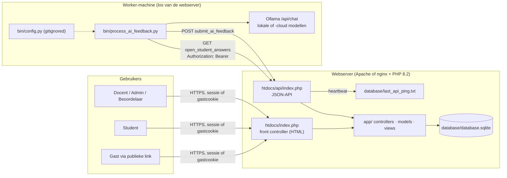
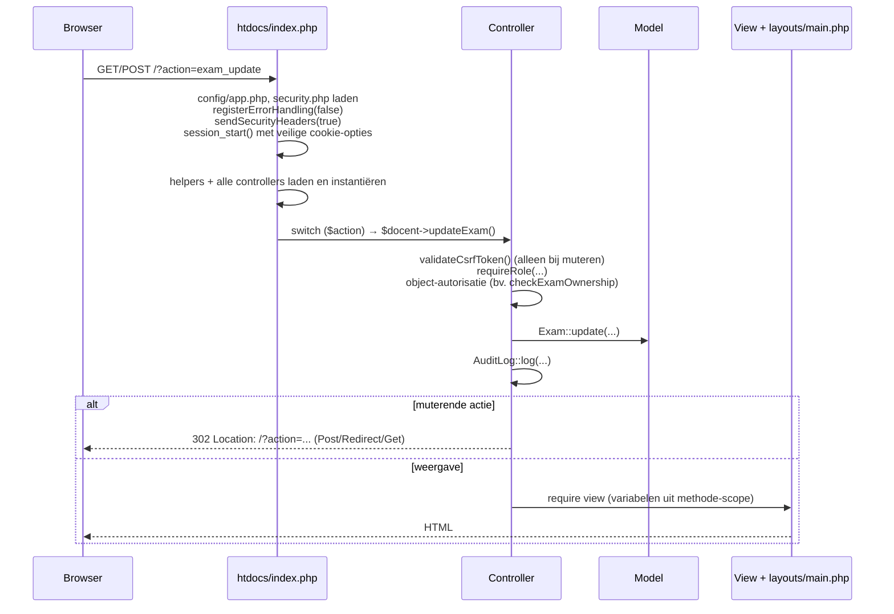
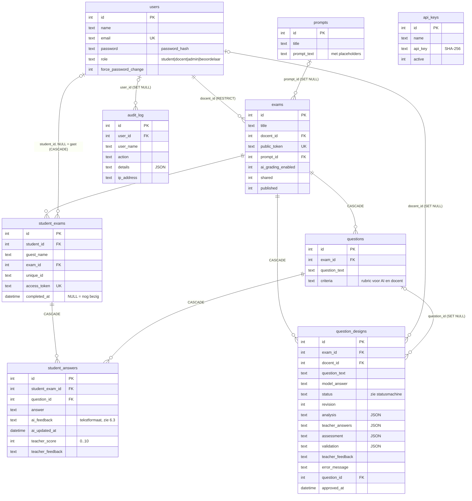
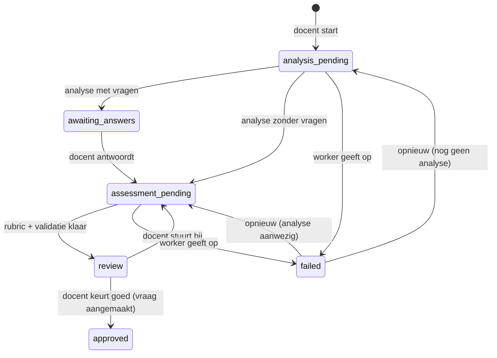
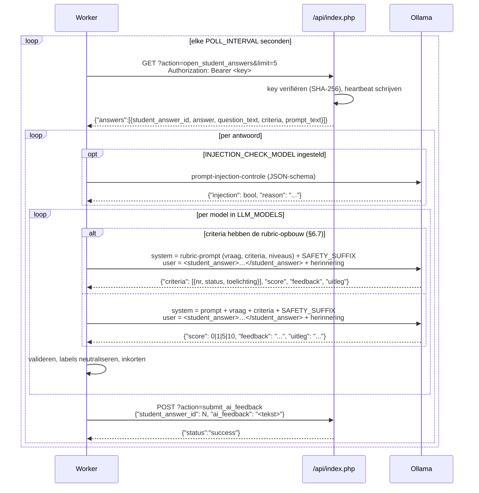
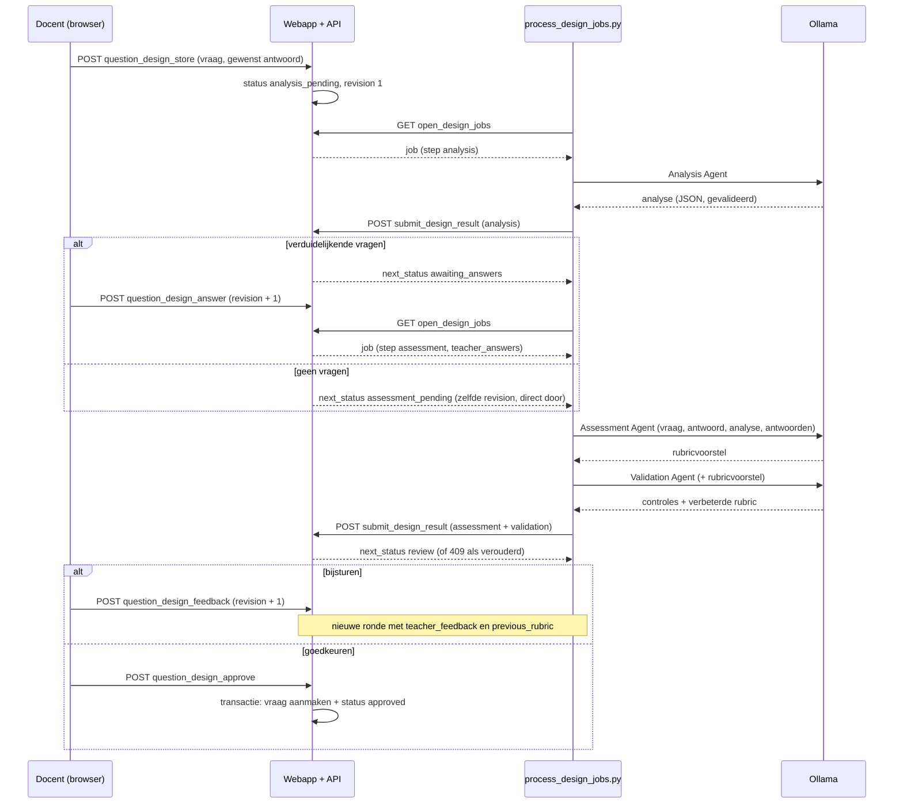

# Architectuur — genai-open-assessment

Dit document beschrijft hoe de applicatie is opgebouwd, welke afspraken (contracten) er tussen de onderdelen gelden en hoe je de opzet hergebruikt: voor een nieuwe feature-branch of als blauwdruk voor een nieuwe applicatie.

- Wat de applicatie inhoudelijk doet en waarom: [README.md](README.md)
- Hoe gebruikers ermee werken: [MANUAL.md](MANUAL.md)
- Werkafspraken voor Claude Code: [CLAUDE.md](CLAUDE.md)

---

## 1. Systeemoverzicht

De applicatie bestaat uit **twee los gedeployde componenten** die alleen via een kleine HTTP/JSON-API met elkaar praten:

| Component | Taal / runtime | Locatie | Verantwoordelijkheid |
|---|---|---|---|
| **Webapplicatie** | PHP 8.2, SQLite (PDO), Bootstrap 5 | `htdocs/`, `app/`, `config/`, `setup/` | Gebruikers, toetsen, vragen, afname, docentbeoordeling, rapportage, API voor de worker |
| **AI-feedbackworker** | Python 3, `requests` | `bin/process_ai_feedback.py` | Haalt ingeleverde antwoorden op, laat ze door één of meer LLM's beoordelen via Ollama, stuurt de feedback terug |
| **AI-ontwerpworker** | Python 3, `requests` | `bin/process_design_jobs.py` + `bin/design_agents.py` | Werkt vraagontwerpen van docenten uit met drie agents (analyse, rubricvoorstel, validatie), zie §6.6 |



Belangrijke ontwerpkeuzes:

- **Geen framework, geen Composer, geen build-stap.** Gewone PHP-bestanden met `require_once`. Dat houdt de deployment simpel: bestanden kopiëren, documentroot op `htdocs/` zetten en klaar.
- **Pull in plaats van push.** De webserver roept nooit een LLM aan. De worker vraagt periodiek om werk. Daardoor blijft de webserver licht, kan de worker op een andere machine draaien (met GPU of met Ollama Cloud) en kan de webserver doorwerken als de worker uitvalt.
- **De database is de wachtrij.** Een antwoord staat "in de wachtrij" zolang `student_answers.ai_feedback` leeg is, de poging is ingeleverd en AI-beoordeling voor de toets aanstaat. Er is geen aparte queue-tabel.
- **De mens beslist.** AI-scores zijn adviezen. De docentscore (`teacher_score`) is leidend voor het eindcijfer.

---

## 2. Mappenstructuur

```
.
├── htdocs/                  # DOCUMENT ROOT: alleen dit is publiek bereikbaar
│   ├── index.php            # Front controller voor alle HTML-pagina's (?action=...)
│   ├── api/index.php        # Front controller voor de JSON-API (worker)
│   ├── style.css            # Huisstijl bovenop Bootstrap (CSS-variabelen in :root)
│   ├── images/, site.webmanifest
├── app/
│   ├── controllers/         # Eén klasse per domein; publieke methode = één action
│   ├── models/              # Statische data-access-klassen (PDO, prepared statements)
│   ├── views/
│   │   ├── layouts/main.php # Enige layout: navbar, flash-berichten, modal, cookiebanner, JS-helpers
│   │   ├── auth/            # Login, registratie, wachtwoord wijzigen
│   │   ├── docent/          # Docent-, beoordelaar- en admin-schermen
│   │   ├── student/         # Student- en gastschermen
│   │   └── pages/           # Statische pagina's (privacy)
│   └── helpers/
│       ├── security.php     # e(), abort(), requestInt/String(), headers + CSP, foutafhandeling
│       ├── csrf.php         # CSRF-token genereren/valideren (POST-only)
│       └── auth.php         # requireLogin(), requireRole(), sessie, wachtwoordbeleid
├── config/
│   ├── app.php              # Beveiligings- en limietconstanten
│   └── database.php         # Database-klasse: PDO-singleton, lichte migraties, default admin
├── setup/
│   ├── schema.sql           # Volledig schema voor een NIEUWE database
│   └── init_db.php          # CLI-only: maakt database/database.sqlite aan vanuit schema.sql
├── database/                # (gitignored) SQLite-bestand + heartbeat; buiten de webroot
├── bin/
│   ├── process_ai_feedback.py  # De AI-worker (beoordeling van studentantwoorden)
│   ├── process_design_jobs.py  # De ontwerp-worker: pollt open_design_jobs, stuurt resultaten terug
│   ├── design_agents.py        # Agents, JSON-schema's, validatie en orchestrator van de vraagontwerper
│   ├── test_design_agents.py   # Mocktests voor design_agents.py (unittest, gemockte call_ollama)
│   ├── fixtures/               # Voorbeelduitvoer van de agents (PLC-voorbeeld) voor tests en curl
│   ├── config.py.sample        # Sjabloon voor bin/config.py (gitignored)
│   ├── dataset_import.py       # Importeert de Mohler ASAG-dataset voor validatie-onderzoek
│   └── README.md
├── docker/                  # Lokale testomgeving (php:8.2-apache), zie docker/README.md
└── docs/                    # Paper, security-review, uitrolhandleiding
```

---

## 3. De webapplicatie

### 3.1 Request-levenscyclus (HTML)

Elke pagina is `/?action=<naam>`. Er is geen URL-rewriting.



De API (`htdocs/api/index.php`) volgt hetzelfde patroon, maar met `registerErrorHandling(true)` (JSON-fouten), `sendSecurityHeaders(false)` (strikte CSP zonder HTML), geen sessie en API-key-authenticatie.

### 3.2 Lagen en conventies

**Config** (`config/app.php`): alleen `const`-waarden (limieten, timeouts, feature-vlaggen zoals `ALLOW_SELF_REGISTRATION`). Geen secrets: de webapp heeft er geen nodig.

**Helpers** (functies, geen klassen):

| Helper | Doel |
|---|---|
| `e($v)` | HTML-escaping voor álle output in views |
| `abort($code, $msg)` | Nette foutpagina + `exit` (nooit `die()`) |
| `requestInt($src, $key)` | Positieve integer of `null` (ids uit `$_GET`/`$_POST`) |
| `requestString($src, $key, $max, $default)` | String (nooit array), afgekapt op `$max` |
| `validateCsrfToken()` | Eist POST (anders 405) en een geldig token (anders 403) |
| `csrfInput()` | Hidden input voor in elk formulier |
| `requireLogin()` | Sessie + idle-timeout + afgedwongen wachtwoordwijziging |
| `requireRole($rol)` | `requireLogin()` + rolcontrole (zie §4) |
| `cspNonce()` | Nonce voor inline `<script>` |
| `csvSafe($v)` | Bescherming tegen formula injection in CSV-exports |
| `appBaseUrl()`, `isHttps()` | Links opbouwen, ook achter een reverse proxy |

**Models** (`app/models/*.php`): klassen met **alleen statische methodes**. Elke methode haalt `Database::connect()` op (singleton-PDO), gebruikt prepared statements en geeft associatieve arrays terug (`PDO::FETCH_ASSOC`). Geen ORM, geen entiteit-objecten.

**Controllers** (`app/controllers/*.php`): één klasse per domein. Een publieke methode komt overeen met één `action`. Vast patroon voor muterende acties:

```php
public function updateThing() {
    validateCsrfToken();                         // 1. POST + CSRF
    requireRole('docent');                       // 2. ingelogd + juiste rol
    $id = requestInt($_POST, 'id');
    $this->checkExamOwnership($id, true);        // 3. mag déze gebruiker dít object wijzigen?
    $title = trim(requestString($_POST, 'title', 255));
    if ($title === '') {                         // 4. invoer valideren
        abort(400, 'Titel is verplicht.');
    }
    Thing::update($id, $title);                  // 5. model
    AuditLog::log('thing_update', ['id' => $id]);// 6. audit trail
    header('Location: /?action=things');         // 7. Post/Redirect/Get
    exit;
}
```

Gebruikersfouten die geen `abort()` rechtvaardigen gaan via een flash-bericht: `$_SESSION['error'] = '...'` of `$_SESSION['success_message'] = '...'` plus een redirect. De layout toont en wist ze.

**Views** (`app/views/**.php`): gewone PHP-templates die de variabelen uit de controllermethode gebruiken. Elke view vangt zijn eigen output op en geeft die aan de layout:

```php
<?php ob_start(); ?>
<h2><?= e($title) ?></h2>
<form action="/?action=<?= e($action) ?>" method="post">
    <?= csrfInput() ?>
    ...
</form>
<script nonce="<?= e(cspNonce()) ?>"> /* alleen met nonce */ </script>
<?php
$content = ob_get_clean();
$breadcrumbs = ['Dashboard' => '/?action=docent_dashboard', $title => ''];
require __DIR__ . '/../layouts/main.php';
```

Variabelen die de layout gebruikt: `$content`, `$title`, `$breadcrumbs` (label ⇒ url, lege url = huidige pagina), `$hideHeaderFooter` (bv. tijdens de toetsafname) en `$isGuest`.

Voor aanmaken en bewerken wordt **één formulier** gedeeld (`*_form.php`). De controller zet `$action` (`exam_store` of `exam_update`), `$title` en het object (`null` bij nieuw).

**Client-side conventies** (in `layouts/main.php`):

- **`data-confirm="Vraag?"` op een `<a>`** toont een bevestigingsmodal en verstuurt de link daarna als **POST met CSRF-token**. Zo werken alle verwijder-, toggle- en dupliceerlinks. Een gewone GET naar een muterende action geeft 405.
- `data-confirm` op een submitknop toont de modal vóór het verzenden.
- `data-copy-target="<id>"` kopieert de waarde van een input naar het klembord. `data-select-on-click` selecteert de inhoud.
- De CSP staat **geen inline event handlers** (`onclick=...`) toe en geen scripts zonder nonce. Externe scripts mogen alleen van `cdn.jsdelivr.net` of `cdnjs.cloudflare.com`, en altijd met `integrity` (SRI).

### 3.3 Routes

Alle routes staan in de `switch` van [htdocs/index.php](htdocs/index.php). Per controller:

| Controller | Actions | Minimale rol |
|---|---|---|
| `AuthController` | `login`, `do_login`, `logout`, `register`, `do_register`, `change_password`, `do_change_password` | publiek / ingelogd |
| `DocentController` | `docent_dashboard`, `exam_*` (create/store/edit/update/delete/duplicate), `questions`, `question_*`, `exam_results`, `exam_comparison`, `exam_comparison_export`, `view_student_answers`, `delete_student_exam`, `update_guest_name`, `audit_log` | docent |
| | `grade_student_exam`, `save_teacher_feedback`, `pending_assessments` | beoordelaar |
| | `clear_audit_log` | admin |
| `StudentController` | `students`, `student_create`, `student_store`, `student_delete` (gebruikersbeheer, alle rollen) | admin |
| | `student_edit`, `student_update` (eigen profiel, of iedereen als admin) | ingelogd |
| `StudentExamController` | `student_dashboard`, `exams_list` | student |
| | `start_exam`, `my_exams` | ingelogd |
| | `guest`, `guest_start`, `guest_logout`, `take_exam`, `submit_exam`, `student_view_results` | ingelogd **of** gast met geldig token |
| `QuestionDesignController` | `question_design_create`, `question_design_store`, `question_design_view`, `question_design_answer`, `question_design_feedback`, `question_design_approve`, `question_design_retry`, `question_design_delete` (alleen eigenaar van de toets of admin) | docent |
| `ApiKeyController` | `api_keys`, `api_key_create`, `api_key_toggle`, `api_key_delete` | admin |
| `PromptController` | `prompts`, `prompt_*`, `prompt_help` | admin |
| (direct in router) | `privacy` | publiek |

> `StudentController` beheert ondanks de naam **alle** gebruikers, niet alleen studenten. De views daarvoor staan in `views/docent/student_*.php`.

---

## 4. Rollen en autorisatie

### 4.1 Rollen

Een gebruiker heeft precies één rol. De lijst staat op meerdere plekken die gelijk moeten blijven: de `CHECK`-constraint in `setup/schema.sql`, `validRoles()` in `auth.php`, de hiërarchie in `requireRole()`, de navigatie in `layouts/main.php` en de redirect-per-rol in `AuthController`, `StudentController` en `StudentExamController`.

| Rol | Komt door `requireRole(...)` voor | Startpagina na login |
|---|---|---|
| `admin` | alles | `docent_dashboard` |
| `docent` | `docent`, `beoordelaar` | `docent_dashboard` |
| `beoordelaar` | `beoordelaar` | `pending_assessments` |
| `student` | `student` | `student_dashboard` |
| *gast* (geen account) | n.v.t.: toegang via tokens | toetsafname |

### 4.2 Autorisatie op objectniveau (toetsen)

Een rolcheck is niet genoeg: ook moet worden bepaald of de gebruiker *deze* toets mag zien of wijzigen. Dat gebeurt in `DocentController`:

| Handeling | Wie mag | Functie |
|---|---|---|
| Inzien (vragen, resultaten, vergelijking, export) | eigenaar, admin, of iedere docent als `shared = 1` | `checkExamOwnership($id)` |
| Wijzigen (toets, vragen, dupliceren, poging verwijderen, gastnaam) | eigenaar of admin | `checkExamOwnership($id, true)` |
| Beoordelen (docentscore) | admin, beoordelaar (alle toetsen), docent bij eigen of gedeelde toets | `checkGradingPermission($examId)` |
| Starten (ingelogd) | admin: alles; docent: eigen, gedeeld of gepubliceerd; student: alleen `published = 1` | `StudentExamController::startExam()` |

Autoriseer altijd op basis van data uit de database (bijvoorbeeld `StudentAnswer::findWithExam($id)` → `exam_id`), nooit op basis van ids die de client meestuurt.

### 4.3 Gasttoegang

Gasten hebben geen account. Hun toegang loopt via twee tokens:

1. **`exams.public_token`** (32 hex): zit in de deelbare link `/?action=guest&token=…`. Werkt los van `published`.
2. **`student_exams.access_token`** (64 hex): wordt bij `guest_start` aangemaakt en opgeslagen in de cookie `guest_access_token` (HttpOnly, SameSite=Strict, `GUEST_COOKIE_LIFETIME`). Daarnaast houdt de cookie `guest_history` (JSON, maximaal 20 tokens) eerdere pogingen bij, zodat de gast resultaten kan terugzien.

Komt een token in de URL binnen (bijvoorbeeld via de deellink die de docent kopieert), dan zet `absorbUrlToken()` het in de cookie en redirect naar dezelfde URL zónder token. Zo blijft het niet in logs of browsergeschiedenis staan.

Een gastpoging herken je aan `student_exams.student_id IS NULL`.

### 4.4 Overige beveiligingsmaatregelen

- **Sessie:** cookie met HttpOnly, SameSite=Strict en Secure (ook achter een proxy via `X-Forwarded-Proto`). `session_regenerate_id()` bij login en bij een wachtwoordwijziging. Na `SESSION_IDLE_TIMEOUT` volgt automatisch uitloggen.
- **Wachtwoorden:** `password_hash()`, minimaal `PASSWORD_MIN_LENGTH` tekens met een letter en een cijfer. Wie het eigen wachtwoord wijzigt, moet het huidige opgeven.
- **Rate limiting gebeurt via de audit log:** `AuditLog::countRecent()` telt recente `login_failed`- en `guest_start`-regels per IP of e-mailadres. Wie de audit log leegmaakt, zet dus ook de lockouts terug.
- **Headers:** centraal in `sendSecurityHeaders()`: CSP met nonce, `nosniff`, `X-Frame-Options`, `Referrer-Policy`, `Permissions-Policy`, HSTS (alleen over HTTPS).
- **Foutafhandeling:** `registerErrorHandling()` logt exceptions server-side en toont de gebruiker alleen een generieke 500-melding.
- De volledige security-review en de status per bevinding staan in [docs/security-issues.txt](docs/security-issues.txt).

---

## 5. Datamodel

SQLite, bestand `database/database.sqlite` (buiten de webroot en gitignored). Foreign keys worden per verbinding aangezet (`PRAGMA foreign_keys = ON`) en zijn dus echt van kracht.



**Toestanden van een antwoord:**

| Toestand | Voorwaarde |
|---|---|
| Concept (student bezig) | `student_exams.completed_at IS NULL` |
| Wacht op AI | ingeleverd, `exams.ai_grading_enabled = 1`, `ai_feedback` leeg |
| AI-beoordeeld | `ai_feedback` gevuld |
| Wacht op docent | ingeleverd, `teacher_score IS NULL` (zie `pending_assessments`) |
| Docent-beoordeeld | `teacher_score` gevuld |

**Statusmachine van een vraagontwerp** (`question_designs.status`, constanten in `QuestionDesign`; bewust geen `CHECK` in het schema):



Elke overgang is één `UPDATE … WHERE id = ? AND status = ? AND revision = ?`. Docentacties die nieuw werk opleveren (antwoorden, bijsturen, opnieuw) verhogen `revision`; de worker stuurt de revision van zijn job terug, zodat een verouderd resultaat niets overschrijft. De `*_pending`-statussen zijn de wachtrij van de ontwerp-worker.

Bijzonderheden:

- **Wijzigt de prompt van een toets, dan wordt alle AI-feedback van die toets gewist** (`StudentAnswer::clearAiFeedbackByExam`). De worker beoordeelt daarna alles opnieuw.
- **Dupliceren** kopieert de vragen, pogingen en antwoorden **met** docentscores en **zonder** AI-feedback. De kopie is niet gedeeld en niet gepubliceerd. Vraagontwerpen worden bewust niet gekopieerd.
- Het eindcijfer is het gemiddelde van de `teacher_score`s. Per AI-model wordt apart een gemiddelde berekend, alleen ter vergelijking.

### 5.1 Schemawijzigingen (migraties)

Er is geen migratietool. Er zijn twee paden, en **beide moeten worden bijgewerkt**:

1. **Nieuwe database:** `setup/schema.sql` (wordt uitgevoerd door `setup/init_db.php`, ook in de Docker-entrypoint).
2. **Bestaande database:** `Database::migrate()` in [config/database.php](config/database.php). Die draait bij elke verbinding en moet idempotent zijn: eerst controleren (bijvoorbeeld met `PRAGMA table_info(...)`), dan pas `ALTER TABLE` of `CREATE TABLE IF NOT EXISTS`.

Kies voor nieuwe kolommen een default die voor bestaande rijen veilig is. Zo kreeg `published` de waarde `0`, zodat bestaande toetsen niet ongemerkt zichtbaar werden.

---

## 6. De AI-pipeline

### 6.1 Verloop



### 6.2 API-contract (webapp ↔ worker)

| | |
|---|---|
| Endpoint | `/api/index.php?action=<naam>` |
| Authenticatie | `Authorization: Bearer <64 hex>` of `X-Api-Key: <64 hex>`. **Nooit** in de query string. |
| Opslag van de key | SHA-256-hash in `api_keys`. De ruwe key wordt één keer getoond bij het aanmaken. Oude keys die nog in platte tekst staan, worden bij het eerste gebruik automatisch gehasht. |
| Fout bij authenticatie | `401`, header `WWW-Authenticate: Bearer`, regel `api_auth_failed` in de audit log |
| `GET open_student_answers` | optioneel `limit` (1–100) → `{"answers": [...]}`. Schrijft `database/last_api_ping.txt`. |
| `POST submit_ai_feedback` | JSON-body `{"student_answer_id": int, "ai_feedback": string}`. Maximaal `MAX_AI_FEEDBACK_LENGTH` tekens. Antwoorden: `200`, `400`, `404`, `405` of `413`. |
| `GET open_design_jobs` | optioneel `limit` (1–10, standaard 3) → `{"jobs": [{design_id, revision, step: "analysis"\|"assessment", question_text, model_answer, analysis\|null, teacher_answers: [{question, why, answer}], teacher_feedback, previous_rubric\|null}]}`. Schrijft `database/last_design_ping.txt`. Zie §6.6. |
| `POST submit_design_result` | JSON-body `{"design_id", "revision", "step", "result": {…}}` of `{…, "error": "reden"}`, maximaal `MAX_DESIGN_RESULT_LENGTH` bytes. Bij `analysis` is `result` de analyse, bij `assessment` `{"assessment": {…}, "validation": {…}}`. Antwoorden: `200 {"status":"success","next_status":"…"}`, `400` (ongeldig, ook als de uitvoer niet door de normalisatie komt), `404`, `405`, `409` (status, stap of revision klopt niet meer: verouderd resultaat) of `413`. |
| Foutformaat | `{"error": "..."}` |

**Heartbeat:** de layout toont "Parser Actief" als `last_api_ping.txt` jonger is dan 120 seconden. De ontwerppagina meldt dat de AI-ontwerpassistent niet actief is als `last_design_ping.txt` ouder is dan 120 seconden terwijl een ontwerp wacht.

### 6.3 Contract: het tekstformaat van `ai_feedback`

De worker slaat de feedback van alle modellen op als **één tekstveld**. De webapp haalt de scores daar met een regex weer uit:

```
[optioneel] WAARSCHUWING: dit antwoord bevat mogelijk instructies aan de AI ...

Model: gpt-oss:20b-cloud
Tijdsduur: 3.21s
Aantal punten: 5
Feedback: <tekst>

Model: gpt-oss:120b-cloud
...
```

Bij een rubric-beoordeling (§6.7) volgt onder `Feedback:` een blok `Criteria:` met per criterium een regel `- <naam> (<gewicht>): voldaan|deels voldaan|niet voldaan. <toelichting>`, en eventueel een regel dat de score van 10 naar 5 is verlaagd. De regex leest daar niets uit; criteriumnamen en toelichtingen gaan ook door `clean_output_text()`.

```php
preg_match_all('/Model:\s+(.+?)\s+.*?Aantal punten:\s+(\d+)/is', $ai_feedback, $m, PREG_SET_ORDER);
```

Deze regex komt op vijf plekken voor: `DocentController` (`viewStudentAnswers`, `compareExamResults`, twee keer in `exportExamComparison`) en `StudentExamController::viewResults`.

**Regels:**

- Wijzig de labels `Model:`, `Tijdsduur:`, `Aantal punten:` en `Feedback:` alleen samen met álle regex-plekken.
- `clean_output_text()` in de worker maakt deze labels in modeluitvoer onschadelijk (`Model -`), zodat een model of een student via de feedbacktekst geen extra scores kan "injecteren". Laat die stap staan.
- Als een antwoord na `MAX_ATTEMPTS` pogingen niet te beoordelen is, slaat de worker een tekst zonder `Model:`-blokken op. Dat antwoord telt dan voor geen enkel model mee.
- Op termijn is gestructureerde opslag beter (zie §9).

### 6.4 Prompting en verdediging tegen prompt injection

- **Prompttemplate:** bij rubric-criteria `RUBRIC_SYSTEM_PROMPT` (§6.7). Anders het `prompt_text` van de toets (tabel `prompts`), of `DEFAULT_SYSTEM_PROMPT`. De placeholders `{{question_text}}` en `{{criteria}}` worden ingevuld. `{{student_answer}}` wordt **niet** door het antwoord vervangen maar door een verwijzing naar het gebruikersbericht.
- **Rolscheiding:** het studentantwoord staat uitsluitend in het *user*-bericht, tussen `<student_answer>`-tags (die tags worden eerst uit het antwoord gefilterd) en afgekapt op `MAX_ANSWER_CHARS`. Na het antwoord volgt een herinnering (`GRADING_REMINDER`, de "sandwich").
- **Afgedwongen output:** het Ollama-`format` krijgt een JSON-schema mee (score als enum `{0,1,5,10}`, tekstvelden met `maxLength`). Daarna valideert `validate_feedback()` de uitvoer nogmaals, want cloud-modellen houden zich niet altijd aan het schema. Bij ongeldige JSON volgen tot `JSON_RETRY_ATTEMPTS` correctiepogingen. Raakt het tokenbudget op aan het denken, dan wordt `num_predict` verdubbeld (tot `NUM_PREDICT_MAX`).
- **Voorcontrole (optioneel):** `INJECTION_CHECK_MODEL` beoordeelt eerst of het antwoord instructies aan de AI bevat. Is dat zo, dan krijgt de feedback een waarschuwing en wordt de AI-score met `INJECTION_ZERO_SCORE` op 0 gezet. De originele score blijft zichtbaar in de tekst. De docentscore wordt nooit aangeraakt.
- **Per modelfamilie:** `THINK_LEVELS` en `SAMPLING_OPTIONS` regelen het denkgedrag en gaan herhalingslussen tegen (bijvoorbeeld bij qwen3 en gpt-oss).

### 6.5 Worker-configuratie

`bin/config.py` is gitignored en staat op de **worker-machine**, die niet dezelfde machine hoeft te zijn als de webserver of je ontwikkelmachine. Verplichte waarden: `API_KEY`, `BASE_URL`, `OLLAMA_URL`, `LLM_MODELS` en `POLL_INTERVAL`. Alle andere instellingen leest de worker met `getattr(config, "NAAM", default)`, zodat een oudere `config.py` blijft werken. Buiten localhost moet `BASE_URL` met `https://` beginnen (anders stopt de worker), tenzij `ALLOW_INSECURE_BASE_URL = True`.

### 6.6 De vraagontwerper (agentic)

Een docent voert een vraag en het gewenste antwoord in; drie agents werken die uit tot een rubric, en de docent stuurt bij of keurt goed. Pas bij goedkeuring ontstaat een gewone rij in `questions` (`question_text` + `criteria` als platte tekst, via `QuestionDesign::rubricToCriteriaText()`). De beoordelingsworker herkent die opbouw en beoordeelt dan per criterium (§6.7); de scores in contract 1 (`ai_feedback`) en de scoreschaal blijven gelijk.

- **Waar het draait:** de webserver roept geen LLM aan. De orchestrator en de agents draaien in een eigen worker-proces (`bin/process_design_jobs.py`), los van de beoordelingsworker, zodat een docent die interactief wacht niet achter de wachtrij met studentantwoorden aansluit. `design_agents.py` bevat geen netwerkcode richting de webapp en hergebruikt `call_ollama()` (met een eigen `num_ctx`) uit `process_ai_feedback.py`.
- **Agents:** *Analysis* (essentiële elementen, duidelijkheid, mismatch tussen vraag en antwoord, issues, 0–5 verduidelijkende vragen met *waarom*), *Assessment* (1–6 criteria *essentieel*/*aanvullend*, niveaus 10/5/1/0 in termen van de criteria, alternatieve antwoorden) en *Validation* (zes controles, verbeterde rubric, wijzigingen met *waarom*, optioneel een betere vraagtekst). De schaal is holistisch: geen punten per criterium.
- **Eén doorloop per ronde:** zonder verduidelijkende vragen gaat de orchestrator direct door naar Assessment en Validation (zelfde revision). Er zijn geen automatische lussen.
- **Contract 6 (JSON-vormen):** de vormen en limieten (tekstvelden ≤ 800 tekens, lijsten met een maximum, `checks` precies zes) staan aan beide kanten: `validate_*()` in de worker en `QuestionDesign::normalize*()` in PHP. Houd ze gelijk.
- **Invoer als data:** alle docenttekst gaat als gelabelde blokken (`<vraag>`, `<gewenst_antwoord>`, `<analyse>`, `<antwoorden_docent>`, `<feedback_docent>`, `<vorige_rubric>`, `<rubricvoorstel>`) in het user-bericht; blokmarkeringen in de inhoud worden eerst verwijderd.



**Robuustheid:** de worker telt pogingen per `(design_id, revision, step)` en stuurt na `DESIGN_MAX_ATTEMPTS` een `error` in (status `failed`, de docent kan opnieuw proberen). Starten is begrensd met `DESIGN_START_MAX_PER_HOUR` per docent (via de audit log), bijsturen met `DESIGN_MAX_REVISIONS`.

### 6.7 Beoordelen met de rubric

De rubric van de vraagontwerper komt als platte tekst in `questions.criteria`, zodat de docent hem bij goedkeuren en later in "Vraag bewerken" vrij kan aanpassen. `parse_rubric_criteria()` in `process_ai_feedback.py` herkent die opbouw (**contract 7**):

```
Modelantwoord:                         (optioneel)
<tekst>

Beoordelingscriteria:
- [essentieel] <naam>: <beschrijving>
- [aanvullend] <naam>: <beschrijving>

Puntentoekenning:
10 punten: <tekst>
5 punten: <tekst>
1 punt: <tekst>
0 punten: <tekst>

Ook correct:                           (optioneel)
- <tekst>
```

- **Herkend:** 1–10 criteria met een geldig gewicht en elk niveau precies één keer. Vervolgregels (een afgebroken regel) horen bij het vorige item, `\r\n` uit een textarea mag. Tekst vóór het eerste kopje, een dubbel kopje of een onbekende regel betekent: geen rubric. Er geldt dan de gewone beoordeling met de tekst als `{{criteria}}`, dus er gaat nooit iets verloren.
- **Beoordeling:** `RUBRIC_SYSTEM_PROMPT` zet vraag, modelantwoord, genummerde criteria, alternatieven en niveaus in het systeembericht. Het JSON-schema (`rubric_feedback_schema()`) zet `criteria` vóór `score`: het model oordeelt eerst per criterium (`voldaan`/`deels`/`niet`, met toelichting) en kiest dan de score. Een custom prompt van de toets wordt hier niet gebruikt, omdat die een eigen puntentoekenning heeft.
- **Validatie:** `validate_rubric_feedback()` eist elk criterium precies één keer. Cloud-modellen dwingen `minItems` niet af; bij een onvolledig oordeel volgt `RUBRIC_RETRY_ATTEMPTS` keer een gerichte correctie. Een 10 terwijl een essentieel criterium niet volledig voldaan is, wordt een 5 (de rubric eist alle essentiële criteria voor 10).
- **Instellingen:** `RUBRIC_GRADING` (uitzetten = altijd de oude beoordeling) en `RUBRIC_NUM_CTX` (ruimer contextvenster, want de rubric is lang).
- **Tests:** `bin/test_rubric_grading.py` (gemockte `call_ollama`). De fixture `bin/fixtures/criteria_rubric.txt` is de echte uitvoer van `rubricToCriteriaText()`; maak hem opnieuw aan als dat formaat verandert (zie `bin/README.md`).

---

## 7. Deployment

| Omgeving | Hoe |
|---|---|
| **Lokaal testen** | `./docker/start.sh` start `php:8.2-apache` op poort 8080 met de documentroot op `htdocs/`. De database staat in volume `db_data`, en de entrypoint draait `init_db.php` als er nog geen database is. **De code wordt bij het bouwen in de image gekopieerd** (geen bind mount), dus na elke wijziging opnieuw bouwen. Met `docker compose down -v` (in `docker/`) begin je met een schone database. Standaardlogin: `admin@school.nl` / `admin123` (bij de eerste login moet het wachtwoord worden gewijzigd). |
| **Productie (web)** | nginx + PHP-FPM, documentroot `htdocs/`, map `database/` schrijfbaar voor de webgebruiker. Zorg dat de `Authorization`-header PHP bereikt (`fastcgi_param HTTP_AUTHORIZATION $http_authorization;`). Werkwijze: [docs/rollout-new-version.md](docs/rollout-new-version.md). |
| **Productie (worker)** | Een aparte machine met Python 3, `requests` en een draaiende Ollama. Voor cloud-modellen eenmalig `ollama signin`. Daarna `python process_ai_feedback.py` in `bin/`, en voor de vraagontwerper als tweede proces `python process_design_jobs.py` (zie [docs/rollout-agentic-design.md](docs/rollout-agentic-design.md)). |

Breekt een wijziging het API-contract, het feedbackformaat of de authenticatie, dan moeten webapp en worker **tegelijk** worden bijgewerkt. Bouw daarom een overgangsweg in (zoals `LEGACY_API_KEY_IN_QUERY`) en beschrijf de uitrol, met terugdraaiscenario, in `docs/`.

---

## 8. Recepten

### 8.1 Nieuwe pagina of actie toevoegen

1. **Model:** voeg een statische methode toe aan het juiste model in `app/models/` (prepared statement, `FETCH_ASSOC`).
2. **Controller:** voeg een publieke methode toe in de passende controller. Volg het patroon uit §3.2: CSRF (bij muteren), rol, object-autorisatie, invoer via `requestInt`/`requestString`, model, `AuditLog::log()` en een redirect.
3. **Route:** voeg een `case 'mijn_actie':` toe aan de `switch` in `htdocs/index.php`.
4. **View:** maak `app/views/<gebied>/<naam>.php` met `ob_start()` en de layout, gebruik `e()` voor alle output en `csrfInput()` in formulieren.
5. **Navigatie:** link toevoegen in `layouts/main.php`, binnen het juiste rolblok.
6. **Muterende links** krijgen `data-confirm`, of worden een formulier met `method="post"`.
7. Werk [MANUAL.md](MANUAL.md) bij als het gebruikersgedrag verandert.

### 8.2 Nieuwe kolom of tabel

1. Pas `setup/schema.sql` aan (met commentaar per kolom en een expliciete `ON DELETE`).
2. Voeg een idempotente stap toe aan `Database::migrate()`.
3. Pas de model-queries aan, inclusief `Exam::duplicate()` als het om toetsdata gaat.
4. Test met een **nieuwe** database (`docker compose down -v`) en met een **bestaande** database.

### 8.3 Nieuw API-endpoint voor de worker

1. Voeg een methode toe aan `ApiController`. Begin met `$this->verifyApiKey()` en valideer de invoer zoals in `submitAiFeedback()`. Antwoorden en fouten zijn altijd JSON.
2. Voeg een `case` toe in `htdocs/api/index.php`.
3. Laat de worker de key via `API_HEADERS` meesturen en `api_params()` gebruiken.
4. Leg het endpoint vast in §6.2 van dit document en in `bin/README.md`.

### 8.4 Nieuwe worker-instelling

1. Lees de instelling in `process_ai_feedback.py` met `getattr(config, "NAAM", veilige_default)`, en nooit met `from config import NAAM`.
2. Voeg de instelling met uitleg toe aan `bin/config.py.sample` en `bin/README.md`.
3. Vermeld in de PR of release notes dat de `config.py` op de worker-machine aangepast kan of moet worden.

### 8.5 Nieuwe rol

Pas alle plekken uit §4.1 aan: de schema-`CHECK` (in SQLite betekent dat de tabel opnieuw opbouwen in `migrate()`), `validRoles()`, `requireRole()`, de navigatie, de drie redirect-per-rol-functies en de rolkeuze in `student_form.php`.

---

## 9. Bekende technische schuld

Weet dat deze punten bestaan voordat je in de buurt iets wijzigt. Los ze bij voorkeur op in een eigen branch.

| Punt | Waar | Gevolg |
|---|---|---|
| Geen geautomatiseerde tests | hele repo | Controleren gebeurt handmatig (zie CLAUDE.md) |
| AI-scores als tekst opgeslagen en met een regex uitgelezen | 5 plekken, zie §6.3 | Formaatwijziging is foutgevoelig. Gestructureerde opslag staat nog open (S-18). |
| Score-aggregatie gedupliceerd | `DocentController::viewStudentAnswers`, `StudentExamController::viewResults`, `compareExamResults`, `exportExamComparison` | Wijzigingen moeten op elke plek worden doorgevoerd |
| Losse SQL in controllers | `StudentController`, `DocentController` (`pendingAssessments`, `auditLog`, vergelijking) | Niet alle data-access zit in de models |
| Ongebruikte bestanden | views `exam_create.php`, `exam_edit.php`, `question_create.php`, `question_edit.php`, `student_create.php`, `student_edit.php`; model `Student.php` | Niet bewerken in de veronderstelling dat ze live zijn. De actieve formulieren zijn `*_form.php`. |
| Bestandsnaam wijkt af van de klassenaam | `models/Questions.php` bevat `class Question` | Let op bij `require_once` |
| Gemengde redirect-stijl | `index.php?action=` en `/?action=` door elkaar | Gebruik in nieuwe code `/?action=` |
| Veld `uitleg` niet opgeslagen | worker: `process_answer()` gebruikt alleen `feedback` | Het model genereert het wel, maar het gaat verloren |
| Pogingenteller van de worker staat in het geheugen | `run()` → `attempts` (beide workers) | Bij een herstart begint de teller opnieuw |
| Eén ontwerp-worker tegelijk | `process_design_jobs.py`, geen claim-mechanisme | Twee workers doen dubbel werk; de `revision`-controle (409) voorkomt wel dat er iets wordt overschreven |
| Geen geschiedenis per ontwerpronde | `question_designs` overschrijft `analysis`, `assessment` en `validation` | Eerdere rondes zijn alleen via de audit log (`question_design_feedback`) na te gaan |
| Rubric als platte tekst in `questions.criteria` | `QuestionDesign::rubricToCriteriaText()` ↔ `parse_rubric_criteria()` | De worker leidt de structuur uit de tekst af (contract 7, §6.7). Een docent die de opbouw loslaat, valt zonder melding terug op de gewone beoordeling |
| Rolwijziging pas na opnieuw inloggen actief | sessie bevat `role` | Admin moet de gebruiker laten herinloggen |
| Publieke gastlink zonder vervaldatum of uitschakelknop | `exams.public_token` | Openstaand punt S-08 |

---

## 10. Deze opzet als blauwdruk

### 10.1 Voor een nieuwe branch

1. Tak af van `main` en volg de bestaande naamgeving: `dev/<onderwerp>` of `dev-<onderwerp>`.
2. Bepaal vooraf welke component(en) je raakt:
   - **Alleen web** of **alleen worker:** zelfstandig uit te rollen.
   - **Contract** (API, `ai_feedback`-formaat, authenticatie, schema): webapp en worker moeten tegelijk mee. Plan backwards compatibility en een uitrolbeschrijving in `docs/`.
3. Volg de recepten in §8 en de conventies in §3.2.
4. Doorloop vóór de merge de checklist in [CLAUDE.md](CLAUDE.md#checklist-voor-een-merge-naar-main).

### 10.2 Voor een nieuwe applicatie

De opzet is herbruikbaar voor elke kleine, rolgebaseerde webapplicatie met een achtergrondverwerker. Neem deze bouwstenen ongewijzigd of bijna ongewijzigd over:

| Bouwsteen | Bestanden | Aanpassen |
|---|---|---|
| Front controller + routing | `htdocs/index.php` | `switch` met eigen actions |
| Beveiligingshelpers | `app/helpers/security.php`, `csrf.php`, `auth.php` | CSP-bronnen, rollen in `requireRole()`/`validRoles()` |
| Configuratie | `config/app.php` | Eigen limieten en vlaggen |
| Databasetoegang + migraties | `config/database.php`, `setup/` | Eigen schema, default admin |
| Authenticatie + gebruikersbeheer | `AuthController`, `StudentController` (hernoem naar `UserController`), `User`-model, `views/auth/` | Rollen en startpagina's |
| Audit log + rate limiting | `AuditLog`-model, `audit_log`-tabel en -view | Eigen action-namen |
| API-keys voor machine-tot-machine | `ApiKey`-model, `ApiKeyController`, `api_keys`-view, `ApiController::verifyApiKey()` | Ongewijzigd |
| Layout + client-helpers | `views/layouts/main.php`, `htdocs/style.css` | Navigatie, huisstijl (`--brand-*`-variabelen), logo |
| Achtergrondworker | `htdocs/api/index.php`, `ApiController`, `bin/process_ai_feedback.py` (patroon: poll → verwerk → terugschrijven, `config.py` + sample, heartbeat) | Eigen "wachtrij"-query en verwerking |
| Lokale testomgeving | `docker/` | Image-naam, poort |

Stappen:

1. Neem de mappenstructuur uit §2 over en verwijder het domeinspecifieke deel (toetsen, vragen, antwoorden, prompts).
2. Ontwerp het datamodel in `setup/schema.sql`. Houd `users`, `audit_log` en `api_keys` aan en geef elke foreign key een expliciete `ON DELETE`.
3. Leg rollen en de autorisatiematrix vast (zoals §4) **voordat** je controllers schrijft.
4. Bouw per entiteit: model, controller (`index`/`create`/`store`/`edit`/`update`/`delete`), één gedeeld `*_form.php` en routes.
5. Is er zwaar of extern werk (AI, e-mail, conversies), gebruik dan het wachtrijpatroon: een statuskolom in de database, een pull-API met een Bearer-key en een losse worker met een heartbeat.
6. Neem de beveiligingschecklist uit CLAUDE.md integraal over.
7. Schrijf voor de nieuwe applicatie meteen een eigen `ARCHITECTURE.md` en `CLAUDE.md` naar dit model.
