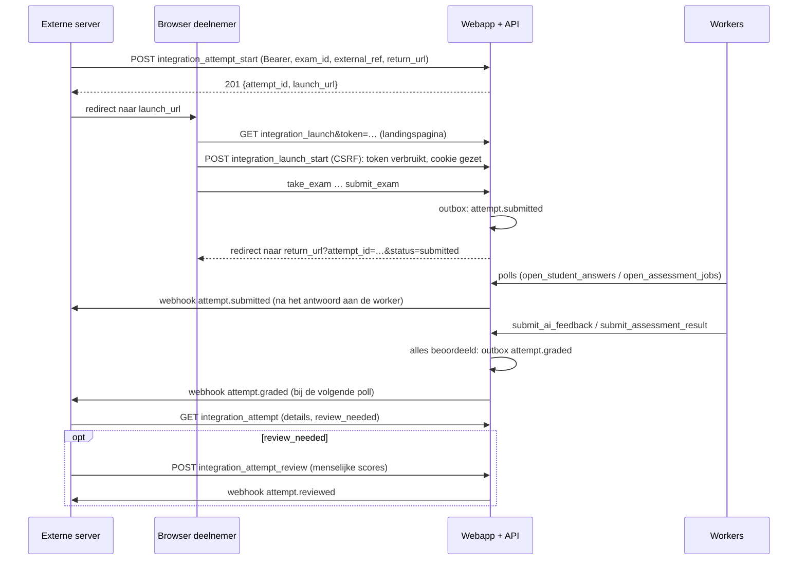

# TASKS: Externe koppeling (toetsen afnemen vanuit een andere website)

Takenlijst voor de branch `dev-external-integration`. De vorige takenlijsten staan in [TASKS-agentic-exam-ai.md](TASKS-agentic-exam-ai.md) (vraagontwerper) en [TASKS-agentic-student-ai.md](TASKS-agentic-student-ai.md) (agentic beoordelen). Het oorspronkelijke idee staat in [IDEAS.md](IDEAS.md).

**Zo gebruik je deze lijst:**

- Lees eerst de [prompt](#prompt-de-opdracht) (wat we bouwen) en de [analyse](#analyse-van-de-prompt) (hoe de vage punten zijn ingevuld).
- Werk de stappen in volgorde af en vink ze af. Elke stap is klein en eindigt waar nodig met een controle (*Klaar als*).
- Commit aan het eind van elke fase (kort, Engels, zoals de bestaande historie).
- Lees vooraf [CLAUDE.md](CLAUDE.md) (verplichte beveiligingspatronen, contracten 1, 2, 3 en 8) en [ARCHITECTURE.md](ARCHITECTURE.md) §4, §6.2 en §6.8. Alles daarin geldt hier ook.

---

## Prompt: de opdracht

> Deze sectie is de uitgewerkte versie van het idee. Je kunt hem als geheel aan een AI-assistent geven. De rest van dit document is de analyse en het plan dat eruit volgt.

**Rol en context.** Je bent een senior PHP-ontwikkelaar die werkt in de repository `genai-open-assessment`: een webapplicatie (PHP 8.2 zonder framework, SQLite, Bootstrap 5) voor toetsen met open vragen. Generatieve AI beoordeelt die vragen vooraf met rubrics. Losse Python-workers doen de AI-beoordeling via een pull-API. Volg [CLAUDE.md](CLAUDE.md) en [ARCHITECTURE.md](ARCHITECTURE.md) strikt.

**Doel.** Een andere website, bijvoorbeeld een leeromgeving of een cursusplatform, moet een toets uit deze applicatie kunnen laten maken door een eigen deelnemer. Die deelnemer heeft hier geen account. De koppeling werkt zo:

1. Een **admin** maakt in deze applicatie een **koppeling** aan voor de externe website. Die bestaat uit een naam, een API-key, een webhook-URL met geheim, het toegestane adres om naar terug te keren en de toetsen die de koppeling mag gebruiken.
2. De **server** van de externe website roept met de API-key een endpoint aan om een **toetspoging te starten** voor een deelnemer. Daarbij geeft hij een eigen referentie (`external_ref`) en een terugkeer-URL mee. Hij krijgt een **eenmalige, kortlevende startlink** terug.
3. De externe website stuurt de deelnemer met die startlink naar deze applicatie. De deelnemer **maakt de toets** in de bestaande afnameschermen, zonder account en zonder toegang tot de rest van de applicatie.
4. Na **definitief inleveren** keert de deelnemer automatisch terug naar de terugkeer-URL van de externe website.
5. De toets wordt **automatisch nagekeken** door de bestaande AI-pipeline: agentic voor rubric-vragen en de AI-feedbackworker voor de overige vragen.
6. De externe website volgt de **status** via **webhooks** (ondertekend met HMAC). Die geven een seintje bij `ingeleverd`, `nagekeken` en `handmatig beoordeeld`. Daarnaast is er een **statusendpoint**, en dat is de bron van waarheid.
7. Is de AI **niet zeker genoeg**, dan meldt de applicatie per poging `review_needed = true`, met de redenen erbij. Dat is het geval als de confidence onder de drempel van de koppeling ligt (standaard: alles wat niet `hoog` is), als de modellen het oneens zijn of als agentic beoordelen menselijke controle vraagt. Een persoon bij de externe website kijkt de poging dan met de hand na. Optioneel stuurt de externe website die **menselijke beoordeling terug**. Die wordt dan de docentscore.
8. Via de API kan de externe website een **lijst van openstaande pogingen** opvragen: nog niet gestart, bezig, wordt nagekeken of wacht op menselijke beoordeling.

**Eisen.**

- **F1** Koppelingen beheren (admin): aanmaken, wijzigen, toetsen koppelen, in- en uitschakelen, webhookgeheim vernieuwen en verwijderen. De API-key en het webhookgeheim worden één keer getoond.
- **F2** API-keys krijgen een **scope**: `worker` (de bestaande keys en workers) of `integration`. Een integratiekey kan nooit bij de worker-endpoints, en een workerkey nooit bij de integratie-endpoints.
- **F3** Endpoints voor de externe server: toetsen opvragen, poging starten (idempotent per `external_ref`), één poging opvragen, een lijst opvragen (filter `open` / `needs_review` / `all`) en een menselijke beoordeling terugmelden.
- **F4** Een startlink is eenmalig en verloopt na `INTEGRATION_LAUNCH_TTL` seconden. De link opent een landingspagina met een knop die een POST doet. Een muterende GET is niet toegestaan.
- **F5** De afname hergebruikt het gastmechanisme (`student_exams.access_token` in de cookie `guest_access_token`). Een koppelingspoging komt niet in `guest_history` en toont geen resultatenpagina. Na het inleveren volgt een redirect naar de terugkeer-URL.
- **F6** De status van een poging wordt afgeleid uit de bestaande data (`completed_at`, `ai_feedback`, `answer_assessments`, `teacher_score`) en niet apart opgeslagen. De confidence en `review_needed` worden deterministisch berekend volgens vaste, gedocumenteerde regels.
- **F7** Webhooks gaan via een outbox-tabel, met at-least-once-aflevering, backoff, een maximum aantal pogingen, een HMAC-SHA256-handtekening met tijdstempel en geen gevolgde redirects. De payload bevat geen toetsinhoud.
- **F8** Docenten zien in de resultaten welke pogingen via een koppeling binnenkwamen (naam van de koppeling en `external_ref`).

**Beveiliging en privacy.** Volg alle patronen uit CLAUDE.md (CSRF, `requireRole`, objectautorisatie, `e()`, prepared statements, audit log, geen inline handlers). Daarnaast geldt:

- Een koppeling ziet alleen haar eigen pogingen. Een poging van een andere koppeling geeft 404, geen 403.
- De terugkeer-URL moet exact overeenkomen met de geregistreerde origin. Dat voorkomt een open redirect.
- Webhook-URL's stelt alleen de admin in, en alleen met `https`. Dat beperkt SSRF.
- Er geldt een rate limit per koppeling.
- De API-key gaat alleen server-to-server en nooit via de browser.
- De terugkeer-URL bevat geen scores. De externe website haalt het resultaat op met de API.

**Randvoorwaarden.**

- Alles is additief. De Python-workers en hun API-contract veranderen niet. Bestaande keys krijgen scope `worker`.
- Een schemawijziging komt in `setup/schema.sql` én in `Database::migrate()`.
- UI-teksten, commentaar en documentatie zijn in het Nederlands, code in het Engels.
- De AI beslist niets definitief. `teacher_score` komt alleen van een mens: een docent hier, of de beoordelaar bij de externe website via het review-endpoint.

**Buiten scope:** LTI 1.3, insluiten in een iframe, tijdslimieten, accounts aanmaken voor externe deelnemers, een eigen webhook-worker of cron, en meerdere webhook-URL's per koppeling.

**Opleveren:** de code, een demo-"externe website" (`docs/integration-demo/demo_site.py`), documentatie voor externe ontwikkelaars (`docs/integration-api.md`), bijgewerkte `MANUAL.md`, `ARCHITECTURE.md`, `CLAUDE.md` (contract 9), `docs/security-issues.txt` en een uitrolbeschrijving.

**Acceptatie:** de demo-site doorloopt de hele flow tegen Docker: starten, maken, inleveren, terugkeren, webhooks `submitted` en `graded`, de open lijst en het terugmelden van een review. Alle negatieve gevallen uit fase 12 geven de verwachte statuscode.

---

## Analyse van de prompt

### Van idee naar eisen

Het idee in [IDEAS.md](IDEAS.md) is kort. Per zin staat hieronder hoe het is ingevuld en waarom.

| Idee | Ingevuld als | Waarom |
|---|---|---|
| "Externe koppeling met API-key" | Een koppeling is een eigen object met een API-key met **scope** `integration` | Nu geeft elke actieve key toegang tot `open_student_answers`, dus tot **alle** studentantwoorden. Zonder scope zou een externe partij alles kunnen lezen. Dit is het belangrijkste beveiligingspunt. |
| "Deze wordt dan aangeroepen en vervolgens maakt deze student de toets" | Server-to-server start, eenmalige startlink, landingspagina en dan de bestaande afname als gastpoging | Het gastmechanisme bestaat al (account-loos, token in een HttpOnly-cookie). Een startlink in plaats van een vaste link voorkomt dat een doorgestuurde link een poging overneemt. |
| "De toets wordt automatisch nagekeken" | Er komt niets nieuws bij; we eisen alleen `ai_grading_enabled = 1` | Agentic (rubric) en de AI-feedbackworker (overige vragen) bestaan al. De koppeling hoeft alleen te weten wanneer alles klaar is. |
| "Via een hook kan de externe website de status tracken" | Webhooks als **seintje**, plus een statusendpoint als bron van waarheid | Webhooks kunnen verloren gaan of dubbel komen. Met het statusendpoint blijft de externe kant altijd correct. |
| "Als de student deze inlevert, dan komt men terug op de pagina" | Redirect naar een terugkeer-URL op een vooraf geregistreerde origin, met `attempt_id`, `external_ref` en `status` | Zonder origin-controle ontstaat een open redirect. Scores staan niet in de URL, omdat die te vervalsen en te lekken zijn. |
| "Als het confident niet hoog scoort … met de hand nakijken" | `review_needed` per antwoord en per poging, met redenen, en een drempel per koppeling (standaard `hoog`) | Agentic beoordelen levert al `confidence` en `human_review_needed`. Voor de gewone AI-feedback bestaat geen confidence, dus die leiden we af uit de overeenstemming tussen modellen (zie B7). |
| "In de externe website zal een persoon … nakijken" | Optioneel review-endpoint: de menselijke score wordt de `teacher_score` | Zo blijft het eindcijfer hier kloppen en blijft de regel "teacher_score komt van een mens" gelden. Zonder scores markeert het endpoint de poging alleen als afgehandeld. |
| "Een lijst … van de openstaande systemen" | Gelezen als "openstaande **pogingen**". `GET integration_attempts?filter=open\|needs_review\|all` | "Systemen" past niet in de context. Bedoeld is vrijwel zeker welke toetsen nog openstaan. Zie [Te bevestigen](#keuzes-die-je-nog-kunt-omdraaien). |

### Wat er al is en wat we hergebruiken

- **Gastpogingen:** `StudentExam::startGuest()` (maakt `access_token`), de cookie `guest_access_token`, `guestHasAccess()`, de afnameschermen en `submitExam()`.
- **API-keys:** de tabel `api_keys` (SHA-256), `ApiKey::findActiveByKey()`, `ApiController::verifyApiKey()` en het admin-scherm `api_keys`.
- **Beoordelen:** `StudentAnswer::aiScores()` (contract 1) en `AnswerAssessment` (`latestByStudentExam()`, `studentSummary()`, `decision.confidence`, `human_review_needed`, `reasons`).
- **Rate limiting:** `AuditLog::countRecent()`.
- **Aanhaakpunten voor "klaar":** `ApiController::submitAiFeedback()` en `submitAssessmentResult()`. Daar komt het laatste AI-resultaat van een poging binnen.

### Wat nieuw is voor deze codebase

- **De webserver doet voor het eerst zelf uitgaande HTTP-verzoeken** (webhooks). Tot nu toe gold "pull in plaats van push". Dat is een bewuste uitzondering, die beperkt is tot URL's die de admin instelt (zie B8 en het documenteren in ARCHITECTURE §1).
- **Een tweede soort API-gebruiker.** Tot nu toe waren alle keys voor de workers.
- **Een flow die van een andere site komt.** Cookies met `SameSite=Strict` worden niet meegestuurd bij een navigatie die op een andere site begint, ook niet na een redirect. Daarom zet de startlink het token pas in de cookie na een POST vanaf onze eigen landingspagina (B4).

### Risico's

| Risico | Maatregel |
|---|---|
| Een externe partij leest alle studentantwoorden via de worker-endpoints | Key-scope (B2). Een integratiekey op een worker-endpoint geeft 403. Dit gebeurt in fase 2, vóór alles wat integratiekeys aanmaakt. |
| Koppeling A ziet de pogingen van koppeling B | Elke query filtert op `integration_id` uit de key. Een poging van een ander geeft 404. |
| Een startlink wordt doorgestuurd of hergebruikt | De link is eenmalig (atomair `launch_used_at`), verloopt na 15 minuten en wordt als hash opgeslagen. |
| Open redirect via de terugkeer-URL | Schema, host en poort moeten gelijk zijn aan `return_origin`. Geen userinfo, maximaal 1000 tekens. |
| SSRF via de webhook-URL | Alleen de admin stelt hem in. Alleen `https` (in de Docker-dev ook `http` naar een vaste lijst hosts), geen redirects volgen, korte timeout, het antwoord wordt niet getoond. |
| Een vervalste webhook bij de externe website | HMAC-SHA256 over `timestamp.body` met een geheim per koppeling. De ontvanger controleert ook de leeftijd van de tijdstempel. |
| Een webhook komt niet aan (externe site plat) | Outbox met backoff en een maximum. Het statusendpoint en de open lijst blijven altijd correct. |
| De deelnemer dwaalt door de applicatie | Een koppelingspoging toont geen resultatenpagina en geen links naar de app, staat niet in `guest_history` en wordt niet hervat via de publieke gastlink. |
| De AI lijkt definitief te beslissen | De statusvelden heten `ai_score` en `review_needed`. `teacher_score` komt alleen van een mens. De documentatie voor externe partijen zegt dit expliciet. |
| Privacy: antwoorden gaan naar een derde partij | Dat is de partij die de deelnemer zelf stuurde, via een geauthenticeerde API. Webhooks bevatten geen inhoud. `display_name` is optioneel (een pseudoniem mag). De privacypagina wordt bijgewerkt. |
| Kosten en misbruik | Rate limit per koppeling (`INTEGRATION_START_MAX_PER_HOUR`). Alleen toetsen die de admin expliciet koppelt. |

### Keuzes die je nog kunt omdraaien

Deze keuzes zijn gemaakt omdat het idee er niets over zegt. Ze staan zo in het plan. Wil je het anders, pas het dan aan vóór fase 1.

1. **"Openstaande systemen" = openstaande pogingen** van de koppeling.
2. **De menselijke beoordeling mag terug** naar deze applicatie (fase 9). Wil je dat niet, laat dan alleen "markeer als afgehandeld" over.
3. **De deelnemer ziet hier geen resultaat.** De externe website bepaalt wat de deelnemer te zien krijgt.
4. **Webhooks worden verstuurd tijdens de polls van de workers** (geen cron). Dat is eenvoudig, met als nadeel dat er geen webhooks gaan als er geen worker draait (zie B8).
5. **Koppelingen beheert de admin**, niet de docent.

---

## Ontwerpbeslissingen

**B1. Een koppeling is een eigen object.** Tabel `integrations` (naam, API-key, webhook-URL en -geheim, `return_origin`, `min_confidence`), plus de koppeltabel `integration_exams` (welke toetsen). De admin beheert ze. De API-key wordt bij het aanmaken van de koppeling gemaakt en heeft scope `integration`. Wordt de key verwijderd, dan verdwijnt de koppeling mee (CASCADE). Aan- en uitzetten gaat via `api_keys.active`.

**B2. Key-scope.** De kolom `api_keys.scope` (`worker` | `integration`, default `worker`, dus veilig voor bestaande rijen). `verifyApiKey(string $scope)` geeft 401 bij een ongeldige key en 403 bij een geldige key met de verkeerde scope (audit `api_scope_denied`). De Python-workers merken niets.

**B3. Pogingen hergebruiken `student_exams`.** Een koppelingspoging is een gastpoging (`student_id IS NULL`, `guest_name` = `display_name`) met een extra rij in `integration_attempts` (sleutel `student_exam_id`). Daarin staan `integration_id`, `external_ref` (uniek per koppeling), `return_url`, de launch-token-hash met de verlooptijd en het gebruiksmoment, en `reviewed_at`. Een aparte tabel betekent geen `ALTER` op `student_exams`, en `Exam::duplicate()` kopieert de koppeling vanzelf niet.

**B4. Starten in twee stappen.** `GET integration_launch&token=…` toont alleen een landingspagina en verbruikt niets. De knop "Start de toets" doet een `POST integration_launch_start` met CSRF. Die verbruikt het token atomair (`UPDATE … WHERE launch_token_hash = ? AND launch_used_at IS NULL AND launch_expires_at > now`), zet de cookie `guest_access_token` en redirect naar `take_exam`. Zo is er geen muterende GET, en wordt de Strict-cookie gezet en verstuurd vanuit een navigatie op onze eigen site.

**B5. Idempotent starten.** `integration_attempt_start` met een bestaande `(integration, external_ref)`:

- bij een andere `exam_id`: 409;
- als de poging al is ingeleverd: 409 met `attempt_id`;
- anders: een nieuwe startlink voor dezelfde poging (het oude token vervalt) en 200.

Een nieuwe poging geeft 201. Zo kan de externe website een deelnemer die de browser sloot gewoon opnieuw sturen.

**B6. De status wordt berekend, niet opgeslagen.** `IntegrationAttempt::summary()` leidt hem af:

| Status | Voorwaarde |
|---|---|
| `not_started` | De startlink is nog niet gebruikt |
| `in_progress` | Gestart, `completed_at IS NULL` |
| `grading` | Ingeleverd, maar nog niet elk antwoord heeft een AI-resultaat |
| `graded` | Elk antwoord heeft een AI-resultaat: een agentic run met status `done`, of `ai_feedback` gevuld |
| `reviewed` | `reviewed_at` is gezet (review-endpoint), of elk antwoord heeft een `teacher_score` |

Daarnaast staan `review_needed` (bool, alleen vanaf `graded`), `confidence` en `reasons` in de samenvatting. Bij een mislukte agentic run valt het antwoord terug op de AI-feedbackworker (bestaand gedrag) en blijft de poging `grading` tot die klaar is.

**B7. Confidence en `review_needed` per antwoord** (deterministisch, in PHP):

| Bron | Confidence | `review_needed` als |
|---|---|---|
| Agentic run `done` | `decision.confidence` | `human_review_needed`, of de confidence ligt onder `min_confidence` |
| `ai_feedback` zonder score (de worker gaf op) | `laag` ("Geen AI-score") | altijd |
| `ai_feedback` met een injectiewaarschuwing | `laag` ("Mogelijke instructies aan de AI") | altijd |
| `ai_feedback` met één model | `middel` ("Slechts één model") | onder de drempel |
| `ai_feedback` met ≥ 2 modellen, alle scores gelijk | `hoog` | nooit door de bron zelf |
| `ai_feedback` met ≥ 2 modellen, scores aan beide kanten van de grens (min ≤ 1 en max ≥ 5) | `laag` ("Modellen zijn het oneens") | altijd |
| `ai_feedback` met ≥ 2 modellen, de overige verschillen | `middel` ("Kleine verschillen tussen modellen") | onder de drempel |

De rangorde is `hoog` > `middel` > `laag`. Per poging gelden de laagste confidence en `review_needed` als één antwoord het nodig heeft. De redenen krijgen een voorvoegsel met het vraagnummer. De AI-score per antwoord is de agentic `final_score`, of anders het gemiddelde van de modelscores. Per poging is het het gemiddelde van de antwoorden, met één decimaal.

**B8. Webhooks via een outbox, verstuurd tijdens de worker-polls.** De tabel `integration_events` krijgt één rij per `(student_exam_id, event)` (`INSERT OR IGNORE`, dus elk event één keer). `IntegrationEvent::deliverDue()` verstuurt hooguit `INTEGRATION_WEBHOOK_BATCH` events. Dat gebeurt aan het eind van `open_student_answers` en `open_assessment_jobs`, ná het antwoord aan de worker (`fastcgi_finish_request()` als die bestaat) en binnen een `try/catch`, zodat een webhookfout nooit een poll breekt.

Aflevering is at-least-once. Bij een fout volgt backoff (`30 s · 2^pogingen`, maximaal 1 uur), en na `INTEGRATION_WEBHOOK_MAX_ATTEMPTS` keer stopt het (audit `integration_webhook_gave_up`). Er is geen cron nodig. Het nadeel: zonder draaiende worker gaan er geen webhooks. Dat staat in §9 en onder [Later](#later-buiten-dit-prototype).

**B9. Events en payload.** De events zijn `attempt.submitted`, `attempt.graded` en `attempt.reviewed`. De payload bevat geen inhoud, alleen ids en status (zie [Contract 9](#contract-9-integratie-api-en-webhooks)). De ontvanger haalt de details op met de API.

**B10. Terugmelden is optioneel.** `integration_attempt_review` schrijft de meegestuurde scores als `teacher_score` en `teacher_feedback` (audit `teacher_grade` met `source: integration` en de naam van de beoordelaar) en zet `reviewed_at`. Zonder `grades` zet het alleen `reviewed_at`. Het mag alleen bij status `graded` of `reviewed` (anders 409).

**B11. Instellingen** (`config/app.php`):

| Instelling | Waarde |
|---|---|
| `INTEGRATION_LAUNCH_TTL` | 900 |
| `INTEGRATION_START_MAX_PER_HOUR` | 300 |
| `MAX_INTEGRATION_BODY` | 100000 bytes |
| `INTEGRATION_WEBHOOK_TIMEOUT` | 3 s |
| `INTEGRATION_WEBHOOK_BATCH` | 3 |
| `INTEGRATION_WEBHOOK_MAX_ATTEMPTS` | 8 |

Daarnaast komt er `define('INTEGRATION_ALLOW_HTTP', getenv('INTEGRATION_ALLOW_HTTP') === '1')`. Dat is alleen voor de Docker-dev en staat `http` toe naar `localhost`, `127.0.0.1` en `host.docker.internal`. Dit is de enige instelling uit een omgevingsvariabele, zodat er nooit per ongeluk een `true` wordt gecommit.

---

## Contract 9: integratie-API en webhooks

Authenticatie: `Authorization: Bearer <key>` met scope `integration`, alleen server-to-server. Alle antwoorden zijn JSON. Een fout heeft de vorm `{"error": "..."}`.

| Endpoint | Gedrag |
|---|---|
| `GET integration_exams` | `{"exams": [{"exam_id", "title", "question_count"}]}`: de gekoppelde toetsen met `ai_grading_enabled = 1` |
| `POST integration_attempt_start` | Body `{"exam_id", "external_ref", "return_url", "display_name"?}`. Antwoord `201` (nieuw) of `200` (nieuwe startlink): `{"attempt_id", "launch_url", "expires_at", "status"}`. Fouten: `400` (ongeldig, verkeerde origin), `404` (toets niet gekoppeld), `409` (andere toets, of al ingeleverd), `413`, `429`. |
| `GET integration_attempt&attempt_id=N` | De samenvatting (zie hieronder). `404` als de poging niet van deze koppeling is. |
| `GET integration_attempts&filter=open\|needs_review\|all&limit=1..100` | `{"attempts": [{"attempt_id", "external_ref", "exam_id", "status", "review_needed", "updated_at"}]}`. `open` betekent: niet `reviewed`, en niet `graded` zonder `review_needed`. |
| `POST integration_attempt_review` | Body `{"attempt_id", "reviewer"?, "grades"?: [{"question_id", "score": 0..10, "feedback"?}]}`. Antwoorden: `200 {"status":"success"}`, `400`, `404`, `409` (nog niet `graded`), `413`. |

**Samenvatting van een poging**

```json
{
  "attempt_id": 34, "external_ref": "lms-123", "exam_id": 5, "exam_title": "PLC basis",
  "display_name": "Sam", "status": "graded", "review_needed": true, "confidence": "middel",
  "reasons": ["Vraag 2: Modellen zijn het oneens"],
  "started_at": "...", "submitted_at": "...",
  "ai_score": 6.5, "teacher_score": null,
  "answers": [{
    "question_id": 11, "nr": 1, "question_text": "...", "answer": "...",
    "ai": {"source": "agentic|models", "score": 5, "model_scores": {"gpt-oss:20b": 5},
           "feedback": "...", "confidence": "hoog", "review_needed": false, "reasons": [],
           "criteria": [{"name": "...", "weight": "essentieel", "status": "deels"}]},
    "teacher": {"score": 7, "feedback": "..."}
  }]
}
```

`ai` is `null` zolang het antwoord niet beoordeeld is, en `teacher` is `null` zonder docentscore. Bij `source: models` is `feedback` de ruwe `ai_feedback` (contract 1) en ontbreekt `criteria`. Bij `source: agentic` is `feedback` de feedback van de laatste Assessment-ronde (`studentSummary()`) en ontbreekt `model_scores`.

**Webhook** (`POST` naar `webhook_url`)

```
Content-Type: application/json
X-Assessment-Event: attempt.graded
X-Assessment-Timestamp: 1791043200
X-Assessment-Signature: sha256=<hex HMAC-SHA256(secret, timestamp + "." + body)>

{"event_id": 12, "event": "attempt.graded", "attempt_id": 34, "external_ref": "lms-123",
 "status": "graded", "review_needed": true, "occurred_at": "2026-10-03T12:00:00Z"}
```

De ontvanger controleert de handtekening (constant-time), weigert een tijdstempel die ouder is dan 5 minuten, ontdubbelt op `event_id` en antwoordt binnen `INTEGRATION_WEBHOOK_TIMEOUT` met een 2xx. Elke andere status, of een timeout, betekent: later opnieuw.

**Terugkeer-URL:** `return_url` met `attempt_id`, `external_ref` en `status=submitted` toegevoegd aan de query. Deze URL is **niet ondertekend**. Gebruik hem alleen om te navigeren en haal de status op met de API.



---

## Fase 0: Voorbereiding

- [ ] **0.1 Agentic beoordelen eerst naar main.** `dev-agentic-assessment` is nog niet gemerged. Deze feature leest `answer_assessments` (B6, B7). Rond die branch af en merge naar `main`.
  *Klaar als:* `git branch --contains 63860e7` ook `main` toont.
- [ ] **0.2 Branch.** Maak `dev-external-integration` vanaf de bijgewerkte `main`.
- [ ] **0.3 Nulmeting.** Draai `./docker/start.sh` en maak een toets met `ai_grading_enabled = 1` en twee vragen: één met de rubric uit `bin/fixtures/criteria_rubric.txt` en één met vrije criteria. Maak via de publieke gastlink een poging en lever die in. Laat beide workers draaien met een **cloud-model**.
  *Klaar als:* de poging zowel een agentic resultaat als `ai_feedback` krijgt.
- [ ] **0.4 curl in PHP.** Controleer `docker compose exec web php -m | grep curl`. Noteer voor de uitrol dat productie `php-curl` nodig heeft.

## Fase 1: Datamodel en instellingen

- [ ] **1.1 Schema: scope.** Voeg in `setup/schema.sql` aan `api_keys` toe: `scope TEXT NOT NULL DEFAULT 'worker'`, met commentaar (`worker` | `integration`).
- [ ] **1.2 Schema: `integrations`.** Kolommen: `id`, `name` (NOT NULL), `api_key_id` (NOT NULL UNIQUE, FK `api_keys` ON DELETE CASCADE), `return_origin` (NOT NULL), `webhook_url` (NULL = geen webhooks), `webhook_secret` (NOT NULL), `min_confidence` (NOT NULL DEFAULT `'hoog'`), `created_by` (FK `users` ON DELETE SET NULL), `created_at` en `updated_at`. Commentaar per kolom.
- [ ] **1.3 Schema: `integration_exams`.** Kolommen `integration_id` (FK CASCADE) en `exam_id` (FK `exams` CASCADE), met PRIMARY KEY `(integration_id, exam_id)`.
- [ ] **1.4 Schema: `integration_attempts`.** Kolommen: `student_exam_id` (PRIMARY KEY, FK `student_exams` CASCADE), `integration_id` (NOT NULL, FK CASCADE), `external_ref` (NOT NULL), `return_url` (NOT NULL), `launch_token_hash` (UNIQUE), `launch_expires_at`, `launch_used_at`, `reviewed_at`, `created_at` en `updated_at`. Plus `UNIQUE (integration_id, external_ref)`.
- [ ] **1.5 Schema: `integration_events`.** Kolommen: `id`, `integration_id` (NOT NULL, FK CASCADE), `student_exam_id` (NOT NULL, FK CASCADE), `event` (NOT NULL), `payload` (TEXT NOT NULL, JSON), `attempts` (NOT NULL DEFAULT 0), `next_attempt_at` (DEFAULT CURRENT_TIMESTAMP), `delivered_at`, `last_status` (INTEGER), `last_error`, `created_at`. Plus `UNIQUE (student_exam_id, event)` en een index op `(delivered_at, next_attempt_at)`.
  *Klaar als:* `schema.sql` in een lege SQLite-database zonder fouten draait.
- [ ] **1.6 Migratie: scope.** Voeg in `Database::migrate()` de kolom `scope` toe met een `PRAGMA table_info(api_keys)`-controle, zoals bij `published`.
- [ ] **1.7 Migratie: tabellen.** Voeg dezelfde vier `CREATE TABLE IF NOT EXISTS` toe, plus de index, elk na een controle in `sqlite_master`.
  *Klaar als:* alles bestaat in een **nieuwe** (`docker compose down -v`) **en** een **bestaande** database, en bestaande keys `scope = 'worker'` hebben.
- [ ] **1.8 Instellingen.** Zet de constanten uit B11 in `config/app.php`, plus de `define` voor `INTEGRATION_ALLOW_HTTP` met commentaar ("alleen Docker-dev").
- [ ] **1.9 Docker-dev.** Voeg in `docker/docker-compose.yml` bij `web` toe: `extra_hosts: ["host.docker.internal:host-gateway"]` en `environment: INTEGRATION_ALLOW_HTTP: "1"`.
  *Klaar als (hele fase):* de PHP-syntaxcheck slaagt. Commit: `Add integration tables and API key scope`.

## Fase 2: Key-scope (beveiliging eerst)

- [ ] **2.1 Model.** Geef `ApiKey` de constanten `SCOPE_WORKER` en `SCOPE_INTEGRATION`. Laat `findActiveByKey()` ook `scope` teruggeven. Voeg `createScoped(string $name, string $scope): array` toe, die `['id' => …, 'key' => …]` teruggeeft, en laat `create()` die aanroepen met `SCOPE_WORKER` (de returnwaarde van `create()` blijft gelijk). Laat `all()` ook `scope` selecteren.
- [ ] **2.2 Controle.** Geef `ApiController::verifyApiKey()` een verplichte parameter `string $scope`. Bij een andere scope: audit `api_scope_denied` (`api_key_id`, `expected`), status 403 en `{"error":"Forbidden for this key"}`. Pas de zes bestaande aanroepen aan naar `ApiKey::SCOPE_WORKER`.
- [ ] **2.3 Admin-scherm API-keys.** Voeg in `api_keys.php` een kolom "Type" toe (Worker of Koppeling). Bij een koppelingskey staat de tekst "Beheer via Koppelingen". De bevestigingstekst bij verwijderen waarschuwt dat de koppeling dan ook verdwijnt.
- [ ] **2.4 Rooktest.** Een bestaande workerkey werkt nog op alle zes de worker-endpoints, en de drie workers draaien zonder wijziging. Zet in de database tijdelijk een key op `integration`: `open_student_answers` geeft dan 403.
  Commit: `Scope API keys to worker or integration`.

## Fase 3: Models

- [ ] **3.1 `Integration`-skelet.** Maak `app/models/Integration.php` met `find($id)`, `findByApiKeyId($keyId)`, `all()` (met `api_keys.active`, het aantal toetsen en het aantal niet-afgeleverde events) en `nameExists($name, ?int $exceptId)`.
- [ ] **3.2 Aanmaken en wijzigen.** `create(array $data, int $userId): array` maakt in één transactie met `ApiKey::createScoped($name, SCOPE_INTEGRATION)` de key aan, plus een geheim (`bin2hex(random_bytes(32))`) en de rij. Het geeft `['id', 'key', 'secret']` terug. Daarnaast `update($id, array $data)`, `rotateSecret($id): string` en `delete($id)` (verwijdert de API-key, waarna de CASCADE de rest doet).
- [ ] **3.3 Toetsen.** `examIds($id)`, `setExams($id, array $examIds)` (in een transactie: verwijderen en opnieuw invoegen) en `allowedExam($id, $examId): ?array` (de toets alleen als hij gekoppeld is en `ai_grading_enabled = 1`).
- [ ] **3.4 URL-regels.** Voeg toe:
  - `normalizeOrigin(string $url): ?string`: `scheme://host[:port]`, zonder pad, userinfo, query of fragment;
  - `validWebhookUrl(string $url): bool`;
  - `allowsReturnUrl(array $integration, string $url): bool`: dezelfde origin als `return_origin`, maximaal 1000 tekens, geen userinfo.

  Alle drie eisen `https`, behalve als `INTEGRATION_ALLOW_HTTP` aan staat en de host `localhost`, `127.0.0.1` of `host.docker.internal` is.
  *Klaar als:* een kort PHP-script in Docker laat zien dat `javascript:alert(1)`, `https://evil.example@lms.nl`, `https://lms.nl.evil.example` en `http://lms.nl` (zonder de vlag) geweigerd worden.
- [ ] **3.5 `IntegrationAttempt`-skelet.** Maak `app/models/IntegrationAttempt.php` met de statusconstanten (`not_started` … `reviewed`), `findForIntegration($integrationId, $attemptId)` (een join met `student_exams`, `exams` en `integrations`), `findByRef($integrationId, $ref)` en `findByStudentExam($studentExamId)`.
- [ ] **3.6 Starten.** `create($integrationId, $examId, $ref, $displayName, $returnUrl): array` roept in één transactie `StudentExam::startGuest()` aan en voegt de koppelingsrij toe met een nieuw launch-token. Het geeft `['attempt_id', 'token', 'expires_at']` terug. Daarnaast `newLaunchToken($studentExamId): array`. Sla het token alleen als SHA-256-hash op.
- [ ] **3.7 Token verbruiken.** `findByLaunchToken(string $raw): ?array` (alleen lezen, voor de landingspagina) en `consumeLaunchToken(string $raw): ?array`. De tweede doet één `UPDATE … SET launch_used_at = CURRENT_TIMESTAMP WHERE launch_token_hash = ? AND launch_used_at IS NULL AND launch_expires_at > CURRENT_TIMESTAMP`. Alleen bij `rowCount() === 1` geeft hij de rij terug.
- [ ] **3.8 Terugkeer-URL.** `returnUrlFor(array $attempt, string $status): string` voegt `attempt_id`, `external_ref` en `status` toe met `http_build_query`, met respect voor een bestaande query string.
- [ ] **3.9 `IntegrationEvent`-skelet.** Maak `app/models/IntegrationEvent.php` met:
  - `enqueue($integrationId, $studentExamId, $event, array $payload): ?int` (`INSERT OR IGNORE`, geeft het id of `null` terug);
  - `due(int $limit)`;
  - `recentByIntegration($id, int $limit)`.

  *Klaar als (hele fase):* de PHP-syntaxcheck slaagt. Commit: `Add integration models`.

## Fase 4: Admin beheert koppelingen

- [ ] **4.1 Controller en lijst.** Maak `app/controllers/IntegrationController.php` en neem hem op in `htdocs/index.php`. De action `integrations` (`requireRole('admin')`) toont `app/views/docent/integrations.php`: naam, actief, origin, webhook ja/nee, aantal toetsen, niet-afgeleverde events en de knoppen. Voeg een `case` toe.
- [ ] **4.2 Formulier.** Maak `integration_form.php` (gedeeld voor aanmaken en wijzigen) met de velden naam, `return_origin`, `webhook_url` (optioneel), `min_confidence` (select) en checkboxes voor alle toetsen. Een toets met `ai_grading_enabled = 0` is uitgeschakeld en krijgt de uitleg "Zet eerst AI-beoordeling aan".
- [ ] **4.3 Aanmaken.** Voeg `integration_create` (GET, formulier) en `integration_store` toe. `integration_store` volgt het vaste patroon: CSRF, admin, velden via `requestString`, een unieke naam, de URL-regels uit 3.4, `min_confidence` uit de enum en toets-id's via `requestInt` per item (alleen bestaande toetsen met AI aan). Daarna `Integration::create()` en `setExams()`, audit `integration_create` en een eenmalige flash met de key en het geheim (zoals `new_api_key`, met kopieerknoppen). Voeg twee `case`s toe.
- [ ] **4.4 Wijzigen.** Voeg `integration_edit` en `integration_update` toe (zelfde validatie, audit `integration_update` met de gewijzigde velden).
- [ ] **4.5 Geheim vernieuwen.** Voeg `integration_rotate_secret` toe (POST via `data-confirm`): `rotateSecret()`, audit en een eenmalige flash met het nieuwe geheim.
- [ ] **4.6 Aan/uit en verwijderen.** `integration_toggle` (gebruikt `ApiKey::toggle()` op de key van de koppeling) en `integration_delete` (`data-confirm`: "De pogingen blijven als gastpogingen bestaan"). Beide krijgen een audit.
- [ ] **4.7 Detailpagina.** Voeg `integration_view` toe: de gegevens, de gekoppelde toetsen, de laatste 50 events (event, poging, pogingen, laatste status of fout, afgeleverd op) en de laatste 50 pogingen, met links naar `view_student_answers`.
- [ ] **4.8 Navigatie.** Zet een link "Koppelingen" in het adminblok van `layouts/main.php`.
- [ ] **4.9 Rooktest.** Maak een koppeling aan. De key en het geheim worden één keer getoond. Een GET op elke muterende action geeft 405, en een docent krijgt geen toegang.
  Commit: `Let admins manage integrations`.

## Fase 5: API: toetsen en een poging starten

- [ ] **5.1 Helpers.** Voeg in `ApiController` twee helpers toe. `requireIntegration(): array` doet `verifyApiKey(SCOPE_INTEGRATION)` en `Integration::findByApiKeyId()`, en geeft 401 als die ontbreekt. `readJsonBody(int $max): ?array` geeft 405 als het geen POST is, 413 bij een te grote body en 400 bij ongeldige JSON, naar het voorbeeld van `submitAssessmentResult()`.
- [ ] **5.2 `GET integration_exams`.** Volg contract 9. Voeg een `case` toe in `htdocs/api/index.php`.
- [ ] **5.3 Start: invoer.** `integrationAttemptStart()` controleert:
  - `exam_id` via `requestInt`;
  - `external_ref`: 1–100 tekens `[A-Za-z0-9._:-]`;
  - `display_name`: getrimd, maximaal `MAX_NAME_LENGTH`, standaard `Deelnemer`;
  - `return_url`: `Integration::allowsReturnUrl()`.

  Ongeldige invoer geeft 400 met de naam van het veld.
- [ ] **5.4 Start: toets en limiet.** `allowedExam()` (404 `Unknown exam`), minstens één vraag (400) en de rate limit `AuditLog::countRecent('integration_attempt_start', 60, null, 'API:' . $name)` (429).
- [ ] **5.5 Start: idempotent.** Gebruik `findByRef()` en volg B5: 409 bij een andere toets of een ingeleverde poging, anders `newLaunchToken()` en 200. Een nieuwe poging gaat via `IntegrationAttempt::create()` en geeft 201.
- [ ] **5.6 Start: antwoord.** Stuur `launch_url` = `appBaseUrl() . '/?action=integration_launch&token=…'`, `expires_at` en `status`. Audit `integration_attempt_start` (`integration_id`, `attempt_id`, `exam_id`, `external_ref`, nieuw of opnieuw). Voeg een `case` toe.
- [ ] **5.7 Rooktest met curl.**
  ```bash
  KEY=...; API=http://localhost:8080/api/index.php
  curl -s -H "Authorization: Bearer $KEY" "$API?action=integration_exams"
  curl -s -X POST -H "Authorization: Bearer $KEY" -H "Content-Type: application/json" \
    --data '{"exam_id":1,"external_ref":"demo-1","display_name":"Sam","return_url":"http://localhost:9000/return"}' \
    "$API?action=integration_attempt_start"
  ```
  *Klaar als:* de eerste aanroep 201 geeft en dezelfde aanroep 200 met een andere `launch_url`. Een workerkey geeft 403, een niet-gekoppelde toets 404 en een andere origin 400.
  Commit: `Add integration attempt start endpoint`.

## Fase 6: De deelnemer maakt de toets

- [ ] **6.1 Landingspagina.** Voeg `StudentExamController::integrationLaunch()` toe (GET `integration_launch`). Controleer het tokenformaat (64 hex) en gebruik `findByLaunchToken()`. Bij een onbekend, verlopen of gebruikt token volgt `abort(410, 'Deze startlink is verlopen of al gebruikt. Ga terug naar de website waar je vandaan kwam en start de toets opnieuw.')`. Anders toont de view `student/integration_launch.php` (`$hideHeaderFooter = true`) de toetstitel, de naam, het aantal vragen en een POST-formulier met `csrfInput()`, een verborgen token en de knop "Start de toets". Voeg een `case` toe.
- [ ] **6.2 Start.** Voeg `integrationLaunchStart()` toe (POST `integration_launch_start`): `validateCsrfToken()`, het token via `requestString($_POST, 'token', 64)` en `consumeLaunchToken()` (mislukt: 410 zoals bij 6.1, plus audit `integration_launch_failed`). Zet daarna `setGuestCookie('guest_access_token', …)` met het `access_token` van de poging, **niet** `addToGuestHistory()`. Audit `integration_launch` en redirect naar `take_exam`. Voeg een `case` toe.
- [ ] **6.3 Afname.** Laat `takeExam()` `IntegrationAttempt::findByStudentExam()` laden. Bij een koppelingspoging wijst `$backToAppUrl` in `take_exam.php` naar `returnUrlFor($attempt, 'in_progress')` met de tekst "Terug naar <naam koppeling>". Er zijn verder geen links naar de app.
- [ ] **6.4 Inleveren.** Na een geslaagd definitief inleveren in `submitExam()` volgt voor een koppelingspoging een redirect naar `returnUrlFor($attempt, 'submitted')` in plaats van `student_view_results`. Het event komt in fase 8.
- [ ] **6.5 Na het inleveren.** `takeExam()` (al ingeleverd) en `viewResults()` sturen een koppelingspoging naar `returnUrlFor($attempt, 'submitted')`.
- [ ] **6.6 Gastflow afschermen.** `guestEntry()` hervat geen koppelingspoging via de publieke link: is het huidige token van een koppelingspoging, dan toont hij het naamscherm. Controleer dat een koppelingspoging niet in `guest_history` komt.
- [ ] **6.7 Rooktest.** Start met curl en open de `launch_url` in de browser. Doorloop de landingspagina, de afname en het inleveren. Je komt uit op `http://localhost:9000/return?...` (een foutpagina is daar nu prima).
  *Klaar als:* de link een tweede keer 410 geeft. Een verlopen link (zet `launch_expires_at` in de database in het verleden) geeft 410, en een GET op `integration_launch_start` geeft 405.
  Commit: `Let external participants take an exam via a launch link`.

## Fase 7: Status, confidence en de lijst

- [ ] **7.1 Injectiewaarschuwing.** Voeg naast `aiScores()` in `StudentAnswer` de functie `hasInjectionWarning(?string $aiFeedback): bool` toe (de tekst begint met `WAARSCHUWING:`). Vermeld in het commentaar dat dit ook contract 1 leest.
- [ ] **7.2 Resultaat per antwoord.** Voeg `IntegrationAttempt::answerResult(array $answer, ?array $run, string $minConfidence): ?array` toe, volgens de tabel in B7. Het geeft `null` als er nog niets is, anders de `ai`-vorm uit contract 9. Lees de criteria uit de gedecodeerde run (`rubric` + `decision.criteria[].final_status`).
- [ ] **7.3 Samenvatting.** Voeg `IntegrationAttempt::summary(array $attempt): array` toe: de status volgens B6, `review_needed`, de laagste confidence, de redenen met vraagnummer, `ai_score`, `teacher_score` (gemiddelde of `null`) en `answers` in de volgorde van `Question::allByExam()`.
- [ ] **7.4 `GET integration_attempt`.** `requireIntegration()`, `attempt_id` via `requestInt` en `findForIntegration()` (anders 404), daarna `summary()`. Audit `integration_attempt_read` alleen als de status `graded` of `reviewed` is, zodat pollen de log niet vult. Voeg een `case` toe.
- [ ] **7.5 Lijst.** `IntegrationAttempt::listForIntegration($id, $filter, $limit)`: haal kandidaten op met `reviewed_at IS NULL` (behalve bij `all`), nieuwste eerst, maximaal 500. Bereken per poging de status en filter en snij af in PHP. Noteer de grens van 500 in §9. Endpoint `GET integration_attempts` met `filter` (standaard `open`) en `limit` (1–100, standaard 50). Voeg een `case` toe.
- [ ] **7.6 Rooktest.** Lever een poging in en laat de workers draaien. Of simuleer: `submit_ai_feedback` met een workerkey en een tekst met twee gelijke modelscores, en `submit_assessment_result` met `bin/fixtures/assessment/result.json`.
  *Klaar als:* gelijke modelscores `hoog` geven, ongelijke (`0` en `10`) `laag` met `review_needed`, en een agentic `human_review_needed` `review_needed` geeft. De lijst `open` toont `grading` en `review_needed`, maar niet een `graded` poging zonder review.
  Commit: `Report integration attempt status and confidence`.

## Fase 8: Webhooks

- [ ] **8.1 Melden.** Voeg `IntegrationAttempt::notify(int $studentExamId, string $event): void` toe. Dat doet niets zonder koppeling of `webhook_url`. Anders bouwt het de payload uit contract 9 (zonder `event_id`) en roept het `IntegrationEvent::enqueue()` aan.
- [ ] **8.2 Ingeleverd.** Roep `notify($id, 'attempt.submitted')` aan in `submitExam()`, direct na het geslaagde `UPDATE` van `completed_at`.
- [ ] **8.3 Nagekeken.** Voeg `IntegrationAttempt::checkGraded(int $studentAnswerId)` toe: zoek de poging op en roep `notify(…, 'attempt.graded')` aan als `summary()['status'] === 'graded'`. Roep dit aan na een geslaagde `submitAiFeedback()` en een geslaagde `submitAssessmentResult()` (niet bij `error`).
- [ ] **8.4 Ondertekenen.** `IntegrationEvent::signature(string $secret, int $ts, string $body): string` geeft `'sha256=' . hash_hmac('sha256', "$ts.$body", $secret)` terug. De body is de opgeslagen payload, aangevuld met `event_id`, en gaat één keer door `json_encode`.
- [ ] **8.5 Claimen.** `claim(array $event): bool` doet `UPDATE … SET next_attempt_at = datetime('now', '+120 seconds') WHERE id = ? AND next_attempt_at = ? AND delivered_at IS NULL`. Zo levert een gelijktijdige poll van de andere worker niet dubbel af.
- [ ] **8.6 Afleveren.** `deliver(array $event, array $integration): void` met curl:
  - POST met de headers uit contract 9;
  - `CURLOPT_TIMEOUT` = `INTEGRATION_WEBHOOK_TIMEOUT` en `CURLOPT_FOLLOWLOCATION` = false;
  - `CURLOPT_PROTOCOLS` alleen HTTPS (plus HTTP als 3.4 dat toestaat);
  - het antwoord wordt niet opgeslagen.

  Een 2xx geeft `delivered_at`. Anders stijgt `attempts`, komen `last_status` en `last_error` (maximaal 300 tekens) erin en wordt `next_attempt_at` gezet volgens B8. Na `INTEGRATION_WEBHOOK_MAX_ATTEMPTS` volgt audit `integration_webhook_gave_up` en zet het geen nieuwe poging meer (`next_attempt_at` = NULL).
- [ ] **8.7 Aanroepen.** `IntegrationEvent::deliverDue(INTEGRATION_WEBHOOK_BATCH)` komt aan het eind van `getOpenAnswers()` en `getOpenAssessmentJobs()`, ná de `echo`, met `if (function_exists('fastcgi_finish_request')) fastcgi_finish_request();` ervoor. Alles staat in een `try/catch (Throwable)` die alleen `error_log` doet.
- [ ] **8.8 Detailpagina.** Toon in `integration_view` het aantal open en opgegeven events. Er komt geen knop om opnieuw te proberen (zie [Later](#later-buiten-dit-prototype)).
- [ ] **8.9 Rooktest** (met een eenvoudige ontvanger, of al met de demo-site uit 10.1).
  *Klaar als:* `attempt.submitted` en `attempt.graded` elk één keer aankomen met een geldige handtekening. Een ontvanger die 500 geeft, levert pogingen met oplopende `next_attempt_at` op, en een poll van de worker wordt niet merkbaar trager (meet dit met `time curl …`).
  Commit: `Deliver signed integration webhooks`.

## Fase 9: Menselijke beoordeling terugmelden

- [ ] **9.1 Invoer.** `integrationAttemptReview()`: `readJsonBody(MAX_INTEGRATION_BODY)`, `attempt_id`, `reviewer` (optioneel, maximaal `MAX_NAME_LENGTH`) en `grades` (optioneel, een lijst). Per grade gelden `question_id` via `requestInt`, `score` als geheel getal 0–10 en `feedback` als string van maximaal 5000 tekens. Elke `question_id` moet een antwoord van **deze** poging zijn (uit de database) en mag maar één keer voorkomen. Anders volgt 400.
- [ ] **9.2 Status.** Alleen `graded` of `reviewed` mag (anders 409 `Not graded yet`).
- [ ] **9.3 Opslaan.** Zet in één transactie per grade `StudentAnswer::updateTeacherGrade()` en daarna `reviewed_at`. Audit per antwoord `teacher_grade` (oud/nieuw, `source: integration`, `reviewer`, `integration_id`) en daarna `integration_attempt_review`. Voeg een `case` toe.
- [ ] **9.4 Event `attempt.reviewed`.** Voeg `IntegrationAttempt::checkReviewed($studentExamId)` toe: `notify(…, 'attempt.reviewed')` als de status `reviewed` is. Roep dit aan na 9.3 en na `DocentController::saveTeacherFeedback()` (een docent die hier alles beoordeelt).
- [ ] **9.5 Rooktest.** Meld scores terug. De docent ziet ze als docentscore, het eindcijfer klopt, en de poging verdwijnt uit `open`. Een tweede review overschrijft de eerste (met audit), en een review vóór `graded` geeft 409.
  Commit: `Accept human review results from integrations`.

## Fase 10: Demo-site en end-to-end

- [ ] **10.1 Demo-site.** Maak `docs/integration-demo/demo_site.py`, met alleen de standaardbibliotheek (`http.server`, `urllib`, `hmac`). De instellingen komen uit omgevingsvariabelen (`APP_URL`, `INTEGRATION_KEY`, `WEBHOOK_SECRET`, `PORT=9000`). Routes:
  - `/`: formulier met toets, ref en naam; daarna start aan de serverkant en een 302 naar `launch_url`;
  - `/return`: toont `integration_attempt` als nette JSON;
  - `/webhook`: controleert de handtekening en de tijdstempel, logt naar stdout en geeft 204;
  - `/open`: de lijst `open`.

  Zet bovenaan in commentaar: "voorbeeld, niet voor productie".
- [ ] **10.2 README voor de demo.** Maak `docs/integration-demo/README.md` met de stappen: een koppeling aanmaken met origin `http://localhost:9000` en webhook `http://host.docker.internal:9000/webhook`, en de demo starten.
- [ ] **10.3 End-to-end.** Laat Docker, beide workers (een cloud-model) en de demo draaien. Doorloop: starten, landingspagina, afname, inleveren, `/return` met `status=submitted`, webhook `submitted`, wachten, webhook `graded`, `/open` met `review_needed` en een review met curl, en tot slot webhook `reviewed`.
  *Klaar als:* alle stappen werken en de docent de poging met de koppelingsbadge ziet (fase 11).
  Commit: `Add integration demo site`.

## Fase 11: De docent ziet de koppeling

- [ ] **11.1 Query.** Laat `StudentExam::findWithStudentDetailsByExam()` ook `integration_name` en `external_ref` ophalen, met een LEFT JOIN op `integration_attempts` en `integrations`.
- [ ] **11.2 Resultatenpagina.** Toon in `exam_results.php` bij zo'n poging de badge "Koppeling: <naam>" met `external_ref` als tooltip (alles via `e()`).
- [ ] **11.3 Antwoordenpagina.** Toon in `student_answers.php` bovenaan een melding: "Deze poging is gestart via de koppeling <naam> (ref <ref>). De externe website haalt het resultaat op; een docentscore die je hier geeft, ziet die website ook."
- [ ] **11.4 Dupliceren en gastnaam.** Controleer dat `Exam::duplicate()` geen rijen in `integration_attempts` kopieert en dat `update_guest_name` werkt. De gewijzigde naam gaat niet terug naar de externe site; noteer dat in de MANUAL.
  Commit: `Show integration attempts to teachers`.

## Fase 12: Foutpaden en beveiliging

- [ ] **12.1 Scope-matrix.** Een workerkey op de vijf integratie-endpoints geeft 403. Een integratiekey op de zes worker-endpoints geeft 403. Een uitgeschakelde of onbekende key geeft 401. Elk geval staat in de audit log.
- [ ] **12.2 Isolatie.** Koppeling B vraagt een poging van A op (404), meldt er een review voor terug (404) en start met een toets die niet aan B gekoppeld is (404). Een `question_id` van een andere poging in `grades` geeft 400.
- [ ] **12.3 URL's.** De terugkeer-URL's uit 3.4 geven 400 bij het starten. In het formulier wordt een webhook naar `http://` (zonder de vlag) en naar een URL met userinfo geweigerd.
- [ ] **12.4 Startlink.** Een tweede gebruik, een verlopen link, een link met een ongeldig formaat en een oud token na een nieuwe startlink geven allemaal 410. Starten na het inleveren geeft 409.
- [ ] **12.5 Afscherming.** Met alleen de koppelingscookie geven `student_view_results`, `my_exams` en de docentpagina's niets prijs. De publieke gastlink van dezelfde toets hervat de koppelingspoging niet.
- [ ] **12.6 Limieten.** Boven de limiet geeft de rate limit 429. Een te grote body geeft 413, ongeldige JSON 400 en een GET op een POST-endpoint 405.
- [ ] **12.7 Verwijderen.** Verwijdert een docent een poging, dan geeft de API 404 en verdwijnen de events mee. Wordt de koppeling verwijderd, dan blijven de pogingen als gastpogingen staan. Een verwijderde toets ruimt alles op.
- [ ] **12.8 Bekende grens.** Zet AI-beoordeling uit na de start: de poging blijft `grading`. Toon in het koppelingsformulier en op de detailpagina een waarschuwing bij een gekoppelde toets met AI uit. Noteer dit in §9.
  Commit: `Harden external integration flow`.

## Fase 13: Documentatie

- [ ] **13.1 `docs/integration-api.md`** (voor externe ontwikkelaars): de flow met het sequentiediagram, authenticatie (alleen server-to-server), de endpoints en JSON uit contract 9, de statussen en de regels voor `review_needed` (B7), het controleren van een webhook (een voorbeeld in PHP en in Python), at-least-once en ontdubbelen, dat de terugkeer-URL niet ondertekend is, en dat `ai_score` een AI-voorstel is.
- [ ] **13.2 `MANUAL.md`:** onder *Voor beheerders* de sectie "Externe koppelingen" (aanmaken, de key en het geheim één keer, toetsen koppelen, events bekijken, geheim vernieuwen). Onder *Voor docenten*: pogingen via een koppeling herkennen, en dat een docentscore ook naar de externe site gaat.
- [ ] **13.3 `ARCHITECTURE.md`:** werk de volgende delen bij.
  - §1: de uitzondering op "pull in plaats van push" voor webhooks.
  - §2: de nieuwe bestanden.
  - §3.3: de routes van `IntegrationController` en de launch-actions.
  - §4: key-scopes, de autorisatie van koppelingen en de launch-flow bij §4.3.
  - §5: de vier tabellen, de kolom `scope` en de afgeleide pogingstatus.
  - §6.2: de integratie-endpoints.
  - Een nieuwe §6.9 "Externe koppeling", met B6–B8.
  - §9: webhooks alleen tijdens worker-polls, status niet opgeslagen, de lijst gefilterd in PHP (maximaal 500 kandidaten), en AI uitzetten na de start.
- [ ] **13.4 `docs/security-issues.txt`:** een nieuwe sectie over key-scope (het grootste punt), eenmalige startlinks, de origin-controle, de beperking van SSRF, HMAC, het geheim in de database (nodig om te ondertekenen), de isolatie per koppeling, de rate limit en privacy.
- [ ] **13.5 Privacypagina** (`app/views/pages/privacy.php`): bij een koppeling krijgt de externe website de antwoorden, scores en feedback van haar eigen deelnemers.
- [ ] **13.6 `CLAUDE.md`:**
  - **Contract 9** (de integratie-API, de webhookvorm en de handtekening, de terugkeerparameters en de regels uit B6 en B7);
  - bij *Verplichte patronen*: "elk API-endpoint roept `verifyApiKey()` aan met de juiste scope";
  - de demo-site in de Python-syntaxcheck;
  - bij contract 1 dat `hasInjectionWarning()` het formaat ook leest.
- [ ] **13.7 `docs/rollout-external-integration.md`** (naar het voorbeeld van `rollout-agentic-assessment.md`): alleen de webapp, en de workers blijven ongewijzigd (bestaande keys worden `worker`). Productie heeft `php-curl` nodig en uitgaand HTTPS van de webserver naar de webhookhosts. Zet `INTEGRATION_ALLOW_HTTP` niet in productie. Beschrijf ook de controle, en het terugdraaien: koppelingen uitzetten is voldoende, en de tabellen mogen blijven staan.
  Commit: `Document external integration`.

## Fase 14: Afronding

- [ ] **14.1** De PHP- en Python-syntaxcheck slagen, net als alle drie de mocktestsuites (die zijn ongewijzigd en controleren dat de workers niet geraakt zijn).
- [ ] **14.2** Doe de rooktest uit 10.3 opnieuw met een **nieuwe** database (`docker compose down -v`) en met een **bestaande** database.
- [ ] **14.3** Loop de [merge-checklist in CLAUDE.md](CLAUDE.md#checklist-voor-een-merge-naar-main) na.
- [ ] **14.4** De PR-beschrijving vermeldt:
  - dat alleen de webapp wordt uitgerold en dat de workers ongewijzigd blijven;
  - dat er geen overgangsvlag nodig is;
  - de nieuwe eisen voor de webserver (`php-curl`, uitgaand HTTPS);
  - dat bestaande keys scope `worker` krijgen;
  - de keuzes uit [Te bevestigen](#keuzes-die-je-nog-kunt-omdraaien) zoals ze zijn uitgevoerd.

---

## Later (buiten dit prototype)

- LTI 1.3 als standaardkoppeling voor leeromgevingen (Moodle, Canvas, Brightspace).
- De toets in een iframe insluiten (een `frame-ancestors` per koppeling).
- Webhooks via een eigen cron of eigen proces in plaats van tijdens de worker-polls, plus een knop "Opnieuw versturen" per event.
- Een opgeslagen statuskolom met index, zodat de lijst ook bij veel pogingen snel is.
- Een tijdslimiet of deadline per poging, meegegeven bij het starten.
- Een ondertekende terugkeer-URL (bijvoorbeeld HMAC over de query).
- Koppelingen per docent in plaats van alleen door de admin.
- Een gewijzigde gastnaam en docentscores actief melden met een eigen event (`attempt.updated`).
