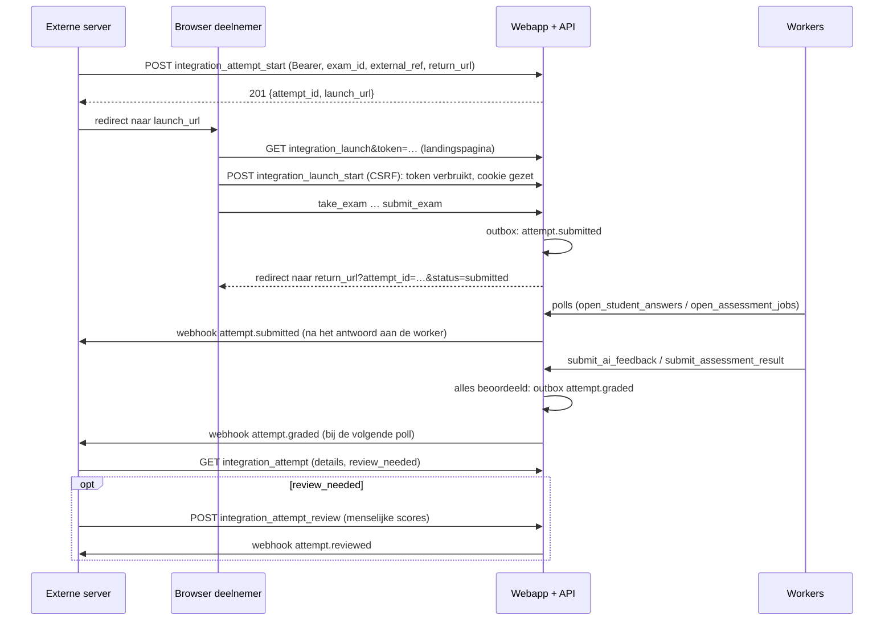

# Integratie-API: toetsen afnemen vanuit je eigen website

Deze handleiding is voor ontwikkelaars van een **externe website** (een leeromgeving, een cursusplatform) die haar eigen deelnemers een toets met open vragen wil laten maken in GenAI Open Assessment. De deelnemer heeft hier geen account nodig. De toets wordt automatisch door AI nagekeken; jij volgt de status via de API en via webhooks.

Een werkend voorbeeld in Python (alleen de standaardbibliotheek) staat in [integration-demo/](integration-demo/README.md).

## Inhoud

1. [De flow in het kort](#1-de-flow-in-het-kort)
2. [Wat je van de beheerder krijgt](#2-wat-je-van-de-beheerder-krijgt)
3. [Authenticatie](#3-authenticatie)
4. [Endpoints](#4-endpoints)
5. [Statussen en `review_needed`](#5-statussen-en-review_needed)
6. [Webhooks](#6-webhooks)
7. [De terugkeer-URL](#7-de-terugkeer-url)
8. [Foutcodes](#8-foutcodes)
9. [Goed om te weten](#9-goed-om-te-weten)

---

## 1. De flow in het kort

1. Jouw **server** start met de API-key een poging voor een deelnemer, met je eigen referentie (`external_ref`) en een terugkeer-URL. Je krijgt een **eenmalige startlink** terug, die 15 minuten geldig is.
2. Je stuurt de **browser** van de deelnemer naar die startlink. De deelnemer ziet een startpagina, klikt op *Start de toets* en maakt de toets.
3. Na het **definitief inleveren** gaat de browser terug naar jouw terugkeer-URL.
4. De AI kijkt de toets na. Je krijgt een **webhook** bij `attempt.submitted`, `attempt.graded` en `attempt.reviewed`.
5. Je haalt het resultaat op met de **API**. Staat `review_needed` op `true`, dan is de AI niet zeker genoeg en kijkt een persoon bij jou de poging na. Die beoordeling kun je **terugmelden**.



## 2. Wat je van de beheerder krijgt

De beheerder van de toetsapplicatie maakt een **koppeling** voor jouw website aan. Je krijgt:

| Gegeven | Gebruik |
|---|---|
| **API-endpoint**, bijvoorbeeld `https://toetsen.example/api/index.php` | Basis-URL van alle aanroepen (`?action=…`) |
| **API-key** (64 hex-tekens) | Authenticatie. Wordt maar één keer getoond; bewaar hem als geheim op je server |
| **Webhookgeheim** (64 hex-tekens) | De handtekening van webhooks controleren |
| De **origin** van je terugkeer-URL, bijvoorbeeld `https://leeromgeving.example` | Een terugkeer-URL moet precies deze origin hebben (schema, host, poort) |
| De **toetsen** die je mag gebruiken | Zie `integration_exams` |
| De **drempel** voor menselijke controle (standaard `hoog`) | Bepaalt wanneer `review_needed` waar is |

De webhook-URL geef je door aan de beheerder; alleen `https` is toegestaan, en de host moet naar een publiek IP-adres wijzen.

## 3. Authenticatie

Elke aanroep stuurt de key mee in een header:

```
Authorization: Bearer <api-key>
```

- Gebruik de key **alleen server-to-server**. Zet hem nooit in de browser, in JavaScript of in een URL.
- De key hoort bij precies één koppeling. Je ziet alleen je eigen pogingen; een poging van een andere koppeling bestaat voor jou niet (`404`).
- Een ongeldige, verwijderde of uitgeschakelde key geeft `401`. Een key van een ander type (bijvoorbeeld een workerkey) geeft `403`.

Alle antwoorden zijn JSON. Een fout heeft de vorm `{"error": "..."}`.

## 4. Endpoints

Alle endpoints staan op `<API-endpoint>?action=<naam>`.

### `GET integration_exams`

De toetsen die je mag gebruiken (gekoppeld en met AI-beoordeling aan).

```json
{"exams": [{"exam_id": 5, "title": "PLC basis", "question_count": 2, "grading_scale": "points"}]}
```

`grading_scale` (toegevoegd) is `points` (een score per antwoord, zoals hieronder beschreven) of `levels` (een niveau per antwoord, zie [Toetsen met niveaus](#toetsen-met-niveaus)).

### `POST integration_attempt_start`

Start een poging en geeft een eenmalige startlink.

```json
{"exam_id": 5, "external_ref": "lms-123", "return_url": "https://leeromgeving.example/toets/klaar", "display_name": "Sam"}
```

| Veld | Regels |
|---|---|
| `exam_id` | Een toets uit `integration_exams` |
| `external_ref` | Jouw eigen referentie: 1–100 tekens `A-Z a-z 0-9 . _ : -`, uniek binnen je koppeling |
| `return_url` | Maximaal 1000 tekens, precies jouw origin, geen `user:pass@` en geen `#` |
| `display_name` | Optioneel, maximaal 100 tekens, standaard `Deelnemer`. Een pseudoniem mag; docenten zien deze naam |

Antwoord:

```json
{"attempt_id": 34, "launch_url": "https://toetsen.example/?action=integration_launch&token=…",
 "expires_at": "2026-10-03T12:15:00Z", "status": "not_started"}
```

**Idempotent per `external_ref`:**

| Situatie | Antwoord |
|---|---|
| Nieuwe `external_ref` | `201`: nieuwe poging |
| Bestaande `external_ref`, zelfde toets, nog niet ingeleverd | `200`: een **nieuwe startlink** voor dezelfde poging; de vorige link werkt niet meer. Zo stuur je een deelnemer die de browser sloot gewoon opnieuw. Antwoorden die al tussentijds zijn opgeslagen, blijven bewaard |
| Bestaande `external_ref`, andere toets | `409` met `attempt_id` |
| Bestaande `external_ref`, al ingeleverd | `409` met `attempt_id` |

`return_url` en `display_name` van de eerste start blijven gelden.

### `GET integration_attempt&attempt_id=N`

De volledige samenvatting van één poging. Dit is de **bron van waarheid**.

```json
{
  "attempt_id": 34, "external_ref": "lms-123", "exam_id": 5, "exam_title": "PLC basis",
  "display_name": "Sam", "status": "graded", "review_needed": true, "confidence": "middel",
  "reasons": ["Vraag 2: Modellen zijn het oneens"],
  "started_at": "2026-10-03T12:01:10Z", "submitted_at": "2026-10-03T12:20:41Z", "reviewed_at": null,
  "updated_at": "2026-10-03T12:21:30Z",
  "ai_score": 6.5, "teacher_score": null,
  "grading_scale": "points", "grade": null, "grade_label": null, "grade_overridden": false,
  "answers": [{
    "question_id": 11, "nr": 1, "question_text": "...", "answer": "...",
    "ai": {"source": "agentic", "score": 5, "feedback": "...", "confidence": "hoog",
           "review_needed": false, "reasons": [],
           "criteria": [{"name": "...", "weight": "essentieel", "status": "deels"}]},
    "teacher": null
  }, {
    "question_id": 12, "nr": 2, "question_text": "...", "answer": "...",
    "ai": {"source": "models", "score": 5.5, "model_scores": {"gpt-oss:20b": 1, "gpt-oss:120b": 10},
           "feedback": "Model: gpt-oss:20b\nTijdsduur: ...", "confidence": "laag",
           "review_needed": true, "reasons": ["Modellen zijn het oneens"]},
    "teacher": {"score": 7, "feedback": "..."}
  }]
}
```

| Veld | Betekenis |
|---|---|
| `status` | Zie [§5](#5-statussen-en-review_needed) |
| `review_needed` | `true`: een mens moet de poging nakijken. Alleen bij status `graded` |
| `confidence`, `reasons` | De laagste confidence van de antwoorden en de redenen (met vraagnummer); vanaf `graded` |
| `ai_score` | Gemiddelde AI-score van de antwoorden (0–10, één decimaal), vanaf `graded`. **Een AI-voorstel, geen cijfer** |
| `teacher_score` | Gemiddelde menselijke score (0–10), of `null` |
| `grading_scale` | `points` of `levels` (toegevoegd) |
| `grade` | Het eindcijfer van de docent (0–10, één decimaal) zoals de toetsapplicatie het toont, inclusief een handmatige aanpassing door een docent; `null` zolang er geen is, of als het eindcijfer een woord is (toegevoegd) |
| `grade_label` | Het eindcijfer als woord (`onvoldoende`, `voldoende`, `goed`, `uitstekend`) als de toets een woordbeoordeling heeft, anders `null` (toegevoegd) |
| `grade_overridden` | `true` als een docent het eindcijfer handmatig heeft aangepast. De reden zie je niet (toegevoegd) |
| `answers[].ai` | `null` zolang het antwoord niet beoordeeld is. `source: agentic` (drie AI-agents met een rubric; met `criteria`) of `source: models` (één of meer AI-modellen; met `model_scores` en als `feedback` de ruwe tekst van de modellen) |
| `answers[].teacher` | De menselijke beoordeling (van een docent hier, of van jouw review), of `null` |
| `started_at` | Moment van de eerste start via de startlink |

Een AI-score per antwoord is 0, 1, 5 of 10 (bij `models` het gemiddelde van de modellen).

#### Toetsen met niveaus

Bij `grading_scale: "levels"` krijgt elk antwoord een niveau: `onvoldoende`, `voldoende`, `goed` of `uitstekend`. De JSON verschilt dan op deze punten (de rest is gelijk):

- `answers[].ai` heeft `level` in plaats van `score`. Bij `source: models` staat het niveau per model in `model_levels` (in plaats van `model_scores`); `level` is dan het **laagste** niveau van de modellen.
- `answers[].teacher` is `{"level": "goed", "feedback": "..."}`.
- `ai_score` en `teacher_score` zijn `null`. Het eindcijfer staat in `grade` (en `grade_label`): `10 × de som van de punten / (aantal vragen × punten voor uitstekend)`, met een puntenschema dat de docent kiest (onvoldoende is altijd 0 punten). `grade` is er pas als een mens elk antwoord een niveau heeft gegeven, of als een docent het eindcijfer handmatig heeft vastgesteld.

```json
{"grading_scale": "levels", "ai_score": null, "teacher_score": null,
 "grade": 6.0, "grade_label": "voldoende", "grade_overridden": false,
 "answers": [{"question_id": 21, "nr": 1, "question_text": "...", "answer": "...",
   "ai": {"source": "models", "level": "onvoldoende", "model_levels": {"gpt-oss:20b": "onvoldoende", "gpt-oss:120b": "voldoende"},
          "feedback": "Model: gpt-oss:20b\nTijdsduur: ...\nNiveau: onvoldoende\n...", "confidence": "laag",
          "review_needed": true, "reasons": ["Modellen zijn het oneens over voldoende of onvoldoende"]},
   "teacher": {"level": "voldoende", "feedback": "..."}}]}
```

### `GET integration_attempts&filter=open|needs_review|all&limit=1..100`

Een lijst van je pogingen, nieuwste eerst (standaard `filter=open`, `limit=50`).

```json
{"attempts": [{"attempt_id": 34, "external_ref": "lms-123", "exam_id": 5, "status": "graded",
               "review_needed": true, "updated_at": "2026-10-03T12:21:30Z"}]}
```

| Filter | Bevat |
|---|---|
| `open` | Alles wat nog aandacht nodig heeft: `not_started`, `in_progress`, `grading` en `graded` met `review_needed` |
| `needs_review` | Alleen `graded` met `review_needed` |
| `all` | Alles |

De lijst bekijkt hooguit de 500 nieuwste pogingen. Houd daarom je eigen administratie bij op basis van de webhooks en `integration_attempt`.

### `POST integration_attempt_review`

Meldt een menselijke beoordeling terug. Alleen bij status `graded` of `reviewed` (anders `409`).

```json
{"attempt_id": 34, "reviewer": "J. Jansen",
 "grades": [{"question_id": 12, "score": 7, "feedback": "Goed, maar noem ook de cyclus."}]}
```

| Veld | Regels |
|---|---|
| `reviewer` | Optioneel, maximaal 100 tekens; komt in de audit log |
| `grades` | Optioneel. Per vraag van deze poging hooguit één keer: `score` een geheel getal 0–10 (bij een toets met niveaus in plaats daarvan `level`: `onvoldoende`, `voldoende`, `goed` of `uitstekend`), `feedback` optioneel (maximaal 5000 tekens; zonder `feedback` blijft de bestaande feedback staan) |

- Met `grades` worden de scores de **docentscores** in de toetsapplicatie (het eindcijfer is daar het gemiddelde van de docentscores; bij niveaus het cijfer uit de niveaus en het puntenschema). Je hoeft niet alle vragen mee te sturen.
- Bij een toets met niveaus geeft een `score` (of een ongeldig niveau) `400` met `Invalid level in grades[i]`; bij een toets met punten geeft een `level` `400` met `Invalid score in grades[i]`.
- Zonder `grades` markeert het endpoint de poging alleen als afgehandeld.
- Daarna is de status `reviewed`. Een tweede review overschrijft de eerste (de audit log bewaart beide).
- Antwoord: `200 {"status": "success"}`.

## 5. Statussen en `review_needed`

De status wordt elke keer berekend uit de actuele gegevens; hij wordt niet apart opgeslagen.

| Status | Betekenis |
|---|---|
| `not_started` | De startlink is nog niet gebruikt |
| `in_progress` | Gestart, nog niet ingeleverd |
| `grading` | Ingeleverd; nog niet elk antwoord heeft een AI-resultaat |
| `graded` | Elk antwoord heeft een AI-resultaat |
| `reviewed` | Een mens heeft beoordeeld: via `integration_attempt_review`, of een docent gaf hier elk antwoord een score (bij een toets met niveaus: een niveau) |

**Confidence per antwoord** (`hoog` > `middel` > `laag`). De regels zijn vast en deterministisch:

| Bron | Confidence | `review_needed` als |
|---|---|---|
| Agentic beoordeling | de confidence van de agents | de agents vragen menselijke controle, of de confidence ligt onder de drempel |
| Modellen, geen score (de AI gaf op) | `laag` ("Geen AI-score") | altijd |
| Modellen, mogelijke instructies aan de AI in het antwoord | `laag` ("Mogelijke instructies aan de AI") | altijd |
| Eén model | `middel` ("Slechts één model") | onder de drempel |
| Twee of meer modellen, allemaal dezelfde score | `hoog` | nooit door deze bron |
| Twee of meer modellen, scores aan beide kanten van de grens (laagste ≤ 1 en hoogste ≥ 5) | `laag` ("Modellen zijn het oneens") | altijd |
| Twee of meer modellen, kleinere verschillen | `middel` ("Kleine verschillen tussen modellen") | onder de drempel |

**Bij een toets met niveaus** gelden voor de modellen deze regels (agentic, geen niveau en mogelijke instructies aan de AI zoals hierboven, met "Geen AI-niveau"):

| Bron | Confidence | `review_needed` als |
|---|---|---|
| Eén model | `middel` ("Slechts één model") | onder de drempel |
| Twee of meer modellen, allemaal hetzelfde niveau | `hoog` | nooit door deze bron |
| Twee of meer modellen, het ene `onvoldoende` en een ander `voldoende` of hoger | `laag` ("Modellen zijn het oneens over voldoende of onvoldoende") | altijd |
| Twee of meer modellen, andere verschillen | `middel` ("Kleine verschillen tussen modellen") | onder de drempel |

**Per poging** geldt de laagste confidence van de antwoorden, en `review_needed` is waar als één antwoord het nodig heeft. De drempel stelt de beheerder per koppeling in; standaard is dat `hoog`, dus alles wat niet `hoog` is, gaat naar een mens.

> **De AI beslist niets definitief.** `ai_score` en `ai` zijn voorstellen. Een `teacher_score` (of docentniveau) en `grade` komen altijd van een mens.

## 6. Webhooks

Webhooks zijn een **seintje**: "er is iets veranderd, haal de details op". De payload bevat geen toetsinhoud.

```
POST <jouw webhook-URL>
Content-Type: application/json
X-Assessment-Event: attempt.graded
X-Assessment-Timestamp: 1791043200
X-Assessment-Signature: sha256=<hex HMAC-SHA256(webhookgeheim, timestamp + "." + body)>

{"event_id": 12, "event": "attempt.graded", "attempt_id": 34, "external_ref": "lms-123",
 "status": "graded", "review_needed": true, "occurred_at": "2026-10-03T12:00:00Z"}
```

| Event | Wanneer |
|---|---|
| `attempt.submitted` | De deelnemer heeft definitief ingeleverd |
| `attempt.graded` | Elk antwoord heeft een AI-resultaat |
| `attempt.reviewed` | Een mens heeft de poging beoordeeld (jouw review, of een docent hier) |

Elk event komt per poging hooguit één keer in de wachtrij. `status` en `review_needed` zijn de stand op het moment van het event; haal de actuele stand op met `integration_attempt`.

**Zo verwerk je een webhook:**

1. Lees de **ruwe body** (nog niet parsen).
2. Controleer dat `X-Assessment-Timestamp` niet ouder is dan **5 minuten**.
3. Bereken `sha256=` + HMAC-SHA256 met het webhookgeheim over `timestamp + "." + body` en vergelijk **constant-time** met `X-Assessment-Signature`. Bij een verschil: `401`.
4. **Ontdubbel** op `event_id`: aflevering is *at-least-once*, dus hetzelfde event kan vaker komen.
5. Antwoord binnen 3 seconden met een **2xx**. Doe het zware werk daarna (bijvoorbeeld `integration_attempt` ophalen in een achtergrondtaak).

Elke andere status, een timeout of een redirect betekent: later opnieuw. De wachttijd verdubbelt per poging (30 s, 1 min, 2 min, … tot maximaal 1 uur); na 8 mislukte pogingen stopt het voor dat event. Redirects worden niet gevolgd.

**PHP:**

```php
$body = file_get_contents('php://input');
$ts = $_SERVER['HTTP_X_ASSESSMENT_TIMESTAMP'] ?? '';
$sig = $_SERVER['HTTP_X_ASSESSMENT_SIGNATURE'] ?? '';
$expected = 'sha256=' . hash_hmac('sha256', $ts . '.' . $body, $webhookSecret);
if (!ctype_digit($ts) || abs(time() - (int)$ts) > 300 || !hash_equals($expected, $sig)) {
    http_response_code(401);
    exit;
}
$event = json_decode($body, true);
if (!alreadyProcessed($event['event_id'])) {   // eigen opslag
    queueFetchAttempt($event['attempt_id']);    // details ophalen via de API
}
http_response_code(204);
```

**Python:**

```python
import hashlib, hmac, time

def verify(headers, body: bytes, secret: str) -> bool:
    ts = headers.get("X-Assessment-Timestamp", "")
    sig = headers.get("X-Assessment-Signature", "")
    if not ts.isdigit() or abs(time.time() - int(ts)) > 300:
        return False
    expected = "sha256=" + hmac.new(secret.encode(), ts.encode() + b"." + body, hashlib.sha256).hexdigest()
    return hmac.compare_digest(expected, sig)
```

Webhooks worden verstuurd op momenten dat de beoordelingsworkers van de toetsapplicatie actief zijn; reken op een vertraging van seconden tot minuten. Het **statusendpoint is altijd correct**, ook als een webhook niet aankomt. Poll bij twijfel `integration_attempts?filter=open`.

## 7. De terugkeer-URL

Na het inleveren gaat de browser naar jouw `return_url`, met drie parameters erbij (een bestaande query string blijft staan):

```
https://leeromgeving.example/toets/klaar?attempt_id=34&external_ref=lms-123&status=submitted
```

- Deze URL is **niet ondertekend**: iedereen kan hem met andere waarden openen. Gebruik hem alleen om te navigeren en haal de echte status op met de API (controleer daarbij ook dat `external_ref` bij de ingelogde gebruiker hoort).
- Er staan bewust **geen scores** in.
- De deelnemer ziet in de toetsapplicatie geen resultaat; wat de deelnemer te zien krijgt, bepaal jij.
- Tijdens de toets staat er ook een link "Terug naar …" met `status=in_progress`.

## 8. Foutcodes

| Code | Betekenis |
|---|---|
| `400` | Ongeldige invoer; de melding noemt het veld. Ook bij ongeldige JSON of een terugkeer-URL op een andere origin |
| `401` | Ongeldige, verwijderde of uitgeschakelde key |
| `403` | Key van een ander type |
| `404` | Onbekende toets of poging (ook: een poging van een andere koppeling) |
| `405` | Verkeerde HTTP-methode |
| `409` | `external_ref` bij een andere toets, poging al ingeleverd, of review vóór `graded` |
| `413` | Body groter dan 100.000 bytes |
| `429` | Te veel pogingen gestart (300 per koppeling per uur, nieuwe startlinks tellen mee) |

Voor de deelnemer: een verlopen, al gebruikte of vervangen startlink geeft een pagina "Deze startlink is verlopen of al gebruikt" (HTTP 410). Vraag dan een nieuwe startlink aan met dezelfde `external_ref`.

## 9. Goed om te weten

- **Privacy:** je krijgt via de API de antwoorden, scores en feedback van je eigen deelnemers. Stuur als `display_name` liefst een pseudoniem. De antwoorden worden door AI-modellen beoordeeld; vraag de beheerder welke verwerker wordt gebruikt.
- **Wijzigingen hier:** past een docent de naam van de deelnemer aan of geeft hij een docentscore, dan zie je dat bij de volgende `integration_attempt`. Alleen een volledige docentbeoordeling levert een webhook op (`attempt.reviewed`).
- **AI uitgezet:** zet de docent na de start de AI-beoordeling van een toets uit, dan blijft een ingeleverde poging op `grading` staan tot die weer aan gaat (of tot een mens beoordeelt).
- **Koppeling uitgeschakeld of verwijderd:** de API geeft `401` en startlinks werken niet meer. Webhooks van een uitgeschakelde koppeling wachten tot die weer aan staat.
